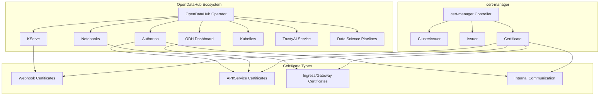

# Cert-Manager in OpenDataHub

## Overview

**cert-manager** is a native Kubernetes certificate management controller that automates the provisioning and management of TLS certificates. Within the OpenDataHub ecosystem, cert-manager plays a crucial role in securing communications between components, webhook configurations, and providing external TLS termination.

## Architecture & Integration

### **Core Components Using cert-manager**



## Certificate Management Patterns

### **1. Webhook Certificate Management**

Most OpenDataHub operators use cert-manager for securing admission webhooks:

#### **KServe Example**
```yaml
# Self-signed issuer for webhook certificates
apiVersion: cert-manager.io/v1
kind: Issuer
metadata:
  name: selfsigned-issuer
  namespace: kubeflow
spec:
  selfSigned: {}

---
# Certificate for KServe webhook
apiVersion: cert-manager.io/v1
kind: Certificate
metadata:
  name: serving-cert
  namespace: kubeflow
spec:
  commonName: kserve-webhook-server-service.kubeflow.svc
  dnsNames:
  - kserve-webhook-server-service.kubeflow.svc
  - kserve-webhook-server-service.kubeflow.svc.cluster.local
  issuerRef:
    kind: Issuer
    name: selfsigned-issuer
  secretName: kserve-webhook-server-cert

---
# Webhook configuration with cert-manager injection
apiVersion: admissionregistration.k8s.io/v1
kind: ValidatingWebhookConfiguration
metadata:
  name: inferenceservice.serving.kserve.io
  annotations:
    cert-manager.io/inject-ca-from: kubeflow/serving-cert
spec:
  webhooks:
  - name: inferenceservice.kserve-webhook-server.validator
    clientConfig:
      service:
        name: kserve-webhook-server-service
        namespace: kubeflow
        path: /validate-serving-kserve-io-v1beta1-inferenceservice
    admissionReviewVersions: ["v1", "v1beta1"]
```

### **2. Service-to-Service Communication**

#### **Authorino Internal CA Pattern**
```yaml
# Root CA issuer
apiVersion: cert-manager.io/v1
kind: Issuer
metadata:
  name: authorino-ca-root
  namespace: authorino-system
spec:
  selfSigned: {}

---
# CA Certificate
apiVersion: cert-manager.io/v1
kind: Certificate
metadata:
  name: authorino-ca-cert
  namespace: authorino-system
spec:
  commonName: '*.authorino-system.svc'
  isCA: true
  issuerRef:
    kind: Issuer
    name: authorino-ca-root
  secretName: authorino-ca-cert

---
# CA Issuer (signs service certificates)
apiVersion: cert-manager.io/v1
kind: Issuer
metadata:
  name: authorino-ca
  namespace: authorino-system
spec:
  ca:
    secretName: authorino-ca-cert

---
# Service certificate for OIDC endpoint
apiVersion: cert-manager.io/v1
kind: Certificate
metadata:
  name: authorino-oidc-server-cert
  namespace: authorino-system
spec:
  dnsNames:
  - authorino-authorino-oidc
  - authorino-authorino-oidc.authorino-system.svc
  - authorino-authorino-oidc.authorino-system.svc.cluster.local
  issuerRef:
    kind: Issuer
    name: authorino-ca
  secretName: authorino-oidc-server-cert

---
# Service certificate for authorization endpoint
apiVersion: cert-manager.io/v1
kind: Certificate
metadata:
  name: authorino-server-cert
  namespace: authorino-system
spec:
  dnsNames:
  - authorino-authorino-authorization
  - authorino-authorino-authorization.authorino-system.svc
  - authorino-authorino-authorization.authorino-system.svc.cluster.local
  issuerRef:
    kind: Issuer
    name: authorino-ca
  secretName: authorino-server-cert
```

### **3. External TLS with Public Certificate Authorities**

#### **Let's Encrypt Integration**
```yaml
# AWS Route53 ClusterIssuer for Let's Encrypt
apiVersion: cert-manager.io/v1
kind: ClusterIssuer
metadata:
  name: lets-encrypt-aws
spec:
  acme:
    privateKeySecretRef:
      name: le-secret
    server: https://acme-v02.api.letsencrypt.org/directory
    solvers:
    - dns01:
        route53:
          accessKeyIDSecretRef:
            key: AWS_ACCESS_KEY_ID
            name: aws-credentials
          region: us-east-1
          secretAccessKeySecretRef:
            key: AWS_SECRET_ACCESS_KEY
            name: aws-credentials

---
# GCP DNS ClusterIssuer for Let's Encrypt
apiVersion: cert-manager.io/v1
kind: ClusterIssuer
metadata:
  name: lets-encrypt-gcp
spec:
  acme:
    privateKeySecretRef:
      name: le-secret
    server: https://acme-v02.api.letsencrypt.org/directory
    solvers:
    - dns01:
        cloudDNS:
          project: my-gcp-project
          serviceAccountSecretRef:
            name: gcp-dns-sa
            key: service-account.json

---
# Azure DNS ClusterIssuer for Let's Encrypt
apiVersion: cert-manager.io/v1
kind: ClusterIssuer
metadata:
  name: lets-encrypt-azure
spec:
  acme:
    privateKeySecretRef:
      name: le-secret
    server: https://acme-v02.api.letsencrypt.org/directory
    solvers:
    - dns01:
        azureDNS:
          clientID: azure-client-id
          clientSecretSecretRef:
            name: azure-dns-secret
            key: client-secret
          subscriptionID: azure-subscription-id
          tenantID: azure-tenant-id
          resourceGroupName: dns-resource-group
```

### **4. OpenDataHub Dashboard TLS**

```yaml
# Certificate for ODH Dashboard
apiVersion: cert-manager.io/v1
kind: Certificate
metadata:
  name: odh-dashboard-cert
  namespace: opendatahub
spec:
  secretName: odh-dashboard-tls
  issuerRef:
    name: lets-encrypt-production
    kind: ClusterIssuer
  dnsNames:
  - dashboard.opendatahub.example.com
  - dashboard.rhods.example.com

---
# Ingress/Route configuration
apiVersion: networking.k8s.io/v1
kind: Ingress
metadata:
  name: odh-dashboard
  namespace: opendatahub
  annotations:
    cert-manager.io/cluster-issuer: lets-encrypt-production
spec:
  tls:
  - hosts:
    - dashboard.opendatahub.example.com
    secretName: odh-dashboard-tls
  rules:
  - host: dashboard.opendatahub.example.com
    http:
      paths:
      - path: /
        pathType: Prefix
        backend:
          service:
            name: odh-dashboard
            port:
              number: 8080
```

### **5. Kubeflow Notebooks TLS**

```yaml
# Certificate for Jupyter Notebook services
apiVersion: cert-manager.io/v1
kind: Certificate
metadata:
  name: notebook-server-cert
  namespace: kubeflow-user-example-com
spec:
  secretName: notebook-server-tls
  issuerRef:
    name: kubeflow-ca-issuer
    kind: ClusterIssuer
  dnsNames:
  - notebook-server.kubeflow-user-example-com.svc
  - notebook-server.kubeflow-user-example-com.svc.cluster.local
  duration: 8760h # 1 year
  renewBefore: 720h # 30 days

---
# Notebook deployment with TLS
apiVersion: apps/v1
kind: Deployment
metadata:
  name: notebook-server
  namespace: kubeflow-user-example-com
spec:
  template:
    spec:
      containers:
      - name: notebook
        image: jupyter/tensorflow-notebook:latest
        args:
        - --certfile=/etc/ssl/certs/tls.crt
        - --keyfile=/etc/ssl/private/tls.key
        - --ip=0.0.0.0
        - --port=8888
        - --allow-root
        volumeMounts:
        - name: notebook-server-tls
          mountPath: /etc/ssl/certs
          readOnly: true
        - name: notebook-server-tls
          mountPath: /etc/ssl/private
          readOnly: true
      volumes:
      - name: notebook-server-tls
        secret:
          secretName: notebook-server-tls
```

## Common Certificate Issuer Patterns

### **1. Self-Signed Certificates (Development)**

```yaml
# Quick self-signed issuer for testing
apiVersion: cert-manager.io/v1
kind: ClusterIssuer
metadata:
  name: selfsigned-cluster-issuer
spec:
  selfSigned: {}
```

### **2. Internal CA Hierarchy**

```yaml
# Root CA for the entire cluster
apiVersion: cert-manager.io/v1
kind: ClusterIssuer
metadata:
  name: cluster-root-ca
spec:
  selfSigned: {}

---
# Root CA certificate
apiVersion: cert-manager.io/v1
kind: Certificate
metadata:
  name: cluster-root-ca-cert
  namespace: cert-manager
spec:
  commonName: OpenDataHub Root CA
  isCA: true
  issuerRef:
    kind: ClusterIssuer
    name: cluster-root-ca
  secretName: cluster-root-ca-cert
  duration: 87600h # 10 years

---
# Intermediate CA for OpenDataHub
apiVersion: cert-manager.io/v1
kind: ClusterIssuer
metadata:
  name: opendatahub-ca
spec:
  ca:
    secretName: cluster-root-ca-cert

---
# Intermediate CA for Kubeflow
apiVersion: cert-manager.io/v1
kind: ClusterIssuer
metadata:
  name: kubeflow-ca
spec:
  ca:
    secretName: cluster-root-ca-cert
```

### **3. Production Let's Encrypt**

```yaml
# Production Let's Encrypt issuer
apiVersion: cert-manager.io/v1
kind: ClusterIssuer
metadata:
  name: lets-encrypt-production
spec:
  acme:
    server: https://acme-v02.api.letsencrypt.org/directory
    email: admin@example.com
    privateKeySecretRef:
      name: lets-encrypt-production
    solvers:
    - http01:
        ingress:
          class: nginx
    - dns01:
        route53:
          region: us-east-1
          accessKeyIDSecretRef:
            name: aws-credentials
            key: AWS_ACCESS_KEY_ID
          secretAccessKeySecretRef:
            name: aws-credentials
            key: AWS_SECRET_ACCESS_KEY

---
# Staging Let's Encrypt issuer for testing
apiVersion: cert-manager.io/v1
kind: ClusterIssuer
metadata:
  name: lets-encrypt-staging
spec:
  acme:
    server: https://acme-staging-v02.api.letsencrypt.org/directory
    email: admin@example.com
    privateKeySecretRef:
      name: lets-encrypt-staging
    solvers:
    - http01:
        ingress:
          class: nginx
```

## OpenDataHub Operator Integration

### **Certificate Management in Component Installation**

The OpenDataHub operator orchestrates cert-manager integration across components:

```yaml
# OpenDataHub configuration with cert-manager
apiVersion: v1
kind: ConfigMap
metadata:
  name: opendatahub-config
  namespace: opendatahub
data:
  cert-manager.yaml: |
    certManager:
      enabled: true
      issuer:
        kind: ClusterIssuer
        name: lets-encrypt-production
      webhook:
        enabled: true
        certDuration: 8760h # 1 year
        renewBefore: 720h   # 30 days
      components:
        kserve:
          enabled: true
          issuer: selfsigned-issuer
        authorino:
          enabled: true
          issuer: authorino-ca
        dashboard:
          enabled: true
          issuer: lets-encrypt-production
        notebooks:
          enabled: true
          issuer: kubeflow-ca
```

### **Webhook Certificate Automation**

```yaml
# Automated webhook certificate management
apiVersion: v1
kind: ConfigMap
metadata:
  name: webhook-cert-config
  namespace: opendatahub
data:
  webhook-certs.yaml: |
    webhooks:
    - name: kserve-webhook
      namespace: kubeflow
      service: kserve-webhook-server-service
      secretName: kserve-webhook-server-cert
      issuer: selfsigned-issuer
    - name: notebook-controller-webhook
      namespace: kubeflow
      service: notebook-controller-webhook-service
      secretName: notebook-controller-webhook-cert
      issuer: kubeflow-ca
    - name: training-operator-webhook
      namespace: kubeflow
      service: training-operator-webhook-service
      secretName: training-operator-webhook-cert
      issuer: kubeflow-ca
```

## Security Best Practices

### **1. Certificate Rotation**

```yaml
# Configure automatic certificate rotation
apiVersion: cert-manager.io/v1
kind: Certificate
metadata:
  name: secure-service-cert
spec:
  secretName: secure-service-tls
  duration: 2160h    # 90 days
  renewBefore: 360h  # 15 days (renew when 15 days left)
  issuerRef:
    name: production-ca
    kind: ClusterIssuer
  commonName: secure-service.example.com
  dnsNames:
  - secure-service.example.com
  - secure-service.internal.cluster.local
  keyAlgorithm: RSA
  keySize: 2048
  keyUsages:
  - digital signature
  - key encipherment
  - server auth
  - client auth
```

### **2. RBAC for Certificate Management**

```yaml
# Service account for component certificate management
apiVersion: v1
kind: ServiceAccount
metadata:
  name: cert-manager-component
  namespace: opendatahub

---
# Role for certificate management
apiVersion: rbac.authorization.k8s.io/v1
kind: Role
metadata:
  name: cert-manager-component
  namespace: opendatahub
rules:
- apiGroups: ["cert-manager.io"]
  resources: ["certificates", "certificaterequests"]
  verbs: ["get", "list", "watch", "create", "update", "patch", "delete"]
- apiGroups: [""]
  resources: ["secrets"]
  verbs: ["get", "list", "watch", "create", "update", "patch"]

---
# RoleBinding
apiVersion: rbac.authorization.k8s.io/v1
kind: RoleBinding
metadata:
  name: cert-manager-component
  namespace: opendatahub
roleRef:
  apiGroup: rbac.authorization.k8s.io
  kind: Role
  name: cert-manager-component
subjects:
- kind: ServiceAccount
  name: cert-manager-component
  namespace: opendatahub
```

### **3. Certificate Monitoring**

```yaml
# PrometheusRule for certificate monitoring
apiVersion: monitoring.coreos.com/v1
kind: PrometheusRule
metadata:
  name: cert-manager-alerts
  namespace: opendatahub
spec:
  groups:
  - name: cert-manager
    rules:
    - alert: CertificateExpiration
      expr: |
        (certmanager_certificate_expiration_timestamp_seconds - time()) / 86400 < 30
      for: 1h
      labels:
        severity: warning
      annotations:
        summary: "Certificate expiring soon"
        description: "Certificate {{ $labels.name }} in namespace {{ $labels.namespace }} expires in less than 30 days"
    
    - alert: CertificateRenewalFailed
      expr: |
        certmanager_certificate_ready_status{condition="False"} == 1
      for: 5m
      labels:
        severity: critical
      annotations:
        summary: "Certificate renewal failed"
        description: "Certificate {{ $labels.name }} in namespace {{ $labels.namespace }} failed to renew"
```

## Component-Specific Configurations

### **KServe Certificate Management**

```yaml
# KServe InferenceService with custom certificates
apiVersion: serving.kserve.io/v1beta1
kind: InferenceService
metadata:
  name: sklearn-iris
  namespace: kubeflow-user-example-com
  annotations:
    cert-manager.io/issuer: kubeflow-ca
spec:
  predictor:
    sklearn:
      storageUri: gs://kfserving-examples/models/sklearn/1.0/model
      resources:
        limits:
          cpu: 100m
          memory: 1Gi
        requests:
          cpu: 100m
          memory: 1Gi
  # TLS configuration
  tls:
    enabled: true
    secretName: sklearn-iris-tls
    certificateSpec:
      issuerRef:
        name: kubeflow-ca
        kind: ClusterIssuer
      dnsNames:
      - sklearn-iris-predictor.kubeflow-user-example-com.svc
      - sklearn-iris-predictor.kubeflow-user-example-com.svc.cluster.local
```

### **Authorino Certificate Management**

```yaml
# Authorino AuthConfig with certificate references
apiVersion: authorino.kuadrant.io/v1beta2
kind: AuthConfig
metadata:
  name: api-protection
  namespace: authorino-system
spec:
  hosts:
  - api.example.com
  authentication:
    "jwt":
      jwt:
        issuerUrl: https://authorino-authorino-oidc.authorino-system.svc.cluster.local:8443/auth/realms/kuadrant
        # Uses certificates managed by cert-manager
        ttl: 300
  authorization:
    "admin":
      patternMatching:
        patterns:
        - selector: auth.identity.preferred_username
          operator: eq
          value: admin
  response:
    success:
      headers:
        "x-auth-user":
          selector: auth.identity.preferred_username
```

### **ODH Dashboard Certificate Management**

```yaml
# ODH Dashboard Route with TLS
apiVersion: route.openshift.io/v1
kind: Route
metadata:
  name: odh-dashboard
  namespace: opendatahub
  annotations:
    cert-manager.io/issuer: lets-encrypt-production
spec:
  host: dashboard.opendatahub.example.com
  tls:
    termination: edge
    certificate: |
      # Certificate will be populated by cert-manager
    key: |
      # Private key will be populated by cert-manager
    caCertificate: |
      # CA certificate will be populated by cert-manager
  to:
    kind: Service
    name: odh-dashboard
    weight: 100
  port:
    targetPort: 8080
```

## Troubleshooting

### **Common Issues**

#### **1. Certificate Not Ready**
```bash
# Check certificate status
kubectl get certificate -n opendatahub
kubectl describe certificate my-cert -n opendatahub

# Check certificate request
kubectl get certificaterequests -n opendatahub
kubectl describe certificaterequest my-cert-xxxxx -n opendatahub

# Check issuer status
kubectl get clusterissuer
kubectl describe clusterissuer my-issuer
```

#### **2. Webhook Certificate Problems**
```bash
# Check webhook configuration
kubectl get validatingwebhookconfiguration
kubectl get mutatingwebhookconfiguration

# Verify cert-manager injection
kubectl get validatingwebhookconfiguration -o yaml | grep -A 10 -B 10 "cert-manager.io"

# Check webhook pod logs
kubectl logs -n kubeflow deployment/kserve-controller-manager
```

#### **3. ACME Challenge Issues**
```bash
# Check ACME challenge status
kubectl get challenge -A
kubectl describe challenge my-challenge

# Check ingress for HTTP01 challenges
kubectl get ingress -A | grep acme

# Check DNS for DNS01 challenges
kubectl get order -A
kubectl describe order my-order
```

### **Debug Commands**

```bash
# Get all cert-manager resources
kubectl get certificates,issuers,clusterissuers,certificaterequests,challenges,orders -A

# Check cert-manager logs
kubectl logs -n cert-manager deployment/cert-manager

# Verify certificate details
kubectl get secret my-tls-secret -o yaml | grep tls.crt | base64 -d | openssl x509 -text -noout

# Test certificate connectivity
openssl s_client -connect my-service.example.com:443 -servername my-service.example.com
```

## Installation and Dependencies

### **cert-manager Installation**

```bash
# Install cert-manager
kubectl apply -f https://github.com/cert-manager/cert-manager/releases/download/v1.13.0/cert-manager.yaml

# Wait for cert-manager to be ready
kubectl wait --for=condition=Available -n cert-manager deployment/cert-manager --timeout=300s
kubectl wait --for=condition=Available -n cert-manager deployment/cert-manager-cainjector --timeout=300s
kubectl wait --for=condition=Available -n cert-manager deployment/cert-manager-webhook --timeout=300s
```

### **OpenDataHub Integration**

```yaml
# OpenDataHub operator configuration
apiVersion: v1
kind: ConfigMap
metadata:
  name: opendatahub-operator-config
  namespace: opendatahub
data:
  config.yaml: |
    certManager:
      enabled: true
      namespace: cert-manager
    components:
      kserve:
        managementState: Managed
        certManager:
          enabled: true
      authorino:
        managementState: Managed
        certManager:
          enabled: true
      dashboard:
        managementState: Managed
        certManager:
          enabled: true
```

## Performance Considerations

### **Certificate Caching**

```yaml
# Configure certificate caching for high-traffic services
apiVersion: cert-manager.io/v1
kind: Certificate
metadata:
  name: high-traffic-cert
spec:
  secretName: high-traffic-tls
  duration: 8760h    # 1 year - longer duration for stability
  renewBefore: 2160h # 90 days - early renewal for safety
  issuerRef:
    name: production-ca
    kind: ClusterIssuer
  privateKey:
    algorithm: ECDSA
    size: 256        # ECDSA-256 is faster than RSA-2048
  # Add multiple DNS names to reduce certificate count
  dnsNames:
  - api.example.com
  - api-v1.example.com
  - api-v2.example.com
  - api-internal.cluster.local
```

### **Resource Limits**

```yaml
# cert-manager resource limits for large deployments
apiVersion: v1
kind: ConfigMap
metadata:
  name: cert-manager-config
  namespace: cert-manager
data:
  config.yaml: |
    # Increase concurrent reconcilers for large deployments
    controllers:
      certificateRequestsPerSecond: 50
      maxConcurrentChallenges: 60
    webhook:
      securePort: 10250
      healthzPort: 6080
```

---

This documentation provides comprehensive coverage of cert-manager integration patterns within the OpenDataHub ecosystem. Each component leverages cert-manager differently based on its specific security requirements, from internal service communication to external API endpoints.

For the latest information on cert-manager features and OpenDataHub integration, refer to the official cert-manager documentation and the individual component repositories. 