# DSCInitialization (DSCI) and DataScienceCluster (DSC) Resources

This document explains the two core Kubernetes custom resources managed by the OpenDataHub operator: **DSCInitialization (DSCI)** and **DataScienceCluster (DSC)**.

## Overview

The OpenDataHub operator uses a two-tier approach to deploy and manage ML/AI components:

1. **DSCInitialization (DSCI)** - Platform foundation and common infrastructure
2. **DataScienceCluster (DSC)** - Component management and configuration

## Resource Relationship Diagram

```mermaid
graph TD
    A[DSCInitialization - DSCI] --> B[Platform Setup]
    A --> C[Common Infrastructure]
    A --> D[Global Configuration]
    
    B --> B1[Applications Namespace]
    B --> B2[ServiceMesh Config]
    B --> B3[Monitoring Config]
    B --> B4[TrustedCA Bundle]
    B --> B5[Auth Setup]
    
    C --> C1[Network Policies]
    C --> C2[Common ConfigMaps]
    C --> C3[Common Secrets]
    
    E[DataScienceCluster - DSC] --> F[Component Management]
    E --> G[Component Configuration]
    
    F --> F1[Dashboard]
    F --> F2[Workbenches]
    F --> F3[Kserve]
    F --> F4[CodeFlare]
    F --> F5[Ray]
    F --> F6[ModelMeshServing]
    F --> F7[DataSciencePipelines]
    F --> F8[Kueue]
    F --> F9[TrustyAI]
    F --> F10[ModelRegistry]
    F --> F11[TrainingOperator]
    F --> F12[FeastOperator]
    F --> F13[LlamaStackOperator]
    F --> F14[ModelController]
    
    G --> G1[Enable/Disable Components]
    G --> G2[Component-specific Settings]
    G --> G3[ManagementState Control]
    
    A -.-> E
    style A fill:#e1f5fe
    style E fill:#f3e5f5
    style B fill:#e8f5e8
    style F fill:#fff3e0
```



## DSCInitialization (DSCI) - Platform Foundation

**DSCInitialization** is the **initialization and platform-level configuration** resource that sets up the common infrastructure before any components are deployed.

### Key Characteristics
- **Singleton resource** - Only one instance per cluster
- **Short name**: `dsci`
- **API Version**: `dscinitialization.opendatahub.io/v1`
- **Purpose**: Platform-level setup and common infrastructure
- **Runs first** - Must exist before DSC can function properly

### What DSCI Manages

#### 1. Platform Infrastructure
- **Applications namespace** creation (default: `opendatahub`)
- **Network policies** for security
- **Common ConfigMaps and Secrets**

#### 2. Cross-Component Services
- **ServiceMesh configuration** (Istio setup for KServe and unified auth)
- **Monitoring setup** (Prometheus, alerting)
- **TrustedCA Bundle** management
- **Authentication** infrastructure

#### 3. Global Configuration
- **Development flags** and logging levels
- **Custom CA bundle** management
- **Cluster-wide certificates**

### DSCI Specification Fields

```go
type DSCInitializationSpec struct {
    // Applications namespace (default: "opendatahub")
    ApplicationsNamespace string `json:"applicationsNamespace,omitempty"`
    
    // Enable monitoring configuration
    Monitoring serviceApi.DSCIMonitoring `json:"monitoring,omitempty"`
    
    // Service Mesh configuration for KServe and unified auth
    ServiceMesh *infrav1.ServiceMeshSpec `json:"serviceMesh,omitempty"`
    
    // Trusted CA Bundle management
    TrustedCABundle *TrustedCABundleSpec `json:"trustedCABundle,omitempty"`
    
    // Development flags for testing
    DevFlags *DevFlags `json:"devFlags,omitempty"`
}
```

### Sample DSCI Configuration

```yaml
apiVersion: dscinitialization.opendatahub.io/v1
kind: DSCInitialization
metadata:
  name: default-dsci
spec:
  applicationsNamespace: 'opendatahub'
  monitoring:
    managementState: "Managed"
    namespace: 'opendatahub'
  serviceMesh:
    controlPlane:
      metricsCollection: Istio
      name: data-science-smcp
      namespace: istio-system
    managementState: "Managed"
  trustedCABundle:
    managementState: "Managed"
    customCABundle: ""
```

## DataScienceCluster (DSC) - Component Management

**DataScienceCluster** is the **component management and configuration** resource that controls which ML/AI components are deployed and how they're configured.

### Key Characteristics
- **Singleton resource** - Only one instance per cluster
- **Short name**: `dsc`
- **API Version**: `datasciencecluster.opendatahub.io/v1`
- **Purpose**: Component enablement and configuration
- **Depends on DSCI** - Requires DSCI to be ready first

### What DSC Manages

#### 1. Component Lifecycle
- **Enable/disable** individual components
- **Component-specific** configuration
- **Per-component** management state

#### 2. Available Components (15 total)
- **Dashboard** - ODH web interface
- **Workbenches** - Jupyter notebook environments
- **Kserve** - Model serving (requires ServiceMesh)
- **ModelMeshServing** - Multi-model serving
- **DataSciencePipelines** - ML pipelines (requires OpenShift Pipelines)
- **CodeFlare** - Distributed computing
- **Ray** - Distributed ML framework
- **Kueue** - Job queuing
- **TrustyAI** - AI explainability
- **ModelRegistry** - Model management
- **TrainingOperator** - Distributed training
- **FeastOperator** - Feature store
- **LlamaStackOperator** - LLM deployment

#### 3. Component Configuration
- **Per-component** settings
- **Resource** specifications
- **Integration** configurations

### DSC Specification Fields

```go
type DataScienceClusterSpec struct {
    // Override and fine tune specific component configurations
    Components Components `json:"components,omitempty"`
}

type Components struct {
    Dashboard            componentApi.DSCDashboard            `json:"dashboard,omitempty"`
    Workbenches          componentApi.DSCWorkbenches          `json:"workbenches,omitempty"`
    ModelMeshServing     componentApi.DSCModelMeshServing     `json:"modelmeshserving,omitempty"`
    DataSciencePipelines componentApi.DSCDataSciencePipelines `json:"datasciencepipelines,omitempty"`
    Kserve               componentApi.DSCKserve               `json:"kserve,omitempty"`
    Kueue                componentApi.DSCKueue                `json:"kueue,omitempty"`
    CodeFlare            componentApi.DSCCodeFlare            `json:"codeflare,omitempty"`
    Ray                  componentApi.DSCRay                  `json:"ray,omitempty"`
    TrustyAI             componentApi.DSCTrustyAI             `json:"trustyai,omitempty"`
    ModelRegistry        componentApi.DSCModelRegistry        `json:"modelregistry,omitempty"`
    TrainingOperator     componentApi.DSCTrainingOperator     `json:"trainingoperator,omitempty"`
    FeastOperator        componentApi.DSCFeastOperator        `json:"feastoperator,omitempty"`
    LlamaStackOperator   componentApi.DSCLlamaStackOperator   `json:"llamastackoperator,omitempty"`
}
```

### Sample DSC Configuration

#### Enable All Components
```yaml
apiVersion: datasciencecluster.opendatahub.io/v1
kind: DataScienceCluster
metadata:
  name: default-dsc
spec:
  components:
    codeflare:
      managementState: "Managed"
    dashboard:
      managementState: "Managed"
    datasciencepipelines:
      managementState: "Managed"
    kserve:
      managementState: "Managed"
      nim:
        managementState: "Managed"
      serving:
        ingressGateway:
          certificate:
            type: OpenshiftDefaultIngress
        managementState: "Managed"
        name: "knative-serving"
    modelmeshserving:
      managementState: "Managed"
    kueue:
      managementState: "Managed"
    trainingoperator:
      managementState: "Managed"
    ray:
      managementState: "Managed"
    workbenches:
      managementState: "Managed"
    trustyai:
      managementState: "Managed"
    modelregistry:
      managementState: "Managed"
      registriesNamespace: "odh-model-registries"
    feastoperator:
      managementState: "Managed"
    llamastackoperator:
      managementState: "Removed"
```

#### Enable Only Basic Components
```yaml
apiVersion: datasciencecluster.opendatahub.io/v1
kind: DataScienceCluster
metadata:
  name: basic-dsc
spec:
  components:
    dashboard:
      managementState: "Managed"
    workbenches:
      managementState: "Managed"
```

## Key Differences Summary

| Aspect | DSCInitialization (DSCI) | DataScienceCluster (DSC) |
|--------|-------------------------|------------------------|
| **Purpose** | Platform foundation & common infrastructure | Component management & configuration |
| **Scope** | Cluster-wide setup | Individual component control |
| **Timing** | Runs first | Depends on DSCI being ready |
| **Responsibility** | ServiceMesh, monitoring, auth, namespaces | Enable/disable ML components |
| **Frequency** | Set once per cluster | Updated as component needs change |
| **Dependencies** | None | Requires DSCI to exist |
| **Management State** | Global services management | Per-component management |

## Relationship Between DSCI and DSC

1. **DSCI** sets up the platform foundation (like laying the foundation of a house)
2. **DSC** builds and configures the actual ML/AI components on top of that foundation (like building rooms in the house)
3. Both are **singletons** - you can only have one of each per cluster
4. **DSCI must exist and be ready** before DSC can successfully deploy components
5. The DSC controller **watches DSCI** for changes and reacts accordingly

## Management States

Both resources use management states to control component behavior:

- **`Managed`** - Operator actively manages the resource
- **`Unmanaged`** - Resource exists but operator doesn't manage it
- **`Removed`** - Resource should be removed/disabled

## Best Practices

### For DSCI
- Create DSCI **before** creating DSC
- Use the default `applicationsNamespace: "opendatahub"` unless you have specific requirements
- Enable ServiceMesh if you plan to use KServe
- Set appropriate monitoring configuration for your cluster

### For DSC
- Start with a minimal configuration and add components as needed
- Be aware of component dependencies (e.g., KServe requires ServiceMesh)
- Use `managementState: "Removed"` to cleanly disable components
- Monitor component status through the DSC status conditions

## Architecture Flow

```
1. Install OpenDataHub Operator
2. Create DSCInitialization (DSCI) → Sets up platform infrastructure
3. Create DataScienceCluster (DSC) → Deploys and configures components
4. Individual component controllers manage their respective resources
```

This architecture provides a clean separation of concerns where platform administrators configure the infrastructure layer (DSCI) and data scientists/ML engineers configure the components they need (DSC).

## References

- [OpenDataHub Operator Design](./src/opendatahub-operator/docs/DESIGN.md)
- [Component Integration Guide](./src/opendatahub-operator/docs/COMPONENT_INTEGRATION.md)
- [Sample Configurations](./src/opendatahub-operator/config/samples/) 