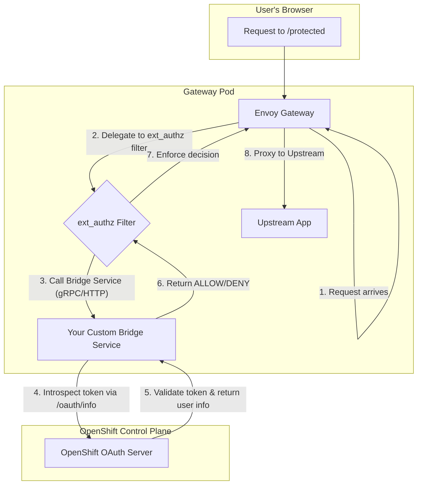
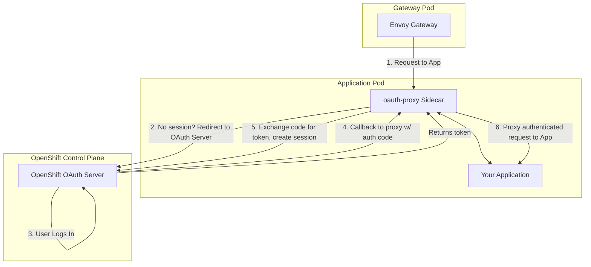

# Using an Envoy Auth Filter with the OpenShift OAuth Server

## Executive Summary

**Is it possible?** Yes, but **not** with Envoy's standard `envoy.filters.http.oauth2` filter.

**How?** The only viable approach is to use the `envoy.filters.http.ext_authz` filter and build a custom "bridge" service that communicates with the OpenShift OAuth server.

**Is it recommended?**
-   **For user-facing web applications:** **No.** The established and officially supported `oauth-proxy` sidecar pattern is far superior because it handles the entire user login and session flow.
-   **For internal service-to-service API authentication:** **Maybe.** If services are already passing around OpenShift-issued opaque tokens, an `ext_authz` bridge can be a clean way to validate them at the gateway.

This document details why the direct approach fails and outlines the architecture for both the technically possible solution and the recommended one.

---

## The Core Problem: A Mismatch of Standards

The primary reason for incompatibility is that Envoy's built-in `oauth2` filter is designed for a **standard OpenID Connect (OIDC) provider**, while the OpenShift OAuth server is a **specialized OAuth 2.0 server** tightly integrated with Kubernetes. It is not a fully-compliant OIDC provider.

Here is a detailed comparison of the incompatibilities:

| Feature | Envoy `oauth2` Filter Expects (Standard OIDC) | OpenShift OAuth Server Provides (Specialized OAuth 2.0) | Incompatibility Reason |
| :--- | :--- | :--- | :--- |
| **Protocol** | **OpenID Connect (OIDC)**, a strict superset of OAuth 2.0. | **Custom OAuth 2.0**. It is *not* a certified OIDC provider. | OpenShift OAuth lacks critical OIDC endpoints and token formats. |
| **Discovery Endpoint** | A standard `/.well-known/openid-configuration` endpoint. | **None.** | Envoy cannot auto-configure its endpoints, keys, and capabilities. |
| **Token Format** | A **JWT** (JSON Web Token) `id_token` that can be validated locally. | **Opaque Access Tokens** (e.g., `sha256~AbCdEf...`). | The token is a random string. Envoy cannot extract user info or validate it without calling back to the server. |
| **User Info Endpoint** | A standard `/userinfo` endpoint. | A **non-standard `/oauth/info`** endpoint. | Envoy's filter doesn't know how to query this custom endpoint. |
| **Client Management** | Clients managed via the IDP's UI or standard APIs. | Clients are Kubernetes Custom Resources (`OAuthClient`). | This highlights the deep, non-standard integration with Kubernetes. |

Due to these fundamental differences, you cannot simply configure Envoy's `oauth2` filter to point at the OpenShift OAuth server and expect it to work.

---

## The Technically Possible (But Not Recommended) Approach

The only way to integrate Envoy directly is to use the `ext_authz` filter, which delegates the authorization decision to an external service that you create.

### Architecture: `ext_authz` Bridge

### Your Custom Bridge Service Would:
1.  Receive the request metadata from Envoy.
2.  Extract the opaque access token from the `Authorization: Bearer` header.
3.  Make a `GET` request to the OpenShift OAuth server's `/oauth/info` endpoint with the token.
4.  Receive the user info (or an error if the token is invalid).
5.  Return an `ALLOW` or `DENY` decision to Envoy.

### Downsides to this Approach
-   **High Implementation Cost:** You must build and maintain this stateful bridge service.
-   **Incomplete Solution:** This pattern **only handles token validation**. It does *not* manage the initial user login flow (i.e., redirecting an unauthenticated user to a login page). The `ext_authz` protocol is not designed for initiating redirects.
-   **Increased Complexity:** You are adding another moving part to your infrastructure that can fail.

---

## The Recommended & Supported Solution: `oauth-proxy`

The problem of authenticating users for web applications against the OpenShift OAuth server is already solved by the `oauth-proxy` component. It is designed specifically for this purpose.

### Architecture: `oauth-proxy` Sidecar Pattern

### Why This Pattern Is Superior
1.  **Handles the Full Flow:** It manages the entire redirect loop for login, session cookie creation, and token validation.
2.  **No Custom Code:** It is a hardened, production-ready, and officially supported component.
3.  **Secure by Default:** It correctly implements secure cookies, token refreshing, and session management.
4.  **Purpose-Built:** It is designed to work with the OpenShift OAuth server's non-standard endpoints and behaviors.

---

## Final Verdict

**Can you build an Envoy auth filter to use the OpenShift OAuth server?**
Yes, by using `ext_authz` and writing a custom bridge service for token validation.

**Should you?**
-   **For user-facing web apps:** **No.** Use the `oauth-proxy` pattern. It is the complete, secure, and low-effort solution.
-   **For internal service-to-service API auth:** **Maybe.** If your services are simply passing around opaque OpenShift tokens, this `ext_authz` pattern could be a valid way to protect them at the mesh gateway without the overhead of a sidecar for every service. However, a standard OIDC provider with JWTs is often a better choice for new microservices architectures.

For the vast majority of use cases, you should follow the established `oauth-proxy` pattern. It correctly and securely achieves the goal of protecting applications with OpenShift authentication. 