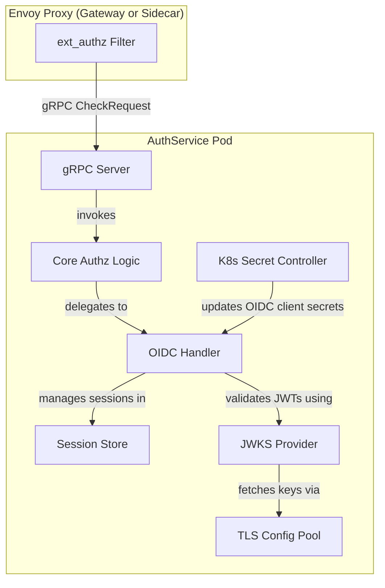
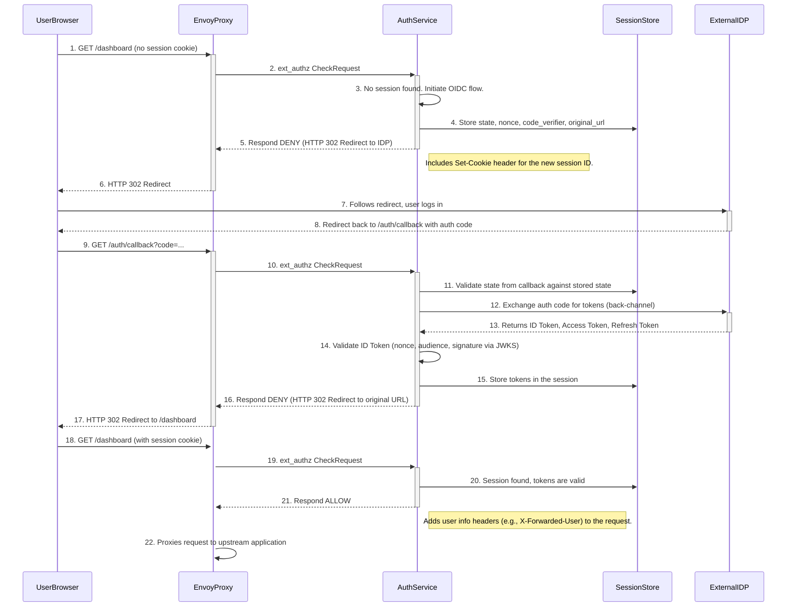
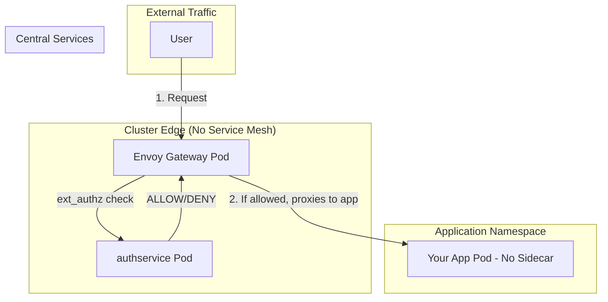
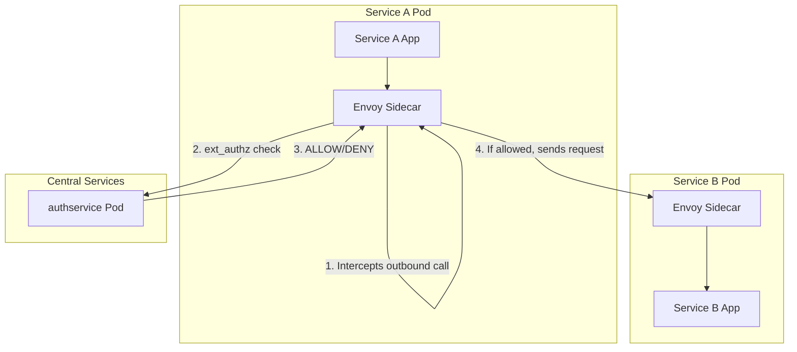

# Istio Ecosystem AuthService: A Deep Dive

## Executive Summary

The `istio-ecosystem/authservice` is a sophisticated, OIDC-aware external authorization (`ext_authz`) server for Envoy. Its primary purpose is to offload the entire **OIDC Authorization Code Grant Flow** from your applications to the service mesh infrastructure.

It is not a simple token-validating webhook; it is a full **OIDC Relying Party** that handles the entire interactive user login lifecycle, including redirecting users to an external Identity Provider (IDP), session management, and transparent token refreshing.

**Key Capabilities:**
*   **Centralized OIDC Logins:** Manages the full browser-based login and consent flow for any standard OIDC provider (Keycloak, Okta, Azure AD, etc.).
*   **Dynamic Configuration:** Can auto-configure its endpoints from an IDP's `.well-known/openid-configuration` discovery document.
*   **Session Management:** Relies on a pluggable session store (e.g., in-memory, Redis) to manage user sessions after login.
*   **Transparent Token Refresh:** Automatically uses refresh tokens to keep user sessions alive without forcing re-authentication.
*   **Dynamic Secrets:** Integrates with Kubernetes to watch for changes to `Secrets` (like OIDC client secrets) and reloads them without a restart.
*   **Performance Optimizations:** Uses `trigger_rules` to completely bypass authentication for public paths (e.g., `/healthz`, marketing pages), minimizing latency.

---

## High-Level Architecture

The `authservice` is designed as a modular Go application built on the `tetratelabs/run` lifecycle framework. This creates a clean separation of concerns between its various components.

**Core Architectural Components:**
1.  **`gRPC Server` (`internal/server/server.go`):** The main server that listens for `ext_authz` gRPC requests from Envoy.
2.  **`ExtAuthZFilter` (`internal/server/authz.go`):** The primary request handler. It implements the chain-and-filter processing logic and decides which authentication flow to apply.
3.  **`OIDCHandler` (`internal/authz/oidc.go`):** The heart of the OIDC logic. This component contains the detailed implementation of the Authorization Code Grant Flow.
4.  **`SessionStoreFactory` (`internal/oidc/session.go`):** A pluggable factory for creating and managing user session storage. This is the stateful component of the system.
5.  **`JWKSProvider` (`internal/oidc/jwks.go`):** A background service that fetches and caches the JSON Web Key Set (JWKS) from the OIDC provider, used for cryptographically verifying ID Tokens.
6.  **`SecretController` (`internal/k8s/secret.go`):** A Kubernetes controller that watches for changes to `Secrets` and dynamically updates the running configuration, allowing for seamless rotation of OIDC client secrets.

---

## The Lifecycle of an Unauthenticated User Request

This detailed flow explains how the `authservice` handles a user visiting a protected web application for the first time.

### Key Steps Explained

1.  **Request Interception:** Envoy calls the `Check` function in `authz.go`.
2.  **No Session Detected:** The code finds no valid session cookie and calls the `redirectToIDP` function.
3.  **Stateful Redirect:** `redirectToIDP` generates the necessary OIDC parameters (`state`, `nonce`, PKCE `code_verifier`), stores them in the session store, and builds a `DeniedHttpResponse` with a `302` status. This response tells Envoy to redirect the user's browser to the IDP's login page and to set the new session cookie.
4.  **Callback Handling:** The service detects the request to the `callback_uri`. The `retrieveTokens` function is called.
5.  **Security Validation:** It validates the `state` parameter from the request against the one in the session store to prevent CSRF.
6.  **Token Exchange:** It makes a secure, back-channel request to the IDP's token endpoint to exchange the authorization code for tokens.
7.  **JWT Validation:** It performs rigorous validation of the received ID Token:
    *   Checks the `nonce` to prevent replay attacks.
    *   Checks the `aud` (audience) claim matches its own `client_id`.
    *   Cryptographically verifies the token's signature using the keys fetched by the `JWKSProvider`.
8.  **Session Finalization:** The validated tokens are saved to the session store, and the user is redirected back to their original destination.
9.  **Authenticated Requests:** On subsequent requests, the service finds the session, validates token expiration, and if necessary, transparently uses the refresh token to get new tokens via the `refreshToken` function.

### Conclusion

The `istio-ecosystem/authservice` is a powerful, production-ready implementation of a centralized authentication gateway. It correctly uses the "rich denial" capabilities of the `ext_authz` protocol to orchestrate a complex, stateful OIDC login flow, allowing applications behind the Envoy proxy to remain completely unaware of authentication. Its dynamic configuration and cloud-native design make it a perfect fit for securing microservices in an Istio and Kubernetes environment. 

---

## Deployment Patterns: With vs. Without a Service Mesh

A common and important question is whether the `authservice` requires a full service mesh to function.

**The short answer is: No, it does not.**

The only hard dependency for the `authservice` is an **Envoy proxy** configured to use it as an external authorization (`ext_authz`) server. Where this Envoy proxy resides determines the architectural pattern.

### Pattern 1: Gateway-Only Deployment (No Service Mesh)

This is the most common and straightforward pattern for securing user-facing web applications. It focuses on authenticating **North-South** traffic (traffic entering the cluster from the outside).

**Architecture:**
*   An **Envoy-based ingress gateway** (like Istio Gateway or Envoy Gateway) is deployed at the edge of the cluster.
*   The `authservice` is deployed as a central service within the cluster.
*   Your application pods run **without any sidecars**.

**Key Characteristics:**
*   **No Service Mesh:** Your internal services communicate over standard Kubernetes networking.
*   **Centralized Enforcement:** Authentication is handled once, centrally, at the ingress point.
*   **Application Transparency:** Your applications require zero changes and are completely unaware of the authentication process or the mesh.
*   **Use Case:** The primary goal is to authenticate external users accessing your web UIs and APIs.

### Pattern 2: Full Service Mesh Deployment (Zero Trust)

This pattern is used when you need to enforce Zero Trust principles and secure **East-West** traffic (communication *between* services inside your cluster).

**Architecture:**
*   A full service mesh (like Istio) is deployed, injecting an **Envoy sidecar proxy** into every application pod.
*   The `authservice` is still deployed as a central service.

**Key Characteristics:**
*   **Service Mesh Required:** This pattern is, by definition, a service mesh implementation.
*   **Distributed Enforcement:** Every single request between services is intercepted and authorized.
*   **Zero Trust:** Untrusted workloads cannot communicate with protected services, even if they are on the same network.
*   **Use Case:** The primary goal is to authenticate and authorize internal service-to-service API calls, often for compliance or high-security environments.

### Summary Table

| Feature | **Gateway-Only Pattern** | **Full Service Mesh Pattern** |
| :--- | :--- | :--- |
| **Service Mesh Required?** | **No** | **Yes** |
| **Envoy Proxy Location** | In the Ingress Gateway Pod | In a Sidecar on every application pod |
| **Traffic Secured** | **North-South** (from outside to inside the cluster) | **East-West** (between services inside the cluster) |
| **Primary Goal** | Authenticate external users for web applications. | Authenticate and authorize internal service-to-service calls. |
| **Impact on Apps** | No changes to application deployments. | All pods are injected with an Envoy sidecar. |

**Conclusion:** You can confidently use the `authservice` in a simple, gateway-only architecture. You only need to introduce a full service mesh if and when your security requirements expand to include controlling internal East-West traffic. 