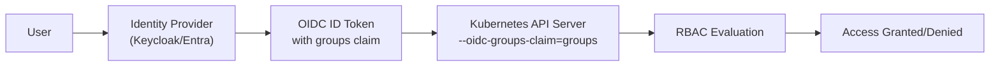
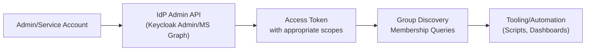
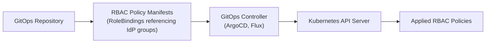
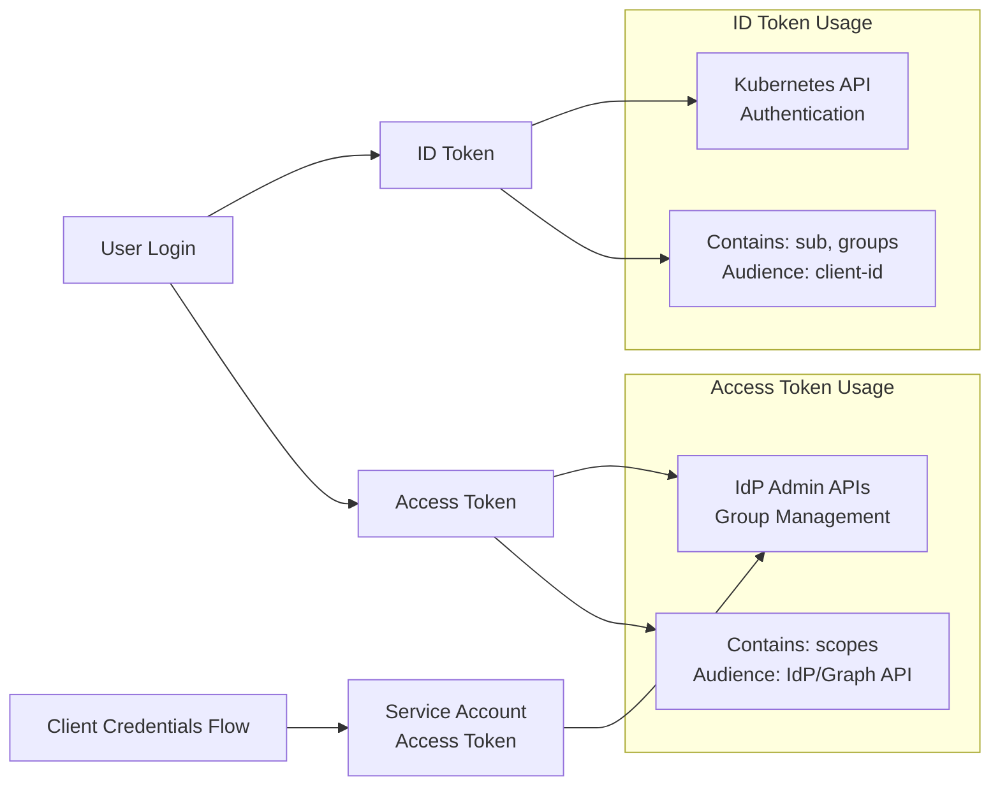
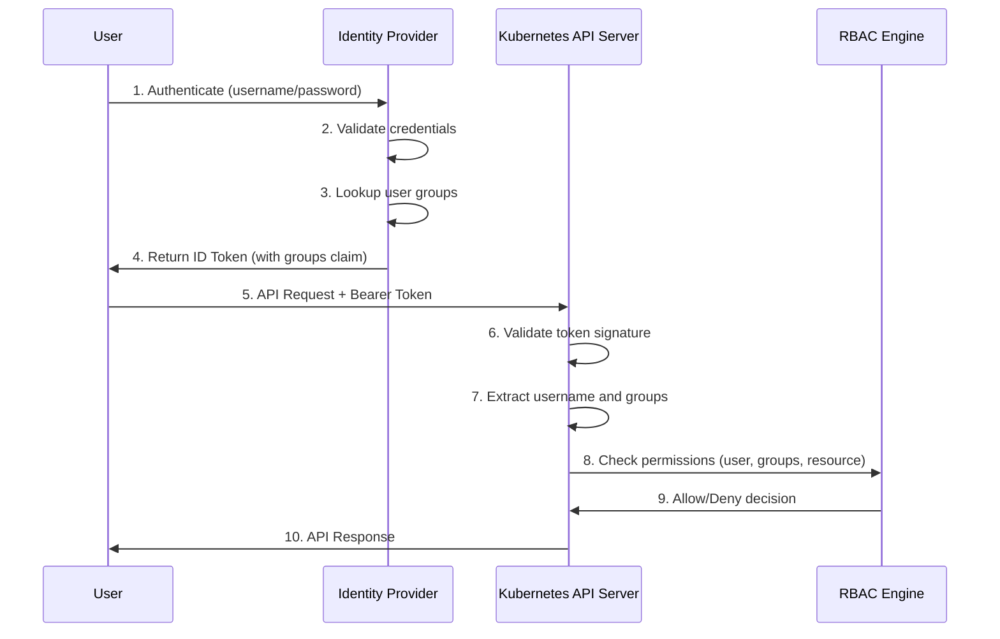

# Managing Groups with OIDC in Kubernetes

When migrating from **OpenShift-managed groups** to **direct OIDC
authentication** with the Kubernetes API server, group membership lives
entirely in the **Identity Provider (IdP)** (e.g., Keycloak, Microsoft
Entra). Below is guidance for how to handle this setup, including how
IdP group APIs work.

## Architecture Overview

The OIDC group management ecosystem involves three distinct workflows:

### 1. User Authentication Flow

How users authenticate and access Kubernetes resources:



### 2. Administrative Group Discovery Flow

How automation and tooling discover available groups and membership:



### 3. GitOps RBAC Policy Management

How RBAC policies that reference IdP groups are managed:



### Understanding Token Types

The OIDC ecosystem relies on different OAuth 2.0 grant types and token formats, each serving specific purposes. **Critically important for group management: only ID tokens reliably contain group claims for Kubernetes authentication.** Understanding which tokens contain groups and which do not is essential for successful implementation.

**Grant Types and Use Cases:**

| Grant Type | Purpose | Tokens Received | Use Case in Group Management |
|------------|---------|-----------------|------------------------------|
| **Authorization Code** | User interactive login | ID Token + Access Token + (Refresh Token) | User authentication to Kubernetes |
| **Client Credentials** | Service-to-service auth | Access Token | Service accounts querying IdP APIs |
| **Password Grant (ROPC)** | Direct username/password auth | ID Token + Access Token + (Refresh Token) | Testing, legacy apps, CLI tools |
| **Refresh Token** | Token renewal without user interaction | New Access Token + (New Refresh Token) | Long-running services, token refresh |
| **On-Behalf-Of** | Token exchange for different audience | Access Token with new audience | Microsoft Graph API access |
| **Token Exchange (RFC 8693)** | Transform tokens for different services | Access Token with different scopes/audience | Keycloak admin API access |

**Token Types and Groups Claims:**

| Token Type | Format | Contains Groups? | Groups Reliability | Primary Use | K8s Auth? |
|------------|--------|------------------|-------------------|-------------|-----------|
| **ID Token** | JWT (always) | ✅ **YES** - Standard claim | **Reliable** - Designed for this | Kubernetes authentication | ✅ **YES** |
| **Access Token** | JWT or Opaque | ⚠️ **MAYBE** - IdP dependent | **Variable** - Not guaranteed | API authorization | ❌ **NO** |
| **Refresh Token** | Opaque (usually) | ❌ **NO** - Only renewal info | **N/A** - No claims | Token renewal | ❌ **NO** |
| **Bearer Token** | Any format | 🔄 **Depends on underlying token** | **Variable** - Check token type | HTTP transport mechanism | 🔄 **Depends** |

**Critical Distinctions:**

1. **🔑 GROUPS CLAIMS**: Only ID tokens reliably contain groups for Kubernetes authentication - never use access/refresh tokens for K8s auth
2. **ID Tokens vs Access Tokens**: ID tokens prove identity (who you are + groups), access tokens grant API permissions (what you can do)
3. **JWT vs Opaque**: JWT tokens are self-contained and readable, opaque tokens require validation at the issuer
4. **Audience Matters**: Access tokens are scoped to specific APIs - a Kubernetes token won't work for Microsoft Graph
5. **Bearer Tokens**: Generic term for any token in `Authorization: Bearer <token>` header - check underlying token type
6. **Refresh Tokens Never Contain Groups**: They're purely for token renewal, not authentication or authorization

**Token Flow Visualization:**



**Common Token Scenarios:**

``` bash
# Scenario 1: User logs in to kubectl
# Authorization Code flow returns:
# - ID Token (aud: k8s-client-id, groups claim present) → Used by kubectl
# - Access Token (aud: k8s-client-id) → Not typically used
# - Refresh Token → Used by kubectl to get new tokens

# Scenario 2: Service needs to list groups from Keycloak
# Client Credentials flow returns:
curl -X POST https://keycloak/realms/myrealm/protocol/openid-connect/token \
  -d "grant_type=client_credentials" \
  -d "client_id=group-service" \
  -d "client_secret=secret"
# Returns: Access Token (aud: account, scope: view-groups)

# Scenario 3: CLI tool or testing with username/password
# Password Grant (ROPC) - ⚠️ Use with caution:
curl -X POST https://keycloak/realms/myrealm/protocol/openid-connect/token \
  -d "grant_type=password" \
  -d "client_id=cli-client" \
  -d "username=testuser" \
  -d "password=testpass" \
  -d "scope=openid groups"
# Returns: ID Token + Access Token + Refresh Token (same as Authorization Code)

# Scenario 4: App needs Microsoft Graph access
# On-Behalf-Of flow returns:
curl -X POST https://login.microsoftonline.com/tenant/oauth2/v2.0/token \
  -d "grant_type=urn:ietf:params:oauth:grant-type:jwt-bearer" \
  -d "client_id=myapp" \
  -d "assertion=<user-access-token>" \
  -d "scope=https://graph.microsoft.com/.default"
# Returns: Access Token (aud: https://graph.microsoft.com)
```

**🔍 Verifying Groups in Tokens:**

``` bash
# Check if a JWT token contains groups (decode without verification for inspection)
# ID Token example - Groups claim present:
echo "eyJhbGc..." | base64 -d | jq .
{
  "iss": "https://keycloak/realms/myrealm",
  "aud": "kubernetes-client",
  "sub": "user123",
  "groups": ["developers", "platform-team"],  ← Groups present!
  "preferred_username": "alice",
  "exp": 1640995200
}

# Access Token example - Groups may be missing:
{
  "iss": "https://keycloak/realms/myrealm", 
  "aud": "account",
  "sub": "user123",
  "scope": "view-groups view-users",  ← No groups claim!
  "exp": 1640995200
}

# Use jwt.io, jwt-cli, or jq to inspect token payloads:
# jwt decode <token>  # Using jwt-cli tool
# echo "<token>" | cut -d. -f2 | base64 -d | jq .  # Manual decode
```

**🚨 CRITICAL: Common Token Mistakes**

❌ **WRONG - Using Access Token for Kubernetes:**
```yaml
# This will fail or not include groups!
apiVersion: v1
kind: Config
users:
- name: alice
  user:
    token: <access-token>  # ❌ Wrong token type!
```

✅ **CORRECT - Using ID Token for Kubernetes:**
```yaml
# This works and includes groups
apiVersion: v1
kind: Config  
users:
- name: alice
  user:
    token: <id-token>  # ✅ Correct token type!
```

**Why Access Tokens Fail:**
- Access tokens are for API authorization, not user authentication
- Group claims are optional and IdP-dependent in access tokens
- Kubernetes expects ID tokens for OIDC authentication
- Wrong audience (`aud`) claim for Kubernetes API server

**⚠️ Security Considerations for Password Grants:**

**When Password Grants Are Acceptable:**
- Local development and testing environments
- Legacy applications that cannot support browser-based flows
- Trusted CLI tools where user enters credentials directly
- Migration scenarios from basic auth systems

**When to Avoid Password Grants:**
- Production web applications (use Authorization Code + PKCE instead)
- Third-party applications (never share user credentials)
- Public/mobile clients (credentials can be extracted)
- Any scenario where Authorization Code flow is feasible

**Best Practices for Password Grants:**
- Require explicit IdP configuration to enable (often disabled by default)
- Use only with confidential clients that can protect credentials
- Implement credential validation and account lockout policies
- Consider it a temporary solution while migrating to proper OIDC flows
- Always use HTTPS to protect credentials in transit

### Detailed Authentication Sequence

Here's the step-by-step process when a user accesses Kubernetes resources:



**Key Points:**
- **Group membership** is managed entirely in the IdP, not in Kubernetes
- **RBAC policies** reference IdP group names/IDs as subjects in role bindings (managed via GitOps)
- **Group discovery** (listing available groups, querying membership) requires separate access tokens with admin scopes
- **GitOps workflows** manage the RBAC policy definitions, but actual group membership changes happen in the IdP
- **Token types matter**: ID tokens for authentication, access tokens for admin APIs

------------------------------------------------------------------------

## 1. How IdP Group APIs Work

### Keycloak

-   **Token injection**: Keycloak can include groups (or roles) as
    claims in tokens (e.g., `groups`).
-   **Group enumeration via Admin API**:
    -   `GET /{realm}/groups` → list all groups (paginated).
    -   `GET /{realm}/groups/{id}` → details for one group.
    -   `GET /{realm}/users/{id}/groups` → groups for a specific user.
-   Requires an **access token** with appropriate roles (`view-groups`,
    `view-users`), not just an ID token from login.

**Example:**

``` bash
# Get admin token (client credentials)
curl -X POST https://<KEYCLOAK>/realms/<realm>/protocol/openid-connect/token   -d grant_type=client_credentials   -d client_id=<admin-client>   -d client_secret=<secret>

# List groups
curl -H "Authorization: Bearer <access_token>"   https://<KEYCLOAK>/admin/realms/<realm>/groups
```

### Microsoft Entra ID (Azure AD)

-   **Token injection**: Can include `groups` claims in ID/Access
    tokens. If the user is in too many groups, a **link to Microsoft
    Graph** is added instead of embedding them all.
-   **Group enumeration via Microsoft Graph API**:
    -   `GET https://graph.microsoft.com/v1.0/groups` → all groups.
    -   `GET https://graph.microsoft.com/v1.0/me/memberOf` → groups for
        signed-in user.
    -   `GET https://graph.microsoft.com/v1.0/users/{id}/memberOf` →
        groups for a given user.
-   Requires an **access token** minted for Graph
    (`aud: https://graph.microsoft.com`) with scopes like
    `Group.Read.All` or `Directory.Read.All`.

**Example:**

``` bash
# Get Graph token (client credentials)
curl -X POST https://login.microsoftonline.com/<tenant>/oauth2/v2.0/token   -d grant_type=client_credentials   -d client_id=<appId>   -d client_secret=<secret>   -d scope="https://graph.microsoft.com/.default"

# List groups
curl -H "Authorization: Bearer <graph_access_token>"   https://graph.microsoft.com/v1.0/groups
```

**Important:**
- An **ID token from login is not enough**. You need an **access token**
with the right `aud` and scopes.

### Admin API Access Token Requirements

Both Keycloak and Microsoft Entra ID share similar challenges when it comes to accessing group information via their admin APIs.

**The Core Problem:**

The ID token from user login is designed for authentication and contains user claims (including groups if configured). However, both IdP admin APIs require a separate access token with admin privileges. This creates a chicken-and-egg problem: you need admin access to list groups, but users typically shouldn't have admin roles.

**Token Exchange Solution:**

OAuth 2.0 Token Exchange (RFC 8693) can help bridge this gap:

``` bash
# Keycloak token exchange
curl -X POST https://<KEYCLOAK>/realms/<realm>/protocol/openid-connect/token \
  -d grant_type=urn:ietf:params:oauth:grant-type:token-exchange \
  -d client_id=<your-client> \
  -d client_secret=<secret> \
  -d subject_token=<user-id-token> \
  -d requested_token_type=urn:ietf:params:oauth:token-type:access_token \
  -d audience=<admin-client-id>

# Microsoft Entra ID on-behalf-of flow (similar concept)
curl -X POST https://login.microsoftonline.com/<tenant>/oauth2/v2.0/token \
  -d grant_type=urn:ietf:params:oauth:grant-type:jwt-bearer \
  -d client_id=<client-id> \
  -d client_secret=<secret> \
  -d assertion=<user-access-token> \
  -d scope=https://graph.microsoft.com/.default \
  -d requested_token_use=on_behalf_of
```

**Remaining Challenges:**
- **Permission Model**: Users still need admin roles assigned, which may violate least-privilege principles
- **Security Scope**: Exchanged tokens might grant broader admin access than needed
- **Token Lifetime**: Admin tokens may have different expiration policies than user tokens
- **Complexity**: Additional token management logic in applications
- **Delegation Rights**: Requires careful configuration of delegation permissions

**Better Alternatives:**
- **Service Account Pattern**: Use client credentials flow with a dedicated service account that has only the necessary group read permissions
- **Proxy Service**: Build a lightweight API that handles group lookups with proper authorization and caching
- **IdP Configuration**: Configure group claims to include all necessary groups in ID tokens, avoiding admin API calls entirely
- **Group Synchronization**: Periodically sync group information to a local cache or database

## 2. Group Management Challenges

### Token Size Limits and Group Overage

While embedding groups in OIDC tokens is convenient, there are several important limitations to consider:

**Token Size Limits:**

OIDC tokens are typically transmitted in HTTP headers, which have size constraints:
- **Web servers**: Nginx default is 4KB-8KB, Apache 8KB
- **Load balancers**: Often 16KB-32KB limits
- **Browsers**: Vary widely, some as low as 2KB for cookies
- **Proxies**: Corporate proxies may have strict limits

When users belong to many groups, tokens can exceed these limits, causing authentication failures.

**Group Overage Handling:**

Both IdPs have mechanisms to handle large group lists:

``` bash
# Keycloak: Groups may be omitted if token becomes too large
# Check realm settings for "Access Token Lifespan" and group claim limits

# Microsoft Entra ID: Returns overage claim instead of groups
{
  "aud": "your-app-id",
  "sub": "user-id", 
  "groups": ["group1", "group2"],  # Only partial list
  "_claim_names": {
    "groups": "src1"
  },
  "_claim_sources": {
    "src1": {
      "endpoint": "https://graph.microsoft.com/v1.0/me/memberOf"
    }
  }
}
```

**Important:** The endpoint in `_claim_sources` requires a Microsoft Graph access token, NOT the user's ID token. This creates the same token access challenge discussed earlier - you need a separate token with `aud: https://graph.microsoft.com` and appropriate scopes like `Group.Read.All`.

**Performance Impacts:**
- **Network overhead**: Large tokens increase bandwidth usage
- **Parsing cost**: Applications must parse larger JSON structures
- **Memory usage**: Tokens stored in session state consume more memory
- **Caching complexity**: Large tokens complicate caching strategies

**Recommended Mitigations:**

1. **Group Filtering**: Configure IdP to include only relevant groups in tokens
2. **Role-Based Claims**: Use roles instead of groups (`--oidc-groups-claim=roles`)
3. **Group Hierarchies**: Structure groups to minimize membership overlap
4. **OIDC Brokers**: Use Dex or Pinniped to expand groups into new tokens
5. **Lazy Loading**: Fetch detailed group information on-demand via admin APIs
6. **Proxy Services**: Use intermediary services to manage group resolution

**Monitoring and Alerting:**
- Monitor token sizes in production
- Alert on authentication failures due to header size limits
- Track group membership growth over time

------------------------------------------------------------------------

## 3. Kubernetes with OIDC: Configuration

### Use IdP Groups Directly

-   Configure the API server with:
    -   `--oidc-issuer-url=...`
    -   `--oidc-client-id=...`
    -   `--oidc-username-claim=sub|email`
    -   `--oidc-groups-claim=groups`
    -   (Optional) `--oidc-groups-prefix=oidc:`
-   Bind RBAC roles directly to IdP group strings.

**Example:**

``` yaml
apiVersion: rbac.authorization.k8s.io/v1
kind: ClusterRoleBinding
metadata:
  name: view-for-team-platform
roleRef:
  apiGroup: rbac.authorization.k8s.io
  kind: ClusterRole
  name: view
subjects:
- kind: Group
  name: oidc:team-platform
```

------------------------------------------------------------------------

## 4. Recommended Implementation Patterns

### GitOps RBAC Management

-   OpenShift provided first-class `Group` objects. Kubernetes does not.
-   Manage RBAC declaratively using **GitOps** (Helm/Kustomize) with Role/ClusterRoleBindings that reference IdP group strings.
-   Keep RBAC policies in version control and apply via CI/CD pipelines.

``` yaml
# Example GitOps RBAC structure
apiVersion: rbac.authorization.k8s.io/v1
kind: ClusterRoleBinding
metadata:
  name: developers-view
  labels:
    managed-by: gitops
roleRef:
  apiGroup: rbac.authorization.k8s.io
  kind: ClusterRole
  name: view
subjects:
- kind: Group
  name: oidc:developers
  apiGroup: rbac.authorization.k8s.io
```

### Service Account Pattern for Admin APIs

For applications needing group information:

1. **Use client credentials flow** with dedicated service accounts
2. **Minimize permissions** - only grant necessary IdP read access
3. **Cache appropriately** - group information doesn't change frequently
4. **Handle errors gracefully** - IdP APIs may be temporarily unavailable

``` bash
# Example service account setup for Keycloak
# 1. Create service account client
# 2. Assign minimal roles (view-groups, view-users)  
# 3. Use client credentials in your application

curl -X POST https://<KEYCLOAK>/realms/<realm>/protocol/openid-connect/token \
  -d grant_type=client_credentials \
  -d client_id=<service-account-client> \
  -d client_secret=<secret>
```

### Proxy Service Pattern

For complex group operations, consider building a lightweight proxy:

-   **Centralized access** to IdP APIs with proper credentials management
-   **Caching layer** to reduce IdP API calls
-   **Authorization checks** before returning group information
-   **Audit logging** of group queries and modifications

### Naming and Stability Best Practices

-   **Prefer group IDs** over names when possible (immutable)
-   **Standardize naming conventions** for group names
-   **Use `--oidc-groups-prefix`** to avoid collisions with local Kubernetes groups
-   **Document group naming** in your organization's runbooks

### Common Pitfalls to Avoid

-   **Expecting Kubernetes to expand group overage links** - handle this at the application layer
-   **Creating Kubernetes `Group` objects** - they have no effect on OIDC authentication  
-   **Calling IdP APIs directly from browser apps** - CORS and permissions issues
-   **Confusing ID tokens with access tokens** - wrong audience and scopes will fail
-   **Storing admin credentials in application config** - use proper secret management

------------------------------------------------------------------------

## 5. Custom Group Management UI Feasibility

Teams migrating from OpenShift often consider building custom UIs for group management, similar to OpenShift's native group administration. However, this approach faces significant challenges with external OIDC providers.

### Why It Seems Appealing

- **Familiar UX**: Replicate OpenShift's group management experience
- **Centralized Control**: Single interface for both Kubernetes RBAC and group membership
- **Custom Workflows**: Tailored approval processes, bulk operations, etc.
- **Integration**: Embed group management into existing admin dashboards

### Technical Challenges

**API Complexity:**
Each IdP has different APIs, schemas, and capabilities:

``` bash
# Keycloak: REST API with realm-specific endpoints
GET /admin/realms/{realm}/groups
POST /admin/realms/{realm}/users/{userId}/groups/{groupId}

# Microsoft Graph: Different JSON schema, pagination, delta queries
GET https://graph.microsoft.com/v1.0/groups
POST https://graph.microsoft.com/v1.0/groups/{groupId}/members/$ref
```

**Authentication Requirements:**
- **Admin Credentials**: UI needs persistent admin-level access to IdP APIs
- **Token Management**: Handle token refresh, expiration, scope validation
- **Multi-Tenant**: Different auth flows for different IdP configurations
- **Security Risk**: Storing/managing admin credentials in your application

**Data Complexity:**
- **Group Hierarchies**: Nested groups, inheritance patterns vary by IdP
- **Pagination**: Large organizations may have thousands of groups/users
- **Schema Differences**: Group attributes, metadata, and relationships differ
- **Sync Challenges**: Real-time updates, conflict resolution, eventual consistency

### Security and Operational Concerns

**Privilege Escalation:**
Building a group management UI essentially means:
- Your application needs admin privileges to the IdP
- Users of your UI can potentially gain admin-level access indirectly
- Audit trails become complex (was it the user or your service account?)

**Maintenance Burden:**
- **API Changes**: IdP vendors regularly update their APIs
- **Error Handling**: Complex failure scenarios across different IdPs
- **Testing**: Mock different IdP behaviors, edge cases, error conditions
- **Documentation**: Keep UI documentation in sync with IdP capabilities

### Recommended Alternatives

**1. Use Native IdP Admin Interfaces**
- **Keycloak Admin Console**: Full-featured, actively maintained
- **Microsoft Entra Admin Center**: Enterprise-grade with proper audit trails
- **Benefits**: No maintenance burden, full feature support, proper audit logging

**2. Delegated Administration Patterns**
Many IdPs support delegation without full admin privileges:

``` yaml
# Keycloak: Create realm-specific admin roles
realm-admin: false
manage-users: true
view-users: true
manage-groups: true
view-groups: true
```

**3. GitOps + Self-Service Patterns**
- Users submit group membership requests via Git PRs/issues
- Automated workflows validate and apply changes via IdP APIs
- Maintains audit trail and approval processes in Git

**4. Integration via Webhooks/Events**
- Configure IdP to send change notifications to your systems
- React to group changes rather than trying to initiate them
- Maintain read-only views with external update triggers

### When Custom UIs Make Sense

Limited scenarios where custom group management might be justified:
- **Simple Read-Only Views**: Displaying group membership for awareness
- **Specific Workflow Integration**: Approval processes tied to business logic
- **Limited Scope**: Single IdP, small user base, simple group structures
- **Dedicated Resources**: Team committed to long-term maintenance

### Best Practices If You Must Build Custom UI

**1. Minimize Scope:**
- Focus on specific workflows, not general group management
- Use service accounts with minimal necessary permissions
- Implement comprehensive logging and audit trails

**2. Defensive Programming:**
- Assume IdP APIs will change or be temporarily unavailable
- Implement proper retry logic and circuit breakers
- Cache data appropriately but assume it may be stale

**3. Security First:**
- Never store IdP admin credentials in application config
- Use short-lived tokens where possible
- Implement proper authorization checks in your UI layer

### Summary

While technically possible, building custom group management UIs for external OIDC providers is generally **not recommended** due to complexity, security risks, and maintenance burden. The native IdP administrative interfaces are purpose-built, well-maintained, and designed for this exact use case.

Focus your engineering efforts on integrating with IdP group information rather than trying to manage it.

------------------------------------------------------------------------

## 6. Day-0 Checklist

1.  Configure apiserver OIDC flags (issuer, client, username, groups,
    prefix).
2.  Ensure IdP emits groups/roles you plan to bind.
3.  Create baseline RBAC bindings in GitOps.
4.  Use IdP APIs for group enumeration, not Kubernetes.
5.  Manage membership only in the IdP.

------------------------------------------------------------------------

**Summary:**
- Groups should be **managed in the IdP**.
- Kubernetes consumes groups as strings from OIDC claims.
- If you need all groups or membership data, query the **IdP's Admin/Graph API** with a proper access token.
- Keep RBAC declarative in Git, and avoid drift between K8s and the IdP.
