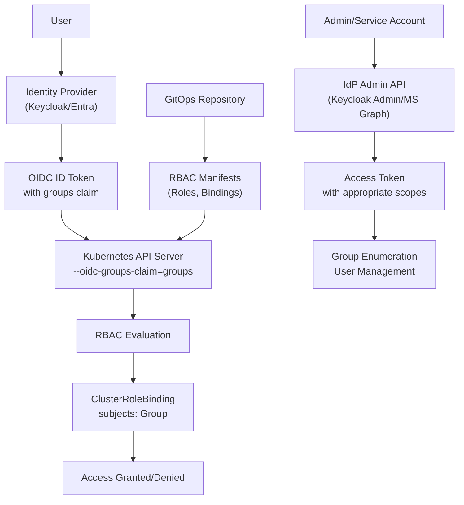
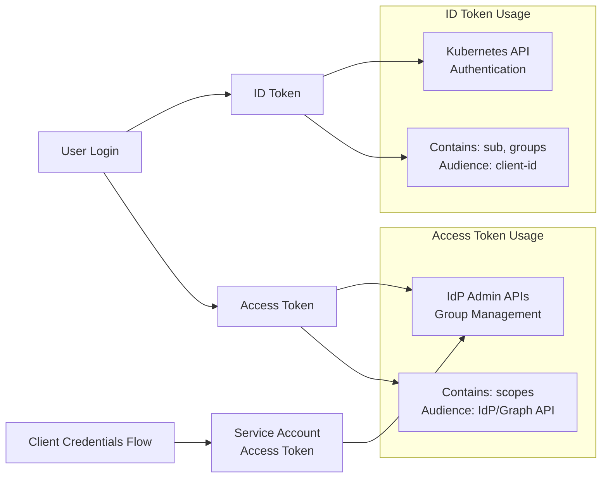
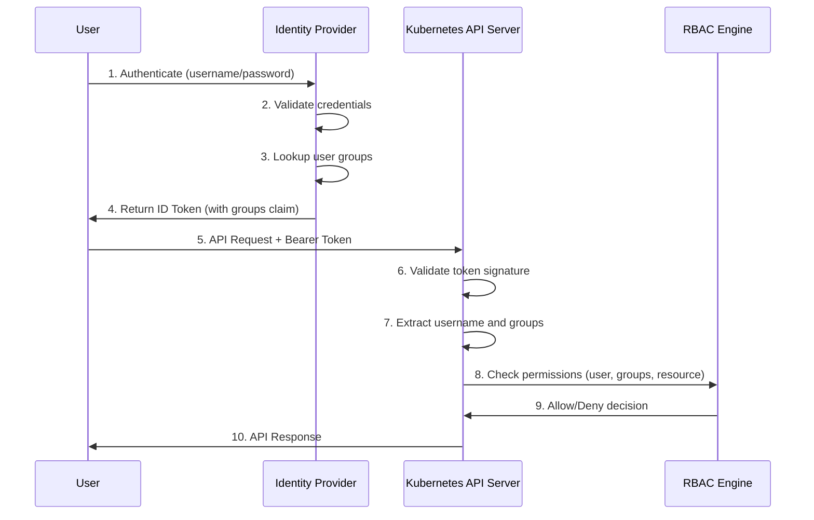

# Managing Groups with OIDC in Kubernetes

When migrating from **OpenShift-managed groups** to **direct OIDC
authentication** with the Kubernetes API server, group membership lives
entirely in the **Identity Provider (IdP)** (e.g., Keycloak, Microsoft
Entra). Below is guidance for how to handle this setup, including how
IdP group APIs work.

## Architecture Overview



------------------------------------------------------------------------

## 1. How IdP Group APIs Work

### Keycloak

-   **Token injection**: Keycloak can include groups (or roles) as
    claims in tokens (e.g., `groups`).
-   **Group enumeration via Admin API**:
    -   `GET /{realm}/groups` → list all groups (paginated).
    -   `GET /{realm}/groups/{id}` → details for one group.
    -   `GET /{realm}/users/{id}/groups` → groups for a specific user.
-   Requires an **access token** with appropriate roles (`view-groups`),
    not just an ID token from login.

**Example:**

``` bash
# Get admin token (client credentials)
curl -X POST https://<KEYCLOAK>/realms/<realm>/protocol/openid-connect/token   -d grant_type=client_credentials   -d client_id=<admin-client>   -d client_secret=<secret>

# List groups
curl -H "Authorization: Bearer <access_token>"   https://<KEYCLOAK>/admin/realms/<realm>/groups
```

### Microsoft Entra ID (Azure AD)

-   **Token injection**: Can include `groups` claims in ID/Access
    tokens. If the user is in too many groups, a **link to Microsoft
    Graph** is added instead of embedding them all.
-   **Group enumeration via Microsoft Graph API**:
    -   `GET https://graph.microsoft.com/v1.0/groups` → all groups.
    -   `GET https://graph.microsoft.com/v1.0/me/memberOf` → groups for
        signed-in user.
    -   `GET https://graph.microsoft.com/v1.0/users/{id}/memberOf` →
        groups for a given user.
-   Requires an **access token** minted for Graph
    (`aud: https://graph.microsoft.com`) with scopes like
    `Group.Read.All` or `Directory.Read.All`.

**Example:**

``` bash
# Get Graph token (client credentials)
curl -X POST https://login.microsoftonline.com/<tenant>/oauth2/v2.0/token   -d grant_type=client_credentials   -d client_id=<appId>   -d client_secret=<secret>   -d scope="https://graph.microsoft.com/.default"

# List groups
curl -H "Authorization: Bearer <graph_access_token>"   https://graph.microsoft.com/v1.0/groups
```

**Important:**\
- An **ID token from login is not enough**. You need an **access token**
with the right `aud` and scopes.

### Token Types and Usage



------------------------------------------------------------------------

## 2. Kubernetes with OIDC: Suggested Approach

### Use IdP Groups Directly

-   Configure the API server with:
    -   `--oidc-issuer-url=...`
    -   `--oidc-client-id=...`
    -   `--oidc-username-claim=sub|email`
    -   `--oidc-groups-claim=groups`
    -   (Optional) `--oidc-groups-prefix=oidc:`
-   Bind RBAC roles directly to IdP group strings.

**Example:**

``` yaml
apiVersion: rbac.authorization.k8s.io/v1
kind: ClusterRoleBinding
metadata:
  name: view-for-team-platform
roleRef:
  apiGroup: rbac.authorization.k8s.io
  kind: ClusterRole
  name: view
subjects:
- kind: Group
  name: oidc:team-platform
```

### Authentication and Authorization Flow



### Handle Group Overage

-   **Preferred:** Configure IdP to emit group names or IDs under the
    claim threshold.\
-   **Alternative:** Use an OIDC broker (Dex, Pinniped) that expands
    groups into a new token.\
-   **Or:** Use roles instead of groups (`--oidc-groups-claim=roles`).

### Replace OpenShift Group APIs

-   OpenShift provided first-class `Group` objects. Kubernetes does
    not.\
-   Manage RBAC in **GitOps** (Helm/Kustomize) with
    Role/ClusterRoleBindings that reference IdP group strings.\
-   If automation is needed, query IdP APIs (Keycloak Admin API or
    Microsoft Graph) and render RBAC YAML.

### Application Group Lookups

-   Apps needing "list all groups" should query IdP APIs, not
    Kubernetes.\
-   Use **service accounts** or **client credentials** for backend
    calls.

### Naming & Stability

-   Prefer **group IDs** if possible (immutable).\
-   If using names, standardize conventions.\
-   Use `--oidc-groups-prefix` to avoid collisions.

### Common Pitfalls

-   Expecting Kubernetes to expand group overage links.\
-   Creating Kubernetes `Group` objects (they have no effect).\
-   Calling IdP APIs directly from browser apps (CORS/perms issues).\
-   Confusing ID tokens with access tokens.

------------------------------------------------------------------------

## 3. Day-0 Checklist

1.  Configure apiserver OIDC flags (issuer, client, username, groups,
    prefix).\
2.  Ensure IdP emits groups/roles you plan to bind.\
3.  Create baseline RBAC bindings in GitOps.\
4.  Use IdP APIs for group enumeration, not Kubernetes.\
5.  Manage membership only in the IdP.

------------------------------------------------------------------------

**Summary:**\
- Groups should be **managed in the IdP**.\
- Kubernetes consumes groups as strings from OIDC claims.\
- If you need all groups or membership data, query the **IdP's
Admin/Graph API** with a proper access token.\
- Keep RBAC declarative in Git, and avoid drift between K8s and the IdP.
