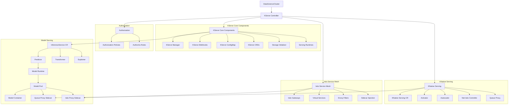

# KServe Component Deep Dive

This document provides a comprehensive analysis of the **KServe** component in the OpenDataHub operator, covering its configuration schema, deployment process, topology, and sub-components.

## Overview

KServe is a machine learning model serving component that provides scalable and standardized inference serving capabilities. It integrates with Istio Service Mesh and OpenShift Serverless to provide advanced traffic management, security, and autoscaling features.

## DSC Schema Configuration

The KServe component can be configured through the `DataScienceCluster` (DSC) with the following schema:

### KServe Schema Structure

```go
type DSCKserve struct {
    // Management state (Managed, Unmanaged, Removed)
    ManagementState operatorv1.ManagementState `json:"managementState,omitempty"`
    
    // KNative Serving configuration
    Serving infrav1.ServingSpec `json:"serving,omitempty"`
    
    // Default deployment mode (Serverless or RawDeployment)
    DefaultDeploymentMode DefaultDeploymentMode `json:"defaultDeploymentMode,omitempty"`
    
    // Raw deployment service configuration (Headless or Headed)
    RawDeploymentServiceConfig RawServiceConfig `json:"rawDeploymentServiceConfig,omitempty"`
    
    // NVIDIA NIM integration
    NIM NimSpec `json:"nim,omitempty"`
    
    // Development flags
    DevFlags *common.DevFlags `json:"devFlags,omitempty"`
}
```

### Configuration Fields Explained

#### 1. ManagementState
- **Type**: `operatorv1.ManagementState`
- **Values**: `Managed`, `Unmanaged`, `Removed`
- **Effect**: Controls whether the operator manages the KServe component
- **Default**: `Managed`

#### 2. Serving Configuration
```go
type ServingSpec struct {
    ManagementState operatorv1.ManagementState `json:"managementState,omitempty"`
    Name            string                      `json:"name,omitempty"`
    IngressGateway  GatewaySpec                `json:"ingressGateway,omitempty"`
}
```

**Key Effects**:
- **ManagementState**: Controls KNative Serving deployment
- **Name**: Specifies the KNativeServing resource name (default: "knative-serving")
- **IngressGateway**: Configures Istio ingress gateway settings

#### 3. DefaultDeploymentMode
- **Type**: `DefaultDeploymentMode`
- **Values**: `Serverless`, `RawDeployment`
- **Effect**: Sets the default deployment mode in the `inferenceservice-config` ConfigMap
- **Default**: `Serverless` (when Serving is Managed)

**Impact**:
- **Serverless**: Models deployed as KNative services with auto-scaling
- **RawDeployment**: Models deployed as standard Kubernetes deployments

#### 4. RawDeploymentServiceConfig
- **Type**: `RawServiceConfig`
- **Values**: `Headless`, `Headed`
- **Effect**: Configures service type for RawDeployment mode
- **Default**: `Headless`

**Impact**:
- **Headless**: Sets `ServiceClusterIPNone = true` (no ClusterIP)
- **Headed**: Sets `ServiceClusterIPNone = false` (normal ClusterIP)

#### 5. NIM (NVIDIA NIM Integration)
```go
type NimSpec struct {
    ManagementState operatorv1.ManagementState `json:"managementState,omitempty"`
}
```

**Effect**: Enables/disables NVIDIA NIM integration for optimized inference

#### 6. DevFlags
- **Type**: `*common.DevFlags`
- **Effect**: Allows custom manifest URIs and logging configuration for development
- **Production**: Should not be used in production environments

## Prerequisites and Dependencies

KServe has several hard dependencies that must be satisfied:

### Required Operators
1. **OpenShift Serverless Operator** - Required for KNative Serving
2. **OpenShift Service Mesh Operator** - Required for Istio integration
3. **Authorino Operator** - Optional, for advanced authorization policies

### Required DSCI Configuration
The DSCInitialization must have ServiceMesh configured:
```yaml
apiVersion: dscinitialization.opendatahub.io/v1
kind: DSCInitialization
spec:
  serviceMesh:
    managementState: "Managed"
    controlPlane:
      name: data-science-smcp
      namespace: istio-system
```

## Deployment Process and Architecture

### Controller Actions Flow

The KServe controller executes the following actions in sequence:

1. **checkPreConditions** - Validates prerequisites
2. **initialize** - Sets up manifest paths
3. **devFlags** - Applies development configurations
4. **releases** - Manages component releases
5. **addTemplateFiles** - Adds service mesh and serving templates
6. **template** - Processes template files
7. **addServingCertResourceIfManaged** - Creates serving certificates
8. **removeOwnershipFromUnmanagedResources** - Cleanup unmanaged resources
9. **cleanUpTemplatedResources** - Removes unused templates
10. **kustomize** - Applies kustomizations
11. **observability** - Sets up monitoring
12. **customizeKserveConfigMap** - Configures KServe settings
13. **deploy** - Deploys resources
14. **deployments** - Manages deployments
15. **setStatusFields** - Updates component status
16. **deleteFeatureTrackers** - Cleanup legacy resources
17. **gc** - Garbage collection

### Topology and Sub-components

KServe deploys a complex topology of interconnected components:



## What KServe Hosts and Runtime Engines

### Model Types Supported

KServe is a **comprehensive model serving platform** that supports both traditional ML models and large language models (LLMs):

#### **Traditional ML/Predictive Models**
- **Scikit-learn** models (classification, regression, clustering)
- **XGBoost** models (gradient boosting)
- **LightGBM** models (gradient boosting)
- **TensorFlow** models (deep learning)
- **PyTorch** models (deep learning)
- **ONNX** models (cross-platform ML)
- **PMML** models (Predictive Model Markup Language)
- **Paddle** models (PaddlePaddle)
- **Triton** models (NVIDIA's inference server)

#### **Large Language Models (LLMs)**
- **HuggingFace** models (transformers, LLMs)
- **OpenAI API compatible** models
- **Custom LLM** implementations
- **Multi-modal models** (text, embeddings, reranking)

### Runtime Engines

KServe uses multiple runtime engines depending on the model type and deployment requirements:

#### **1. vLLM - High-Performance LLM Engine**
- **Purpose**: High-performance LLM inference engine with GPU acceleration
- **GPU Support**: CUDA (NVIDIA), ROCm (AMD), Intel Gaudi, Spyre
- **Features**: Multi-node deployments, dynamic batching, streaming responses
- **APIs**: OpenAI-compatible chat, completion, embedding, reranking
- **Templates Available**:
  - `vllm-cuda-template.yaml` - NVIDIA GPU support
  - `vllm-rocm-template.yaml` - AMD GPU support  
  - `vllm-gaudi-template.yaml` - Intel Gaudi accelerator
  - `vllm-spyre-template.yaml` - Spyre accelerator
  - `vllm-multinode-template.yaml` - Multi-node distributed inference

#### **2. CAIKIT + TGIS (Text Generation Inference Server)**
- **Purpose**: Enterprise LLM serving with IBM's CAIKIT framework
- **Focus**: Production-ready LLM deployments with enterprise features
- **Integration**: Two-container setup (TGIS + CAIKIT transformer)

#### **3. OpenVINO Model Server (OVMS)**
- **Purpose**: Intel's optimized inference for traditional ML models
- **Supports**: TensorFlow, PyTorch, ONNX, OpenVINO IR, Paddle formats
- **Hardware**: CPU optimization and Intel hardware acceleration
- **Protocols**: REST and gRPC (v2)

#### **4. TensorFlow Serving**
- **Purpose**: Google's production TensorFlow model serving
- **Focus**: High-performance TensorFlow model inference
- **Versions**: TensorFlow 1.x and 2.x support

#### **5. TorchServe**
- **Purpose**: PyTorch's official model serving framework
- **Focus**: PyTorch model deployment and management
- **Features**: Model versioning, metrics, custom handlers

#### **6. MLServer (Seldon)**
- **Purpose**: Multi-framework model serving
- **Supports**: SKLearn, XGBoost, LightGBM, MLflow
- **Protocol**: V2 inference protocol

#### **7. HuggingFace Server**
- **Purpose**: Direct HuggingFace transformers serving
- **Integration**: Built-in vLLM support for LLM acceleration
- **Features**: Chat completion, embedding, reranking APIs

### vLLM Integration Deep Dive

vLLM is **heavily integrated** into KServe for high-performance LLM serving:

```python
# KServe VLLMModel provides OpenAI-compatible APIs:
class VLLMModel(OpenAIEncoderModel, OpenAIGenerativeModel):
    async def create_chat_completion(...)      # Chat API
    async def create_completion(...)           # Completion API  
    async def create_embedding(...)            # Embedding API
    async def create_rerank(...)               # Reranking API
```

**Key vLLM Features in KServe:**
- **Automatic GPU Detection**: Scales to available CUDA devices
- **Multi-node Support**: Distributed inference across multiple nodes
- **Tool Integration**: Function calling and reasoning support
- **LoRA Adapters**: Fine-tuned model support
- **Streaming**: Real-time response streaming
- **Batching**: Dynamic request batching for efficiency

### Runtime Architecture

```
┌─────────────────────────────────────────────────────────────┐
│                      KServe Platform                       │
├─────────────────────────────────────────────────────────────┤
│  Model Types:                                               │
│  • Traditional ML (SKLearn, XGBoost, TensorFlow, PyTorch)  │
│  • LLMs (HuggingFace, OpenAI-compatible)                   │
│  • Multi-modal (Text, Embeddings, Reranking)               │
├─────────────────────────────────────────────────────────────┤
│  Runtime Engines:                                           │
│  • vLLM (LLM inference + GPU acceleration)                 │
│  • CAIKIT-TGIS (Enterprise LLM serving)                    │
│  • OVMS (Intel-optimized inference)                        │
│  • TensorFlow Serving (TF models)                          │
│  • TorchServe (PyTorch models)                             │
│  • MLServer (Multi-framework)                              │
├─────────────────────────────────────────────────────────────┤
│  Deployment Modes:                                          │
│  • Serverless (KNative + Istio + Auto-scaling)             │
│  • RawDeployment (Standard K8s + Manual scaling)           │
└─────────────────────────────────────────────────────────────┘
```

### Model Format Support Matrix

| Runtime | TensorFlow | PyTorch | ONNX | SKLearn | XGBoost | HuggingFace | LLMs |
|---------|------------|---------|------|---------|---------|-------------|------|
| vLLM | ❌ | ✅ | ❌ | ❌ | ❌ | ✅ | ✅ |
| CAIKIT-TGIS | ❌ | ❌ | ❌ | ❌ | ❌ | ✅ | ✅ |
| OVMS | ✅ | ✅ | ✅ | ❌ | ❌ | ❌ | ❌ |
| TensorFlow Serving | ✅ | ❌ | ❌ | ❌ | ❌ | ❌ | ❌ |
| TorchServe | ❌ | ✅ | ❌ | ❌ | ❌ | ❌ | ❌ |
| MLServer | ❌ | ❌ | ❌ | ✅ | ✅ | ❌ | ❌ |
| HuggingFace Server | ❌ | ✅ | ❌ | ❌ | ❌ | ✅ | ✅ |

## Resources Created by KServe

### Core KServe Resources

1. **Custom Resource Definitions (CRDs)**
   - `inferenceservices.serving.kserve.io`
   - `servingruntimes.serving.kserve.io`
   - `clusterservingruntimes.serving.kserve.io`
   - `trainedmodels.serving.kserve.io`
   - `inferencegraphs.serving.kserve.io`

2. **Deployments**
   - `kserve-controller-manager` - Main KServe controller
   - Model serving deployments (created per InferenceService)

3. **Services**
   - `kserve-controller-manager-metrics-service`
   - `kserve-controller-manager-service`
   - Model serving services (created per InferenceService)

4. **ConfigMaps**
   - `inferenceservice-config` - KServe configuration
   - `storagecontainer-config` - Storage configuration
   - `logger-config` - Logging configuration

5. **Secrets**
   - `kserve-controller-manager-secret`
   - `knative-serving-cert` - Serving certificates

6. **RBAC Resources**
   - `ClusterRoles` and `ClusterRoleBindings`
   - `Roles` and `RoleBindings`
   - `ServiceAccounts`

7. **Webhooks**
   - `ValidatingWebhookConfiguration` - Admission validation
   - `MutatingWebhookConfiguration` - Admission mutation

### KNative Serving Resources

1. **KNativeServing CR**
   - Configures KNative Serving with Istio integration
   - Enables features like persistent volumes, affinity, tolerations

2. **KNative Controllers**
   - Activator (autoscaling)
   - Autoscaler (scaling decisions)
   - Net-Istio Controller (networking)

### Istio Service Mesh Resources

1. **Gateways**
   - `knative-ingress-gateway` - External traffic ingress
   - `knative-local-gateway` - Internal traffic routing

2. **Virtual Services**
   - Route traffic to model services
   - Support for traffic splitting and canary deployments

3. **Envoy Filters**
   - `activator-envoyfilter` - Activator traffic filtering
   - `kserve-inferencegraph-envoyfilter` - Inference graph filtering

4. **Authorization Policies**
   - `kserve-predictor-authorizationpolicy` - Predictor authorization
   - `kserve-inferencegraph-authorizationpolicy` - Inference graph authorization

5. **Network Policies**
   - Secure network communication between components

### Storage and Runtime Resources

1. **Storage Containers**
   - Pre-built containers for model loading from various sources
   - S3, GCS, Azure Blob, PVC, etc.

2. **Serving Runtimes**
   - Pre-configured runtimes for different model formats
   - TensorFlow, PyTorch, ONNX, SKLearn, etc.

3. **Model Nodes**
   - Local model storage and caching

## Configuration Examples

### Basic KServe Configuration
```yaml
apiVersion: datasciencecluster.opendatahub.io/v1
kind: DataScienceCluster
metadata:
  name: default-dsc
spec:
  components:
    kserve:
      managementState: "Managed"
      serving:
        managementState: "Managed"
        name: "knative-serving"
      defaultDeploymentMode: "Serverless"
      rawDeploymentServiceConfig: "Headless"
      nim:
        managementState: "Managed"
```

### RawDeployment Mode Configuration
```yaml
apiVersion: datasciencecluster.opendatahub.io/v1
kind: DataScienceCluster
metadata:
  name: rawdeployment-dsc
spec:
  components:
    kserve:
      managementState: "Managed"
      serving:
        managementState: "Removed"
      defaultDeploymentMode: "RawDeployment"
      rawDeploymentServiceConfig: "Headed"
```

### Advanced Configuration with Custom Gateway
```yaml
apiVersion: datasciencecluster.opendatahub.io/v1
kind: DataScienceCluster
metadata:
  name: advanced-dsc
spec:
  components:
    kserve:
      managementState: "Managed"
      serving:
        managementState: "Managed"
        name: "knative-serving"
        ingressGateway:
          certificate:
            type: "OpenshiftDefaultIngress"
      defaultDeploymentMode: "Serverless"
      nim:
        managementState: "Managed"
```

## Operational Considerations

### Monitoring and Observability

KServe provides extensive monitoring capabilities:

1. **Metrics Collection**
   - Controller metrics via Prometheus
   - Model serving metrics
   - KNative serving metrics

2. **Service Monitors**
   - Automatic Prometheus scraping configuration
   - Custom metrics for model performance

3. **Logging**
   - Structured logging for all components
   - Configurable log levels

### Security Features

#### Serverless Mode Security (with ServiceMesh)

When KServe is configured in **Serverless mode** with ServiceMesh enabled:

**Istio Service Mesh Features:**
- **mTLS encryption** between all services
- **AuthorizationPolicy** resources for fine-grained access control
- **EnvoyFilter** for request/response manipulation
- **Gateway** configurations for ingress traffic
- **Sidecar injection** for all workloads

**Authorino Integration:**
- **External authorization** via Authorino operator
- **Custom authorization policies** for predictors and inference graphs
- **Token-based authentication** and authorization
- **Request context evaluation** for access decisions

#### RawDeployment Mode Security (no ServiceMesh/Authorino)

When KServe is configured in **RawDeployment mode** (serving.managementState: Removed):

**What's NOT Available:**
- ❌ No Istio Service Mesh (no mTLS, no sidecars)
- ❌ No Authorino authorization policies
- ❌ No AuthorizationPolicy resources
- ❌ No EnvoyFilter request manipulation
- ❌ No Istio Gateway configurations
- ❌ No automatic service mesh security

**Access Control Mechanisms:**
- ✅ **Standard Kubernetes RBAC** - ServiceAccount permissions
- ✅ **OpenShift Routes/Ingresses** - External access control
- ✅ **Network Policies** - Pod-to-pod communication controls
- ✅ **Pod Security Standards** - Container security contexts
- ✅ **Application-level authentication** - Model server authentication
- ✅ **Namespace isolation** - Resource separation

**Key Configuration Changes:**
```yaml
# In RawDeployment mode, KServe ConfigMap sets:
ingress:
  disableIngressCreation: true  # No automatic ingress creation
deploy:
  defaultDeploymentMode: "RawDeployment"  # Standard K8s deployments
```

**Security Recommendations for RawDeployment:**
1. **Implement Network Policies** to control pod-to-pod communication
2. **Use OpenShift Routes** with proper TLS and authentication
3. **Configure Pod Security Standards** for container security
4. **Implement application-level authentication** in model servers
5. **Use Kubernetes Secrets** for sensitive configuration
6. **Enable audit logging** for access tracking
7. **Implement proper RBAC** for service accounts and users

#### Network Policies

- **Pod-to-pod communication** controls
- **Namespace isolation** when required
- **Ingress/egress traffic** filtering

### Scaling and Performance

1. **Auto-scaling**
   - Scale-to-zero for unused models
   - Request-based scaling
   - CPU/memory-based scaling

2. **Traffic Management**
   - Canary deployments
   - Blue-green deployments
   - Traffic splitting

3. **Resource Optimization**
   - Model caching
   - Batch processing
   - GPU acceleration support

## Troubleshooting

### Common Issues

1. **ServiceMesh Not Configured**
   - Error: "ServiceMesh needs to be configured and 'Managed' in DSCI CR"
   - Solution: Enable ServiceMesh in DSCInitialization

2. **Serverless Operator Missing**
   - Error: "ServerlessOperator not installed"
   - Solution: Install OpenShift Serverless Operator

3. **Certificate Issues**
   - Error: "Unsupported certificate type"
   - Solution: Use supported certificate types in serving configuration

### Status Conditions

KServe reports status through these conditions:

1. **ServingAvailable** - KNative Serving readiness
2. **DeploymentsAvailable** - Core deployments readiness
3. **Ready** - Overall component readiness

### Debugging Commands

```bash
# Check KServe controller logs
oc logs -n opendatahub deployment/kserve-controller-manager

# Check KNative Serving status
oc get knativeserving knative-serving -n knative-serving

# Check Istio gateway status
oc get gateways -n istio-system

# Check model serving status
oc get inferenceservice -n <namespace>
```

## Best Practices

1. **Resource Management**
   - Set appropriate resource limits for models
   - Use GPU resources efficiently
   - Monitor resource usage

2. **Security**
   - Always use ServiceMesh for production
   - Enable authorization policies
   - Use secure model storage

3. **Monitoring**
   - Monitor model performance metrics
   - Set up alerts for failures
   - Track resource utilization

4. **Testing**
   - Test models in development environment
   - Validate model performance
   - Test scaling behavior

## References

- [KServe Component Types](./src/opendatahub-operator/api/components/v1alpha1/kserve_types.go)
- [KServe Controller](./src/opendatahub-operator/internal/controller/components/kserve/)
- [KServe Manifests](./src/opendatahub-operator/opt/manifests/kserve/)
- [Infrastructure Types](./src/opendatahub-operator/api/infrastructure/v1/)
- [KServe Official Documentation](https://kserve.github.io/website/)
- [OpenShift Serverless Documentation](https://docs.openshift.com/container-platform/4.15/serverless/serverless-overview.html)
- [OpenShift Service Mesh Documentation](https://docs.openshift.com/container-platform/4.15/service_mesh/v2x/ossm-about.html) 