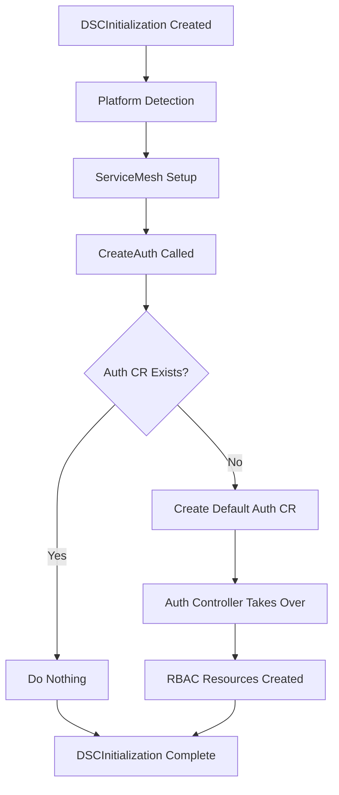

# OpenDataHub Auth Controller: Complete Guide

## Overview

The OpenDataHub Auth Controller is a **RBAC (Role-Based Access Control) management system** that handles user group permissions and authorization for the OpenDataHub/RHOAI platform. It's **not an authentication system** but rather manages **who has what permissions** once users are authenticated.

## Key Concepts

### What It Is
- **Authorization controller** - manages permissions, not authentication
- **RBAC management system** - creates and manages Kubernetes/OpenShift RBAC resources
- **Platform-aware** - adapts behavior based on deployment type (OpenDataHub vs RHOAI variants)
- **Security-first design** - multiple layers prevent privilege escalation

### What It's Not
- **Not an authentication system** - doesn't handle login flows or token validation
- **Not dependent on ServiceMesh** - functions independently of Istio/Authorino
- **Not a proxy or gateway** - doesn't intercept requests

## Architecture

### File Structure
```
internal/controller/services/auth/
├── auth.go                           # Core auth detection logic
├── auth_controller.go                # Controller registration and setup
├── auth_controller_actions.go        # Main controller logic and actions
├── auth_controller_support.go        # Template constants and embedded resources
├── auth_controller_test.go           # Controller tests
├── auth_controller_actions_test.go   # Action tests
└── resources/                        # RBAC template files
    ├── admingroup-role.tmpl.yaml     # Admin role (namespace-scoped)
    ├── admingroup-clusterrole.tmpl.yaml  # Admin cluster role
    ├── allowedgroup-role.tmpl.yaml   # Basic user role
    └── README.md                     # RBAC permissions guidance
```

### API Definition
```
api/services/v1alpha1/
├── auth_types.go                     # Auth CR definition
├── auth_types_test.go                # Type tests
├── auth_cel_integration_test.go      # Security validation tests
└── groupversion_info.go              # API version info
```

### Integration Points
```
internal/controller/dscinitialization/
└── auth.go                           # Bootstrap logic for Auth CR creation
```

## Auth Custom Resource (CR)

### API Specification
```yaml
apiVersion: services.platform.opendatahub.io/v1alpha1
kind: Auth
metadata:
  name: auth  # Must be "auth" - singleton resource
spec:
  adminGroups:    # Groups with administrative privileges
    - "odh-admins"
  allowedGroups:  # Groups with basic access
    - "system:authenticated"
```

### Security Constraints (CEL Validation)
- **`system:authenticated` cannot be in `adminGroups`** - prevents giving admin access to all users
- **Empty strings not allowed** in any group arrays
- **AdminGroups cannot be empty** - must have at least one admin group
- **Resource name must be "auth"** - enforces singleton pattern

### Default Auth CRs by Platform

#### OpenDataHub (Upstream)
```yaml
apiVersion: services.platform.opendatahub.io/v1alpha1
kind: Auth
metadata:
  name: auth
spec:
  adminGroups:
    - "odh-admins"
  allowedGroups:
    - "system:authenticated"
```

#### Self-Managed RHOAI
```yaml
apiVersion: services.platform.opendatahub.io/v1alpha1
kind: Auth
metadata:
  name: auth
spec:
  adminGroups:
    - "rhods-admins"
  allowedGroups:
    - "system:authenticated"
```

#### Managed RHOAI (Red Hat Hosted)
```yaml
apiVersion: services.platform.opendatahub.io/v1alpha1
kind: Auth
metadata:
  name: auth
spec:
  adminGroups:
    - "dedicated-admins"
  allowedGroups:
    - "system:authenticated"
```

## Controller Behavior

### Initialization Flow

1. **DSCInitialization triggers Auth CR creation**
   - Called unconditionally during platform setup
   - Platform detection determines admin group name
   - Creates default Auth CR if none exists
   - Idempotent - safe to run multiple times

2. **Auth Controller processes Auth CR**
   - Template rendering for RBAC resources
   - Group validation and filtering
   - RBAC resource creation and management
   - User group creation (conditional)

### Controller Actions

#### 1. Initialize (`initialize`)
Sets up template configuration:
```go
rr.Templates = []odhtypes.TemplateInfo{
    {FS: resourcesFS, Path: AdminGroupRoleTemplate},
    {FS: resourcesFS, Path: AllowedGroupRoleTemplate}, 
    {FS: resourcesFS, Path: AdminGroupClusterRoleTemplate},
}
```

#### 2. Template Processing (`template.NewAction()`)
Renders RBAC templates with platform-specific values.

#### 3. Default Group Creation (`createDefaultGroup`)
**Conditionally** creates OpenShift user groups:
- **Creates groups** for: `IntegratedOAuth` or empty auth type
- **Skips groups** for: OIDC, custom auth, "None", etc.
- **Platform-specific names**: odh-admins, rhods-admins, dedicated-admins

#### 4. Permission Management (`managePermissions`)
Creates RoleBindings and ClusterRoleBindings:
- Admin groups → admin roles (namespace + cluster)
- Allowed groups → basic roles (namespace only)
- Security filtering (prevents system:authenticated in admin roles)

#### 5. Resource Deployment (`deploy.NewAction`)
Applies all generated RBAC resources to the cluster.

### Authentication Method Detection

```go
func IsDefaultAuthMethod(ctx context.Context, cli client.Client) (bool, error)
```

Checks OpenShift's `config.openshift.io/v1/Authentication` resource:
- **Returns `true`** for: `IntegratedOAuth` or empty type → creates user groups
- **Returns `false`** for: `OIDC`, `None`, custom types → skips user groups

## RBAC Resources Created

### 1. Admin Group Role (Namespace-Scoped)
**Template**: `admingroup-role.tmpl.yaml`

**Permissions**:
- **Auth service management**: Get, list, watch, patch, update Auth CRs
- **Hardware profiles**: Full CRUD on accelerator/hardware profiles
- **OpenShift resources**: Routes (read), builds (read), imagestreams (CRUD)
- **Dashboard**: ODH dashboard configs, applications, documents (CRUD)
- **Templates**: OpenShift templates (CRUD)
- **KServe**: Create serving runtimes
- **NIM**: Full CRUD on NIM accounts
- **Deployments**: Patch/update permissions

### 2. Admin Group Cluster Role (Cluster-Scoped)
**Template**: `admingroup-clusterrole.tmpl.yaml`

**Permissions**:
- **Auth service**: Cluster-wide Auth CR management
- **DataScienceCluster**: Get, list, watch, update, patch DSC resources
- **Model Registry**: Full CRUD on model registries
- **Storage**: Get, list, watch, update, patch storage classes
- **Users/Groups**: Read access to OpenShift users and groups

### 3. Allowed Group Role (Basic Access)
**Template**: `allowedgroup-role.tmpl.yaml`

**Permissions**:
- **Auth service**: Read-only access to Auth CRs and status

### 4. RoleBindings and ClusterRoleBindings
- `admingroup-rolebinding` → Binds admin groups to namespace admin role
- `admingroupcluster-rolebinding` → Binds admin groups to cluster admin role
- `allowedgroup-rolebinding` → Binds allowed groups to basic role

### 5. OpenShift User Groups (Conditional)
Created only for integrated OAuth:
- **OpenDataHub**: `odh-admins`
- **Self-Managed RHOAI**: `rhods-admins`
- **Managed RHOAI**: `dedicated-admins`

## Integration with DSCInitialization

### Bootstrap Process

```go
// In dscinitialization_controller.go
func (r *DSCInitializationReconciler) Reconcile(ctx context.Context, req ctrl.Request) (ctrl.Result, error) {
    // ... ServiceMesh setup ...
    
    // Create Auth - ALWAYS RUNS regardless of ServiceMesh
    if err = r.CreateAuth(ctx, platform); err != nil {
        log.Info("failed to create Auth")
        return ctrl.Result{}, err
    }
    
    // ... finish reconciliation ...
}
```

### Platform Detection Logic

```go
adminGroups = map[common.Platform]string{
    cluster.SelfManagedRhoai: "rhods-admins",
    cluster.ManagedRhoai:     "dedicated-admins",
    cluster.OpenDataHub:      "odh-admins",
}

func BuildDefaultAuth(platform common.Platform) client.Object {
    adminGroup := adminGroups[platform]
    if adminGroup == "" {
        adminGroup = adminGroups[cluster.OpenDataHub] // fallback
    }
    
    return &serviceApi.Auth{
        // ... metadata ...
        Spec: serviceApi.AuthSpec{
            AdminGroups:   []string{adminGroup},
            AllowedGroups: []string{"system:authenticated"},
        },
    }
}
```

## Independence from ServiceMesh

### Key Points

1. **Auth CR creation is unconditional** - runs regardless of ServiceMesh status
2. **No ServiceMesh dependencies** in Auth controller code
3. **Manages standard RBAC resources** - works on any Kubernetes cluster
4. **Separate concerns**: 
   - **ServiceMesh**: Authentication (who you are)
   - **Auth Controller**: Authorization (what you can do)

### With ServiceMesh Removed/Absent

✅ **Still Functions**:
- Auth CR gets created with platform-specific admin groups
- RBAC roles/bindings are created for dashboard, components
- User groups are created (if using integrated OAuth)
- Users can access OpenDataHub based on group membership

❌ **What You Lose**:
- No centralized authentication at mesh level
- No unified auth policies across services
- Components handle auth individually

## Security Features

### 1. CEL Validation Rules
Embedded in the Auth CRD, enforced by Kubernetes API server:
```yaml
# AdminGroups validation
+kubebuilder:validation:XValidation:rule="size(self) > 0",message="AdminGroups cannot be empty"
+kubebuilder:validation:XValidation:rule="self.all(group, group != 'system:authenticated' && group != '')",message="AdminGroups cannot contain 'system:authenticated' or empty strings"

# AllowedGroups validation  
+kubebuilder:validation:XValidation:rule="self.all(group, group != '')",message="AllowedGroups cannot contain empty strings"

# Singleton validation
+kubebuilder:validation:XValidation:rule="self.metadata.name == 'auth'",message="Auth name must be auth"
```

### 2. Runtime Security Checks
Controller-level validation provides defense-in-depth:
```go
// Prevents adding system:authenticated to admin roles
if roleName == "admingroup-role" && e == "system:authenticated" || e == "" {
    log.Info("skipping adding invalid group to RoleBinding")
    continue
}
```

### 3. Comprehensive Testing
- **Unit tests** for controller logic
- **Integration tests** with real Kubernetes API server
- **CEL validation tests** ensure security rules are enforced
- **Error handling tests** for edge cases

## Lifecycle Management

### Creation Flow


### Operational Characteristics

- **Idempotent operations** - safe to run multiple times
- **Preserves user customizations** - won't overwrite existing Auth CR
- **Race condition protection** - handles concurrent operations
- **Graceful error handling** - continues operation on non-critical errors

## Usage Examples

### 1. Basic Setup (Default)
```bash
# Auth CR is created automatically during DSCInitialization
# Add users to admin group
oc adm groups add-users odh-admins alice bob

# All authenticated users get basic access via system:authenticated
```

### 2. Custom Groups
```yaml
# Edit the Auth CR to add custom groups
apiVersion: services.platform.opendatahub.io/v1alpha1
kind: Auth
metadata:
  name: auth
spec:
  adminGroups:
    - "odh-admins"
    - "ml-platform-team"
  allowedGroups:
    - "system:authenticated"
    - "data-scientists"
    - "business-analysts"
```

### 3. Restricted Access
```yaml
# Remove system:authenticated for restricted access
apiVersion: services.platform.opendatahub.io/v1alpha1
kind: Auth
metadata:
  name: auth
spec:
  adminGroups:
    - "odh-admins"
  allowedGroups:
    - "approved-users"
    - "ml-team"
```

## Troubleshooting

### Common Issues

#### Auth CR Not Created
```bash
# Check DSCInitialization status
oc get dsci -o yaml

# Check for errors in operator logs
oc logs -n opendatahub-operator-system deployment/opendatahub-operator-controller-manager
```

#### RBAC Resources Missing
```bash
# Check Auth CR exists
oc get auth auth -o yaml

# Check controller logs
oc logs -n opendatahub-operator-system deployment/opendatahub-operator-controller-manager | grep auth

# Verify RBAC resources
oc get roles,clusterroles,rolebindings,clusterrolebindings | grep -E "(admingroup|allowedgroup)"
```

#### User Groups Not Created
```bash
# Check authentication method
oc get authentication.config.openshift.io cluster -o yaml

# Verify user groups exist
oc get groups | grep -E "(odh-admins|rhods-admins|dedicated-admins)"
```

#### Permission Denied Errors
```bash
# Check user group membership
oc get groups odh-admins -o yaml

# Add user to appropriate group
oc adm groups add-users odh-admins username

# Verify RoleBindings
oc get rolebindings -n opendatahub | grep admingroup
```

### Validation Errors

#### CEL Validation Failures
```yaml
# This will fail - system:authenticated in adminGroups
spec:
  adminGroups:
    - "system:authenticated"  # ❌ Security risk
  allowedGroups:
    - "users"

# This will succeed
spec:
  adminGroups:
    - "odh-admins"           # ✅ Specific admin group
  allowedGroups:
    - "system:authenticated" # ✅ OK in allowed groups
```

## Best Practices

### Security
1. **Never put `system:authenticated` in `adminGroups`** - gives admin access to all users
2. **Use specific group names** rather than broad permissions
3. **Regularly audit group membership** - remove inactive users
4. **Monitor RBAC changes** - track who has admin access

### Operations
1. **Let the operator create the default Auth CR** - don't create manually
2. **Customize after creation** - edit the generated Auth CR as needed
3. **Use OpenShift groups** for user management rather than individual users
4. **Test permission changes** in non-production environments first

### Integration
1. **Auth controller is independent** - works without ServiceMesh
2. **Platform-specific defaults** are appropriate for most use cases
3. **Customize allowed groups** based on your organization's needs
4. **Consider OIDC integration** for external identity providers

## Related Documentation

- [DSCI and DSC Resources](./DSCI_AND_DSC.md) - Platform initialization
- [OpenShift RBAC](./OPENSHIFT-RBAC.md) - RBAC concepts and management
- [ServiceMesh Integration](./GATEWAY.md) - Authentication vs authorization
- [Certificate Management](./ODH-CERTIFICATE-MANAGEMENT.md) - Security infrastructure

## API Reference

### Auth Custom Resource
- **API Version**: `services.platform.opendatahub.io/v1alpha1`
- **Kind**: `Auth`
- **Scope**: Cluster
- **Singleton**: Yes (name must be "auth")

### Controller Configuration
- **Service Name**: `auth`
- **Management State**: Always `Managed`
- **Namespace**: Operates in applications namespace (default: `opendatahub`)

### RBAC Resources
- **Roles**: `admingroup-role`, `allowedgroup-role`
- **ClusterRoles**: `admingroupcluster-role`
- **RoleBindings**: `admingroup-rolebinding`, `allowedgroup-rolebinding`
- **ClusterRoleBindings**: `admingroupcluster-rolebinding`
