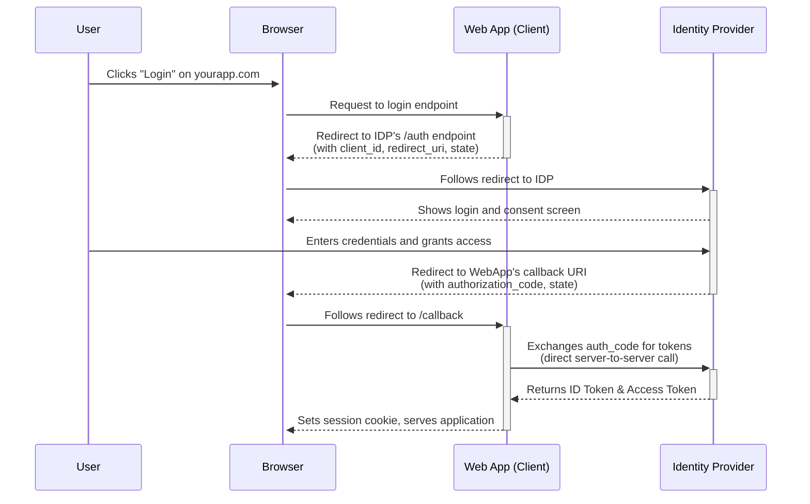
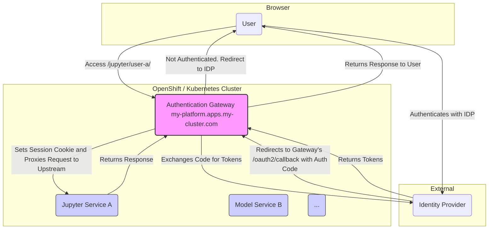
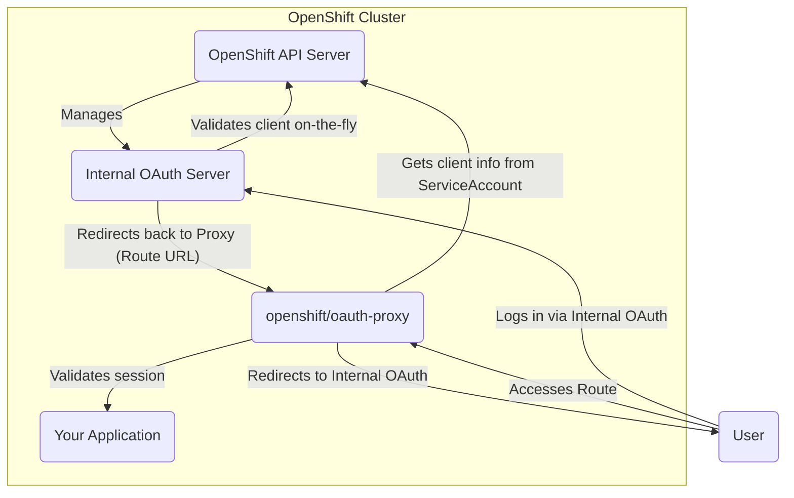
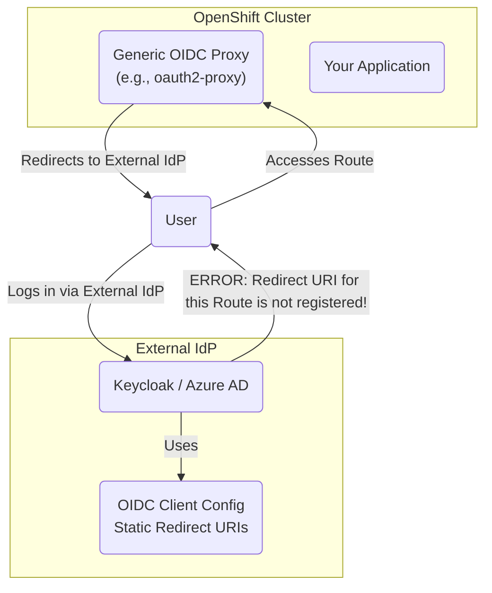

# OIDC and OAuth Exploration

## Realms and Clients

The terms "realm" and "client" are fundamental concepts in identity and access management, particularly within systems like Keycloak. Here's a breakdown of what they mean and how they relate to the broader landscape of Identity Providers (IDPs).

### Realms

A **realm** is a core concept in **Keycloak**. It represents a dedicated, isolated space to manage:
- Users
- Credentials
- Roles
- Groups
- Applications (Clients)

Think of a realm as a self-contained identity management domain. In a multi-tenant application, for example, you might create a separate realm for each customer to ensure that users and resources are completely isolated from one another.

#### Is "Realm" a general term?

While the concept of an isolated identity management container is common, the term "realm" is not universally used across all IDPs. Other systems use different terminology for a similar idea:

- **Auth0 & Okta:** Use the term **Tenant**.
- **Microsoft Entra ID (formerly Azure AD):** Uses **Directory** or **Tenant**.

So, while the architectural pattern is transferable, the specific word "realm" is most strongly associated with Keycloak.

### Clients

The term **client** is standardized by the **OAuth 2.0 and OpenID Connect (OIDC)** specifications. A client is any application that requests authentication or access to a protected resource on behalf of a user.

Examples of clients include:
- A single-page web application (SPA)
- A traditional server-side web application
- A mobile app
- A command-line tool or a backend service

When you see the term **realm client** in Keycloak, it refers to a client that has been registered and is managed within a specific realm.

## Client Homepage, Redirect URIs, and Callback URLs

In the context of OAuth 2.0 and OIDC, these URLs define the trust relationship between your application (the client) and the Identity Provider (IDP). They ensure that the IDP sends sensitive information, like authorization codes and tokens, only to legitimate applications.

### 1. Client Homepage URL

*   **What it is:** This is simply the main URL for your application. It's the page users would typically visit to start using your service.
*   **Its Role:** The primary purpose of this URL is for **informational and administrative** use within the IDP's configuration. When you register your application with an IDP like Keycloak, Google, or Auth0, you often provide a homepage URL. This helps you identify the application in the admin console. It usually has **no direct role** in the authentication flow itself.

### 2. Redirect URI (or Callback URL)

The terms **Redirect URI** and **Callback URL** are often used interchangeably. **Redirect URI** is the official term from the OAuth 2.0 specification.

*   **What it is:** This is the most critical URL in the authentication flow. It's the specific endpoint in your application where the IDP will send the user back to after they have successfully authenticated. When the user is redirected, the IDP includes an **authorization code** (and a `state` parameter) in the URL's query string.

*   **Its Role (Security):** The Redirect URI is a crucial security measure. Before the authentication process begins, your application must be registered with the IDP, and you must provide a list of one or more **allowed Redirect URIs**.
    *   When your application sends a user to the IDP to log in, it includes a `redirect_uri` parameter, telling the IDP where to send the user back.
    *   The IDP will only redirect the user to a URL that **exactly matches** one of the pre-registered URIs.
    *   This strict matching prevents "open redirector" attacks, where an attacker could trick the IDP into sending the authorization code to a malicious site.

### The Authorization Flow in Action

Here’s a simplified step-by-step of how these URLs are used in the "Authorization Code Flow":

1.  **User Clicks "Login":** A user on your application (e.g., `https://yourapp.com`) clicks a "Login with Google" button.

2.  **Redirect to IDP:** Your application redirects the user to the IDP's authorization endpoint (e.g., `https://accounts.google.com/o/oauth2/v2/auth`). This request includes several parameters, most importantly:
    *   `client_id`: Your application's public identifier.
    *   `redirect_uri`: The specific endpoint in your app where Google should send the user back (e.g., `https://yourapp.com/auth/google/callback`).
    *   `response_type=code`: Specifies that you want an authorization code.
    *   `scope`: Defines what information your app is requesting (e.g., `openid profile email`).
    *   `state`: A random, unique string to prevent Cross-Site Request Forgery (CSRF) attacks.

3.  **User Authenticates:** The user enters their credentials on the IDP's login page (e.g., Google's login form) and grants your application the requested permissions.

4.  **IDP Redirects Back to Your App:** The IDP redirects the user's browser back to the `redirect_uri` that was provided in step 2. The URL will look something like this:
    `https://yourapp.com/auth/google/callback?code=SOME_LONG_AUTHORIZATION_CODE&state=THE_SAME_RANDOM_STRING_FROM_STEP_2`

5.  **Application Handles the Callback:** Your application's backend code at the `/auth/google/callback` route does two things:
    *   It verifies that the `state` parameter matches the one it originally generated.
    *   It takes the `code` and makes a secure, direct, server-to-server request to the IDP's token endpoint to exchange the code for an **ID token** and an **access token**.

This process ensures that the sensitive tokens are never exposed in the user's browser.

## Architectural Challenge: Securing Dynamic, On-Demand Services

A significant architectural challenge arises when using OIDC in modern, dynamic platforms like OpenShift or Kubernetes. Consider a platform that allows users or APIs to spawn new services on-demand—such as Jupyter notebooks, ML model servers (like vLLM), or other arbitrary applications. Each of these services is programmatically assigned a unique DNS name and an OpenShift Ingress/Route object.

### The Conflict with OIDC's Static Registration Model

The core security principle of OIDC is that the Identity Provider (IDP) will only redirect users to pre-registered, whitelisted **Redirect URIs**. This creates a fundamental conflict with the dynamic nature of on-demand services:

*   **A New Service, A New Redirect URI:** Each new service (e.g., `https-jupyter-user-a.apps.my-cluster.com`) has its own unique hostname. To secure it with OIDC directly, its full callback URL would need to be a valid `redirect_uri` in the OIDC client configuration.

This leaves platform architects with several poor options:

1.  **Automated Client Creation:** Programmatically create a new OIDC client for every service that gets spawned. This is technically possible via APIs (like the Keycloak Admin API) but leads to a massive proliferation of clients, creating significant management overhead and clutter in the IDP.
2.  **Manual URI Updates:** Require an administrator to manually add the new service's URI to an existing client's allowlist. This is slow, error-prone, and completely defeats the goal of automation, leading to a poor user experience.
3.  **Wildcard Redirect URIs:** Some IDPs allow wildcard `redirect_uri`s (e.g., `https://*.apps.my-cluster.com`). This is **strongly discouraged** as it weakens the security of the OIDC flow, making the platform vulnerable to open redirector attacks if not implemented with extreme care. The official OAuth 2.0 spec ([RFC 6749](https://datatracker.ietf.org/doc/html/rfc6749#section-3.1.2)) mandates strict handling of the redirect URI. It states:
    > The redirection endpoint URI MUST be an absolute URI as defined by [RFC3986] Section 4.3. The endpoint URI MAY include an "application/x-www-form-urlencoded" formatted (per Appendix B) query component ([RFC3986] Section 3.4), which MUST be retained when adding additional query parameters. The endpoint URI MUST NOT include a fragment component.

### The Solution: The Authentication Gateway (Reverse Proxy) Pattern

A more secure, scalable, and manageable solution is to decouple the authentication logic from the backend services using a centralized **Authentication Gateway**. This is typically implemented as a reverse proxy with built-in OIDC support.

In this pattern:

1.  **Centralized Ingress:** Instead of giving each service its own external ingress, all traffic is routed through a single, central gateway with a stable DNS name (e.g., `https://my-platform.apps.my-cluster.com`).
2.  **Single OIDC Client:** You create **one** OIDC client for the entire platform. The `redirect_uri` for this client points to a single, stable callback endpoint on the gateway itself (e.g., `https://my-platform.apps.my-cluster.com/oauth2/callback`).
3.  **Proxy Handles OIDC Flow:** The gateway is responsible for the entire OIDC flow. It intercepts incoming requests, redirects the user to the IDP for login, handles the callback, exchanges the authorization code for tokens, and manages the user's session (often via a secure cookie).
4.  **Path-Based Routing to Upstream Services:** Once the user is authenticated, the gateway proxies the request to the appropriate backend service based on the URL path. For example:
    *   A request to `https://my-platform.apps.my-cluster.com/jupyter/user-a/` is routed to the internal service for that user's Jupyter notebook.
    *   A request to `https://my-platform.apps.my-cluster.com/models/bert/` is routed to the BERT model serving container.

This architecture provides a clean separation of concerns. The backend services can remain blissfully unaware of OIDC; they simply receive traffic from a trusted source (the gateway). The IDP, in turn, only needs to know about a single, stable client, perfectly aligning with the OIDC security model while still enabling a dynamic and automated backend.

## A Note on OpenShift's Integrated OAuth

The friction described above is often invisible to developers working in a default OpenShift environment, which provides a uniquely seamless authentication experience thanks to its integrated OAuth server and the specialized `openshift/oauth-proxy`.

### The "Magic": Default Integrated Authentication

In a standard OpenShift installation, the internal OAuth server is deeply integrated with the platform's core concepts.

*   **Dynamic Client Recognition:** When you deploy an application protected by `openshift/oauth-proxy`, you typically point it to a `ServiceAccount`. The OpenShift OAuth server is smart enough to treat this `ServiceAccount` as a dynamic `OAuthClient`. It automatically trusts the redirect URI provided by the proxy (which is simply the application's Route URL) without any pre-registration.
*   **Seamless Experience:** This allows for effortless, automated protection of new services. You can create a new Route and an `oauth-proxy` sidecar for it, and the authentication flow works immediately without any manual IdP configuration.

### The Federated Reality: Using an External IdP

This "magic" disappears the moment you configure the cluster to federate with an external Identity Provider. The `openshift/oauth-proxy` cannot be used with generic OIDC providers; it is exclusively for the integrated OpenShift OAuth server. Therefore, you must switch to a different proxy implementation.

*   **Loss of Dynamic Clients:** When you switch to a generic OIDC-aware proxy (like `oauth2-proxy`), that proxy must be configured to talk to the external IdP. The external IdP has no knowledge of OpenShift's internal `ServiceAccount` objects. It only knows about the OIDC clients that have been explicitly registered in its own database.
*   **The Redirect URI Problem Reappears:** The generic proxy will try to use the application's unique Route URL as the redirect URI. Since this dynamic URL was never manually added to the client configuration in the external IdP, the IdP will correctly reject the authentication request as a security measure.
*   **The Gateway Pattern Becomes Necessary:** At this point, the seamless integrated experience is broken. You are forced to confront the standard OIDC architectural challenge, making the **Authentication Gateway (Reverse Proxy) Pattern** the necessary and correct solution to re-establish a secure and automated authentication system for your on-demand services against an external IdP.
