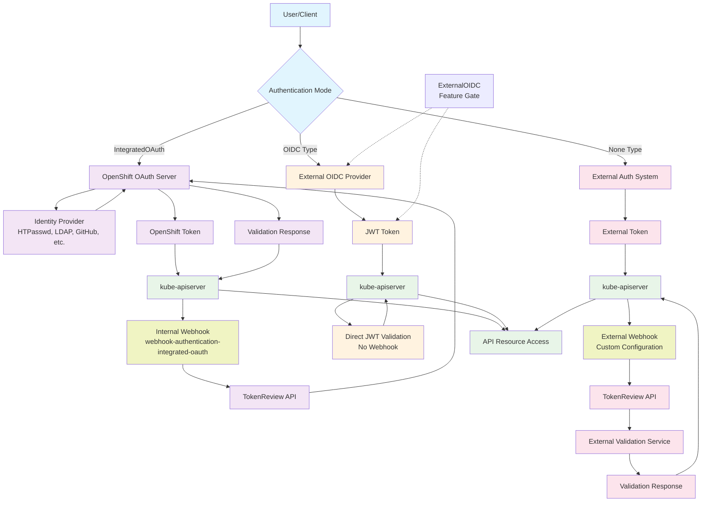
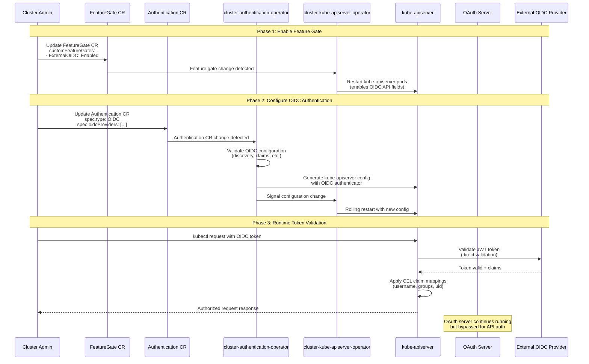

# OpenShift Authentication Modes

This document outlines the different authentication modes available in OpenShift and how they interact with the integrated OAuth server and external identity providers.

## Overview

OpenShift supports multiple authentication architectures, controlled by the `Authentication` custom resource (`config.openshift.io/v1`) and feature gates. The authentication mode determines how users and clients authenticate with the cluster.

## Architecture Overview



## Authentication Types

OpenShift supports three primary authentication types via `Authentication.spec.type`:

### 1. IntegratedOAuth (Default)

**Description**: Uses OpenShift's built-in OAuth server as an identity broker.

**Architecture**:

```
User/Client → OpenShift OAuth Server → External Identity Provider → OAuth Server → OpenShift Token
Token Validation: Client → kube-apiserver → webhook-authentication-integrated-oauth → OAuth Server
```

**Characteristics**:

- Default authentication mode
- OAuth server acts as identity broker/federation gateway
- Supports multiple identity providers simultaneously
- Issues OpenShift-specific tokens
- kube-apiserver validates tokens via internal webhook to OAuth server
- Maintains user sessions and identity mapping
- Always available (no feature gate required)

**Configuration**: Via `OAuth` custom resource with identity providers:

```yaml
apiVersion: config.openshift.io/v1
kind: OAuth
spec:
  identityProviders:
    - name: google-oidc
      type: OpenID
      openID:
        clientID: "your-client-id"
        clientSecret:
          name: google-secret
        issuer: "https://accounts.google.com"
```

### 2. OIDC (External OIDC)

**Description**: Direct integration with external OIDC providers, bypassing OpenShift's OAuth server for API authentication.

**Feature Gate**: Requires `ExternalOIDC` feature gate to be enabled.

**Architecture**:

```
User/Client → External OIDC Provider → JWT Token → Direct to kube-apiserver
```

**Characteristics**:

- Cloud-native OIDC standard compliance
- Direct JWT token usage from external providers
- Advanced claim mapping with CEL expressions
- Reduced authentication latency (no broker hop)
- Single external OIDC provider per cluster

**Configuration**: Via `Authentication` custom resource:

```yaml
apiVersion: config.openshift.io/v1
kind: Authentication
spec:
  type: OIDC
  oidcProviders:
    - name: external-oidc
      issuer: "https://your-oidc-provider.com"
      claimMappings:
        uid:
          claim: "sub"
```

### 3. None

**Description**: No cluster-managed authentication system. Requires external authentication infrastructure.

**⚠️ Advanced Configuration**: While technically configurable, this mode is rarely used in practice and requires significant expertise and external infrastructure.

**Architecture**:

```
User/Client → External Auth System → External Token
Token Validation: Client → kube-apiserver → External Webhook Authenticator → External Validation Service
```

**Characteristics**:

- Completely external authentication
- **Requires manual configuration** of external OAuth/OIDC systems
- **Must provide webhook token authenticators** for token validation via TokenReview API
- **Must configure external OAuth metadata** pointing to your authentication system
- Full control over authentication flow
- **No OpenShift-managed tokens** - all token lifecycle handled externally

**Prerequisites for Configuration**:

- External OAuth/OIDC server infrastructure
- Webhook token authenticator service
- OAuth metadata configuration
- Manual user identity management
- Custom token validation logic

**Typical Use Cases**:

- Air-gapped environments with existing enterprise authentication
- Highly regulated environments requiring external identity providers
- Custom authentication solutions that don't fit standard patterns
- Migration scenarios requiring temporary disabling of OpenShift auth

## Feature Gates

### ExternalOIDC

Controls availability of direct OIDC integration features:

**Enables**:

- `Authentication.spec.type: OIDC`
- `Authentication.spec.oidcProviders` field
- `Authentication.status.oidcClients` tracking

### ExternalOIDCWithUIDAndExtraClaimMappings

Extends ExternalOIDC with advanced claim mapping:

**Enables**:

- UID claim mapping with CEL expressions
- Extra claims mapping for custom attributes
- Complex token transformation rules

## Authentication Mode Comparison

| Feature                | IntegratedOAuth                   | OIDC                  | None              |
| ---------------------- | --------------------------------- | --------------------- | ----------------- |
| **OAuth Server Role**  | Identity Broker + Token Validator | Bypassed for API      | Not Used          |
| **Token Type**         | OpenShift Tokens                  | External JWT          | External/Webhook  |
| **Token Validation**   | Internal Webhook to OAuth         | Direct JWT Validation | External Webhook  |
| **Identity Providers** | Multiple                          | Single OIDC           | External System   |
| **Feature Gate**       | None Required                     | ExternalOIDC          | None Required     |
| **Claim Mapping**      | Basic                             | Advanced (CEL)        | External System   |
| **Session Management** | OpenShift Managed                 | Provider Managed      | External System   |
| **Upgrade Impact**     | Supported                         | May Restrict          | Manual Management |

## Key Implementation Details

### Mutual Exclusion

- Authentication types are **mutually exclusive** per cluster
- Cannot mix `IntegratedOAuth` and `OIDC` for API authentication
- Switching types is a cluster-wide change

### OAuth Server Behavior

When switching from `IntegratedOAuth` to `OIDC`:

- OAuth server process **continues running**
- API authentication **bypasses** OAuth server (no more internal webhook validation)
- kube-apiserver switches from webhook validation to direct JWT validation
- Console/UI may **still use** OAuth server for web flows
- OAuth metadata endpoints may remain available

### Validation Rules

- `WebhookTokenAuthenticator` allowed with `None` or `IntegratedOAuth` types (IntegratedOAuth uses internal webhook)
- OIDC providers only validated when `ExternalOIDC` feature gate is enabled
- Complex cross-validation ensures configuration consistency

### Real-World Configuration Example

A typical OpenShift cluster (like CRC) shows this configuration pattern:

```yaml
# Authentication resource (defaults)
apiVersion: config.openshift.io/v1
kind: Authentication
spec:
  type: ""  # Empty = IntegratedOAuth (default)
  webhookTokenAuthenticator:
    kubeConfig:
      name: webhook-authentication-integrated-oauth  # Internal webhook
status:
  integratedOAuthMetadata:
    name: oauth-openshift  # OAuth server metadata

# OAuth resource (identity providers)
apiVersion: config.openshift.io/v1
kind: OAuth
spec:
  identityProviders:
  - name: developer
    type: HTPasswd
    htpasswd:
      fileData:
        name: htpass-secret
```

## Feature Gate Control

Authentication features controlled by feature gates:

```yaml
# Example: Authentication resource with feature gate annotations
apiVersion: config.openshift.io/v1
kind: Authentication
metadata:
  annotations:
    # These fields only available with ExternalOIDC feature gate
spec:
  type: OIDC # +openshift:validation:FeatureGateAwareEnum
  oidcProviders: # +openshift:enable:FeatureGate=ExternalOIDC
    - name: provider
      claimMappings: # +openshift:enable:FeatureGate=ExternalOIDCWithUIDAndExtraClaimMappings
        uid:
          expression: "claims.sub" # CEL expression
```

## ExternalOIDC Implementation Process

The implementation of ExternalOIDC involves a coordinated process between feature gates, custom resources, and cluster operators. This section details the step-by-step process and the components involved.

> **📖 Official Documentation**: The complete administrative procedure for configuring external OIDC authentication is documented in the [Red Hat OpenShift Container Platform 4.19 Authentication and Authorization Guide](https://docs.redhat.com/en/documentation/openshift_container_platform/4.19/html/authentication_and_authorization/external-auth). This section focuses on the technical implementation details and system orchestration that occurs behind the scenes.



### Implementation Steps

#### Step 1: Feature Gate Enablement

**Admin Action:**

```yaml
# Update FeatureGate CR
apiVersion: config.openshift.io/v1
kind: FeatureGate
metadata:
  name: cluster
spec:
  customFeatureGates:
    - enabled: true
      name: ExternalOIDC
```

**System Response:**

- `cluster-kube-apiserver-operator` detects feature gate change
- Triggers rolling restart of kube-apiserver static pods
- New API fields become available in Authentication CR schema
- Admission controllers start accepting OIDC configurations

#### Step 2: Authentication Configuration

**Admin Action:**

```yaml
# Update Authentication CR
apiVersion: config.openshift.io/v1
kind: Authentication
metadata:
  name: cluster
spec:
  type: OIDC
  oidcProviders:
    - name: corporate-oidc
      issuer: https://oidc.corp.example.com
      audiences:
        - openshift-cluster
      claimMappings:
        username:
          expression: "claims.preferred_username"
        groups:
          expression: "claims.groups"
```

**System Response:**

- `cluster-authentication-operator` validates OIDC configuration
- Performs OIDC discovery against provider
- Generates kube-apiserver authentication configuration
- Creates necessary secrets and configmaps
- Triggers kube-apiserver reconfiguration

#### Step 3: kube-apiserver Reconfiguration

**Automatic Process:**

```yaml
# Generated kube-apiserver config includes:
authentication:
  oidc:
    issuerURL: https://oidc.corp.example.com
    clientID: openshift-cluster
    usernameClaim: preferred_username
    groupsClaim: groups
    # CEL claim mappings compiled into config
```

**System Actions:**

- `cluster-kube-apiserver-operator` detects config change
- Updates kube-apiserver static pod manifests
- Performs rolling restart of control plane nodes
- New authenticator chain includes OIDC token validator

**Rollout State Monitoring:**

The `cluster-authentication-operator` actively monitors the rollout to ensure OIDC is properly deployed across all control plane nodes before declaring success:

**File**: `pkg/controllers/common/external_oidc.go`

```go
// OIDCAvailable() function performs comprehensive rollout verification:
func (c *AuthConfigChecker) OIDCAvailable() (bool, error) {
    // 1. Verify Authentication CR has type: OIDC
    if auth.Spec.Type != configv1.AuthenticationTypeOIDC {
        return false, nil
    }

    // 2. Collect all active revisions across control plane nodes
    for _, nodeStatus := range kas.Status.NodeStatuses {
        observedRevisions.Insert(nodeStatus.CurrentRevision)
    }

    // 3. For each revision, verify OIDC configuration exists and is correct
    for _, revision := range observedRevisions.UnsortedList() {
        // Check auth-config-<revision> ConfigMap exists (OIDC provider config)
        // Check config-<revision> ConfigMap has proper kube-apiserver args:
        //   - oauthMetadataFile: ""                    (OAuth disabled)
        //   - NO authentication-token-webhook-config   (No OAuth webhook)
        //   - authentication-config: [auth-config.json] (OIDC enabled)
    }
}
```

**Safety Guarantees:**

- **Atomic Rollout**: Returns `false` until ALL nodes have proper OIDC configuration
- **No Mixed Modes**: Prevents scenarios where some nodes use OAuth, others OIDC
- **Configuration Consistency**: Every revision must have identical OIDC setup
- **Rollback Detection**: Immediately detects configuration inconsistencies

This explains why OIDC rollouts take several minutes - the system waits for every control plane node to successfully restart with validated OIDC configuration before considering the change complete.

#### Step 4: Runtime Token Flow

**Token Validation Process:**

1. **Client Request**: User sends request with OIDC JWT token
2. **Token Extraction**: kube-apiserver extracts bearer token
3. **OIDC Validation**: Direct validation against external provider
4. **Claim Processing**: Apply CEL expressions to map claims
5. **Authorization**: Standard RBAC authorization with mapped identity

### Key Components and Responsibilities

#### cluster-authentication-operator

**File**: `pkg/controllers/externaloidc/externaloidc_controller.go`

- Watches Authentication CR for OIDC configuration
- Validates OIDC provider connectivity and metadata
- Generates kube-apiserver authentication configuration
- Manages OIDC client secrets and certificates

#### cluster-kube-apiserver-operator

- Manages kube-apiserver static pod configuration
- Handles rolling restarts when authentication config changes
- Applies generated OIDC authenticator configuration

#### Admission Controllers

**File**: `openshift-kube-apiserver/admission/customresourcevalidation/authentication/validate_authentication.go`

- Validates OIDC provider configurations
- Compiles and validates CEL claim mapping expressions
- Enforces feature gate requirements for OIDC fields

### Configuration Validation

The system performs extensive validation during configuration:

```go
// CEL expression validation
func validateClaimMappings(mappings *configv1.ClaimMappings) error {
    // Compile CEL expressions for username, groups, uid mappings
    // Validate expression syntax and cost estimation
    // Ensure required claims are mappable
}

// OIDC provider validation
func validateOIDCProvider(provider *configv1.OIDCProvider) error {
    // Perform OIDC discovery
    // Validate issuer URL accessibility
    // Check supported algorithms and claims
}
```

### Rollback Process

**Disabling ExternalOIDC (Official Process):**

The [official Red Hat documentation](https://docs.redhat.com/en/documentation/openshift_container_platform/4.19/html/authentication_and_authorization/external-auth#disabling-direct-authentication_external-auth) provides the supported method:

```bash
# Official command to disable external OIDC
oc patch authentication.config/cluster --type=merge -p='
spec:
  type: ""
  oidcProviders: null
'
```

**System Response:**

1. **Authentication CR updated**: `type` set to empty string (equivalent to `IntegratedOAuth`)
2. **OIDC providers removed**: `oidcProviders` field cleared
3. **kube-apiserver restart**: Removes OIDC authenticator from chain
4. **OAuth server**: Resumes handling API authentication via internal webhook
5. **Cluster rollout**: Wait for all nodes to update to new revision

**Feature Gate Disable (Advanced):**

1. **Update FeatureGate CR**: Set `ExternalOIDC: Disabled`
2. **API validation**: OIDC fields become invalid in Authentication CR
3. **Forced cleanup**: Any OIDC configuration must be removed first

> **⚠️ Note**: The official documentation recommends using the `oc patch` command method rather than directly editing the FeatureGate CR, as it provides a cleaner rollback path and proper validation.

## Security Implications

### IntegratedOAuth Security

- Centralized token management
- OpenShift-controlled token lifecycle
- Unified audit logging through OAuth server

### Direct OIDC Security

- External provider token validation
- JWT signature verification
- Direct provider trust relationship
- Advanced claim validation with CEL

## Troubleshooting

### Common Issues

1. **Feature gate not enabled**: OIDC type unavailable
2. **Configuration conflicts**: Webhook authenticators with OIDC type
3. **Token validation failures**: External OIDC connectivity issues
4. **Claim mapping errors**: CEL expression compilation failures

### Diagnostic Commands

```bash
# Check current authentication configuration
oc get authentication cluster -o yaml

# Check feature gate status
oc get featuregate cluster -o yaml

# Check OAuth configuration (IntegratedOAuth mode)
oc get oauth cluster -o yaml

# Check authentication admission controller logs
oc logs -n openshift-kube-apiserver <pod> | grep ValidateAuthentication
```

## References

- [OpenShift Authentication API](https://docs.openshift.com/container-platform/latest/rest_api/config_apis/authentication-config-openshift-io-v1.html)
- [Kubernetes Authentication](https://kubernetes.io/docs/reference/access-authn-authz/authentication/)
- [OIDC Specification](https://openid.net/connect/)
- [CEL Expression Language](https://github.com/google/cel-spec)

---

_This document reflects the authentication architecture found in the OpenShift Kubernetes codebase as of the current analysis._
