# OpenShift Networking Reference

Technical documentation covering DNS, ingress, routing, and load balancing in OpenShift across different deployment types.

## Table of Contents

- [DNS Architecture](#dns-architecture)
- [Ingress System](#ingress-system)
- [Router Implementation](#router-implementation)
- [Endpoint Publishing Strategies](#endpoint-publishing-strategies)
- [Platform Comparison](#platform-comparison)
- [Traffic Flow](#traffic-flow)

## DNS Architecture

OpenShift uses two distinct DNS domains:

- **Base domain**: The cluster domain (e.g., `crc.testing`)
- **Apps domain**: The wildcard domain for application routes (e.g., `apps-crc.testing`)

### DNS Configuration Resources

```
dnses.config.openshift.io/cluster        - Cluster base domain
ingresses.config.openshift.io/cluster    - Application routes domain
```

View current configuration:
```bash
oc get dns.config.openshift.io cluster -o yaml
oc get ingresses.config.openshift.io cluster -o yaml
```

### DNS Domain Assignment

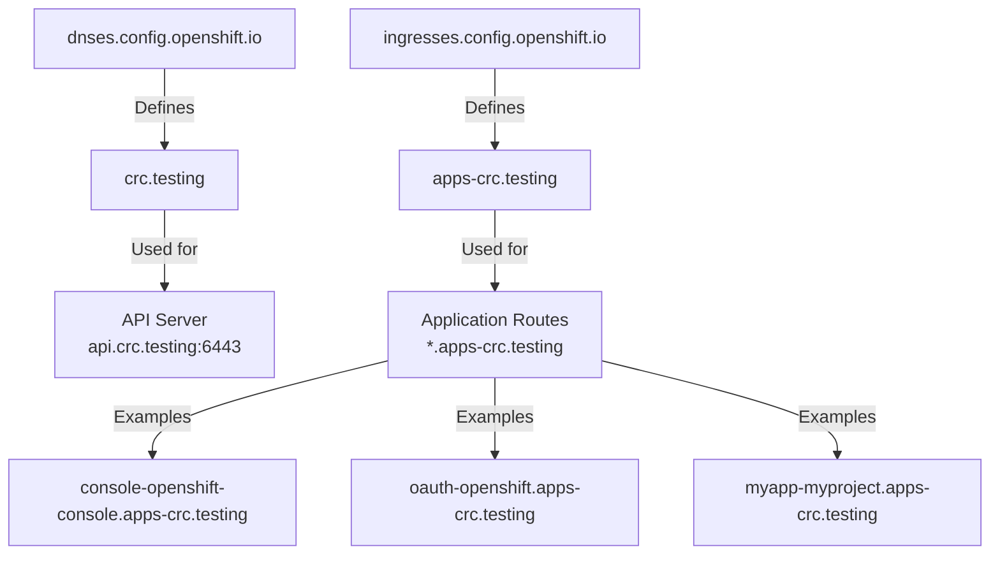

### DNS Management by Platform

| Platform | DNS Management | Implementation |
|----------|---------------|----------------|
| AWS/Azure/GCP | Automatic | DNSRecord CRD + Cloud DNS API |
| Bare Metal | Manual | Static DNS or ExternalDNS |
| CRC | Manual | dnsmasq via NetworkManager |

## Ingress System

The ingress system publishes application routes to external networks.

### Components

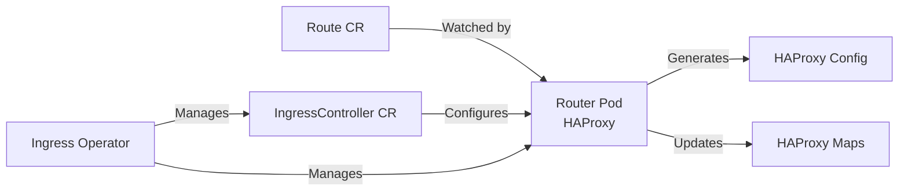

### Ingress Controller

Located in `openshift-ingress-operator` namespace:

```bash
oc get ingresscontroller default -n openshift-ingress-operator -o yaml
```

The spec defines how to publish ingress endpoints. If empty, defaults are chosen based on platform type:

| Platform | Default Strategy |
|----------|-----------------|
| AWS/Azure/GCP/IBMCloud | LoadBalancerService |
| Libvirt/None | HostNetwork |

The resolved strategy appears in `status.endpointPublishingStrategy`.

### Ingress Domain Configuration

From `ingresses.config.openshift.io/cluster`:

```yaml
spec:
  domain: apps-crc.testing
  loadBalancer:
    platform:
      type: ""  # Empty on non-cloud platforms
```

## Router Implementation

The OpenShift router is HAProxy wrapped in a Kubernetes-native controller.

### Architecture

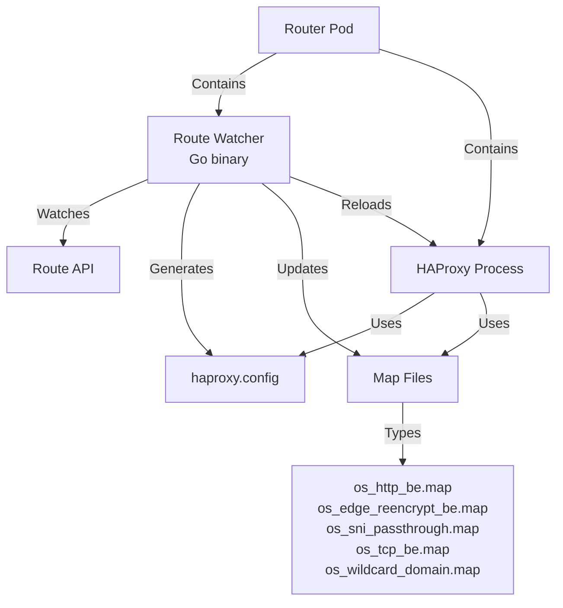

### Router Pod Details

**Pod**: `router-default-*` in `openshift-ingress` namespace

**Process**:
```
/usr/sbin/haproxy -f /var/lib/haproxy/conf/haproxy.config \
  -p /var/lib/haproxy/run/haproxy.pid \
  -x /var/lib/haproxy/run/haproxy.sock \
  -sf <old-pids>
```

**HAProxy Version**: 2.8.10 (long-term support branch until Q2 2028)

**Configuration Location**: `/var/lib/haproxy/conf/`

**Inspection Commands**:
```bash
# View HAProxy process
oc exec -n openshift-ingress <router-pod> -- ps aux | grep haproxy

# Check HAProxy version
oc exec -n openshift-ingress <router-pod> -- haproxy -v

# View generated config
oc exec -n openshift-ingress <router-pod> -- cat /var/lib/haproxy/conf/haproxy.config

# View routing maps
oc exec -n openshift-ingress <router-pod> -- cat /var/lib/haproxy/conf/os_edge_reencrypt_be.map
```

### Route Types and HAProxy Mapping

| Route Termination | TLS Handling | HAProxy Backend | Map File |
|------------------|--------------|----------------|----------|
| Edge | Terminated at router, HTTP to backend | be_edge_http | os_edge_reencrypt_be.map |
| Reencrypt | Terminated at router, re-encrypted to backend | be_secure | os_edge_reencrypt_be.map |
| Passthrough | TLS passes through to backend | SNI routing | os_sni_passthrough.map |
| HTTP | No TLS | Standard HTTP | os_http_be.map |

**Example Map Entry**:
```
^console-openshift-console\.apps-crc\.testing\.?(:[0-9]+)?(/.*)?$ be_secure:openshift-console:console
```

This regex maps the hostname to the HAProxy backend definition.

## Endpoint Publishing Strategies

The `endpointPublishingStrategy` determines how the router is exposed.

### HostNetwork Strategy

Used by: CRC, bare metal (default), Libvirt

```yaml
status:
  endpointPublishingStrategy:
    type: HostNetwork
    hostNetwork:
      httpPort: 80
      httpsPort: 443
      protocol: TCP
      statsPort: 1936
```

**Characteristics**:
- Router pod runs with `hostNetwork: true`
- Binds directly to node IP on ports 80/443/1936
- No intermediate load balancer
- Service type: ClusterIP (for internal use only)
- DNS points to node IP

**Traffic Flow**:
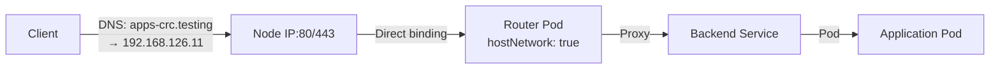

### LoadBalancerService Strategy

Used by: AWS, Azure, GCP (default), bare metal with MetalLB

```yaml
spec:
  endpointPublishingStrategy:
    type: LoadBalancerService
    loadBalancer:
      scope: External  # or Internal
      dnsManagementPolicy: Managed  # Managed (cloud) or Unmanaged (bare metal)
```

**Characteristics**:
- Router pod uses container networking (NOT hostNetwork)
- LoadBalancer service created
- External IP assigned (cloud LB or MetalLB)
- DNS managed automatically (cloud) or manually (bare metal)

**Traffic Flow**:


### Available Strategy Types

```bash
oc explain ingresscontroller.spec.endpointPublishingStrategy.type
```

- **LoadBalancerService**: Kubernetes LoadBalancer Service
- **HostNetwork**: Direct node port binding
- **NodePortService**: Kubernetes NodePort Service
- **Private**: Not published (manual publishing required)

**Important**: `endpointPublishingStrategy` cannot be updated after creation.

## Platform Comparison

### CRC (Single-Node Local)

**Platform Type**: `None`

**DNS**:
- Base domain: `crc.testing`
- Apps domain: `apps-crc.testing`
- Implementation: dnsmasq via NetworkManager
- Config: `/etc/NetworkManager/dnsmasq.d/crc-snc.conf`

```
address=/crc.testing/192.168.126.11
address=/.apps-crc.testing/192.168.126.11
```

**Ingress**:
- Strategy: HostNetwork (default)
- Service: ClusterIP only
- Router binds to: `192.168.126.11:80/443`

**Load Balancer**: Not applicable

**DNS Management**: Manual

### Bare Metal (Multi-Node Production)

**Platform Type**: `None` or `BareMetal`

**DNS**:
- Base domain: Customer-defined (e.g., `ocp.example.com`)
- Apps domain: Customer-defined (e.g., `apps.ocp.example.com`)
- Implementation: External DNS server (BIND, PowerDNS, etc.)

**Ingress Options**:

**Option 1: HostNetwork (simple)**
- Default for bare metal
- Router pods bind to node ports
- External load balancer required (HAProxy, F5, etc.)
- DNS points to load balancer VIP

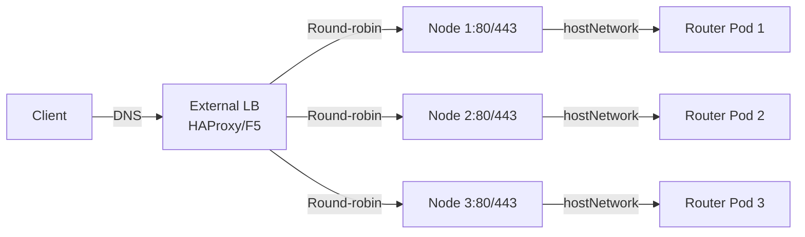

**Option 2: LoadBalancerService + MetalLB**
- MetalLB provides LoadBalancer IP from pool
- Router uses container networking
- DNS points to MetalLB VIP

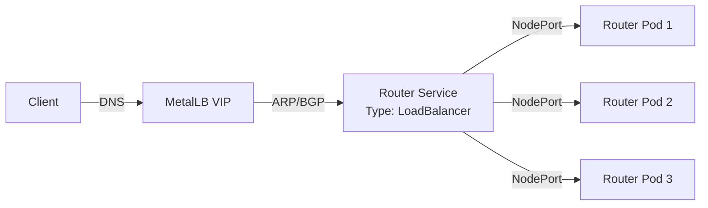

**Load Balancer**:
- MetalLB (optional): IP assignment only
- External LB (required with HostNetwork): Traffic distribution

**DNS Management**:
- Manual DNS records, OR
- ExternalDNS + DNS server with dynamic updates (RFC2136, PowerDNS API)

### Cloud (AWS/Azure/GCP)

**Platform Type**: `AWS`, `Azure`, or `GCP`

**DNS**:
- Base domain: Customer-provided
- Apps domain: Wildcard subdomain
- Implementation: Cloud DNS service (Route53, Azure DNS, Cloud DNS)
- Management: Automatic via DNSRecord CRD

**Ingress**:
- Strategy: LoadBalancerService (default)
- Service: LoadBalancer type
- Cloud LB created automatically (ELB/ALB, Azure LB, GCP LB)

**Load Balancer**: Cloud-native (provisioned automatically)

**DNS Management**: Automatic (dnsManagementPolicy: Managed)

### Side-by-Side Comparison

| Aspect | CRC | Bare Metal | Cloud |
|--------|-----|------------|-------|
| Platform Type | None | None/BareMetal | AWS/Azure/GCP |
| Ingress Strategy | HostNetwork | HostNetwork or LoadBalancerService | LoadBalancerService |
| Router Networking | Host network | Host or container network | Container network |
| Service Type | ClusterIP | ClusterIP or LoadBalancer | LoadBalancer |
| External IP | Node IP | Node IP, VIP, or MetalLB IP | Cloud LB IP |
| Load Balancer | None | External LB or MetalLB | Cloud LB |
| DNS Management | Manual (dnsmasq) | Manual or ExternalDNS | Automatic (DNSRecord CRD) |
| DNS Backend | dnsmasq | BIND/PowerDNS/CoreDNS | Cloud DNS API |
| High Availability | Single node | Multiple nodes + external LB | Cloud LB handles HA |

## Traffic Flow

### Complete Request Flow (CRC Example)

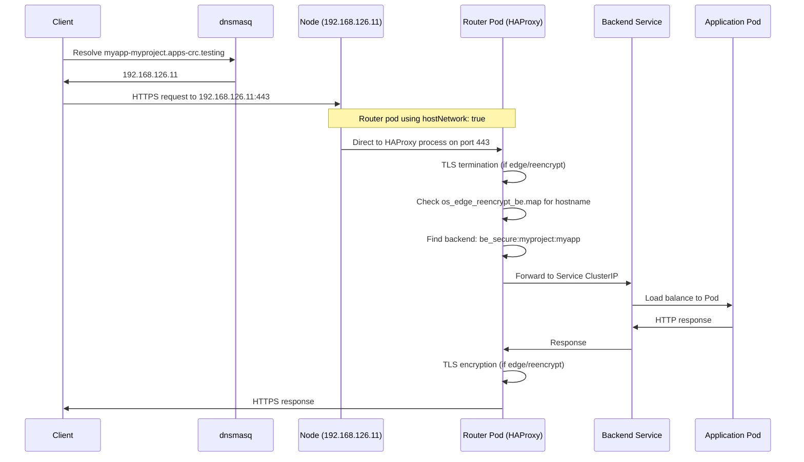

### Route Creation and HAProxy Update

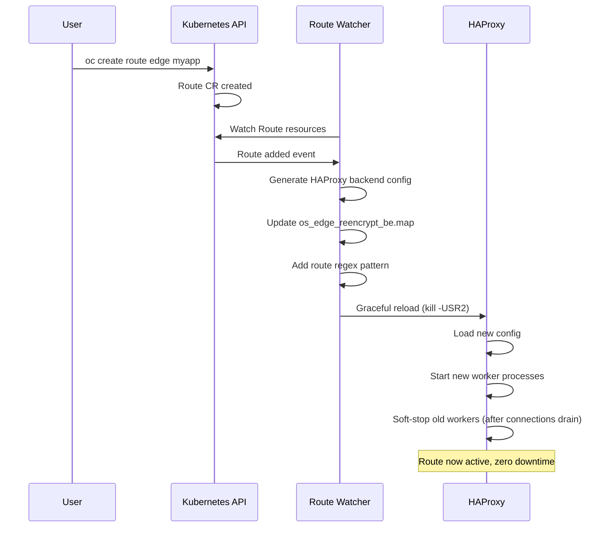

## DNS Management Details

### DNSRecord CRD (Cloud Platforms)

**CRD**: `dnsrecords.ingress.operator.openshift.io`

This is a built-in OpenShift resource for internal operator communication only.

**When Created**:
- Platform is AWS/Azure/GCP
- IngressController has `dnsManagementPolicy: Managed`
- DNS zones configured in `dns.config.openshift.io/cluster`

**What It Does**:
- Ingress Operator creates DNSRecord CR for wildcard domain
- Controller watches DNSRecord CRs
- Controller calls cloud DNS API to create/update records
- Fully automatic, no user interaction needed

**On Non-Cloud Platforms**:
- CRD exists but no instances created
- Platform type is not cloud-compatible
- DNS management is user's responsibility

Check if DNSRecord instances exist:
```bash
oc get dnsrecords -A
```

CRC and bare metal will show: `No resources found`

### ExternalDNS (Bare Metal Solution)

**Purpose**: Synchronize Kubernetes/OpenShift resources with external DNS servers

**Not Built-In**: Must be installed separately (manual deployment or External DNS Operator)

**Supported DNS Backends**:
- RFC2136 (BIND, PowerDNS with dynamic updates)
- PowerDNS API
- CoreDNS with etcd
- Many others

**How It Works**:
1. Watches Routes and Services
2. Extracts hostnames
3. Calls DNS server API/protocol
4. Creates/updates/deletes DNS records
5. Uses TXT records for ownership tracking

**Architecture**:
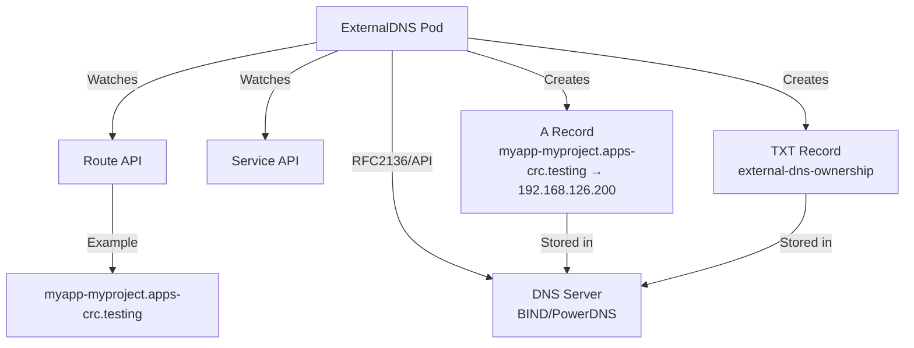

**Deployment**:
- Namespace: `external-dns` (or any)
- ServiceAccount with ClusterRole to watch routes/services
- Deployment running ExternalDNS container
- Configuration via command-line args or ConfigMap

**Example Args**:
```
--provider=rfc2136
--rfc2136-host=192.168.126.1
--rfc2136-port=53
--rfc2136-zone=crc.testing
--source=openshift-route
--source=service
--domain-filter=crc.testing
--policy=sync
```

**IngressController Configuration**:
Even with ExternalDNS, the IngressController still shows:
```yaml
spec:
  endpointPublishingStrategy:
    type: LoadBalancerService
    loadBalancer:
      dnsManagementPolicy: Unmanaged  # ExternalDNS is separate
```

The `Managed` policy only works with cloud platforms. ExternalDNS operates independently.

### MetalLB (Bare Metal Load Balancer)

**Purpose**: Provide LoadBalancer IP addresses on bare metal

**What It Does**:
- Assigns external IPs from configured pool
- Announces IPs via Layer 2 (ARP/NDP) or BGP
- Routes traffic to NodePorts

**What It Does NOT Do**:
- DNS management (MetalLB only handles IPs)
- Application routing (that's the router's job)
- TLS termination (that's HAProxy)

**With IngressController**:
```yaml
spec:
  endpointPublishingStrategy:
    type: LoadBalancerService
    loadBalancer:
      scope: External
      dnsManagementPolicy: Unmanaged
```

**Service Created**:
```
NAME             TYPE           CLUSTER-IP     EXTERNAL-IP        PORT(S)
router-default   LoadBalancer   10.217.4.36    192.168.126.200    80:30080/TCP,443:30443/TCP
```

The `192.168.126.200` is assigned by MetalLB from its pool.

**DNS Configuration**:
Still manual (or use ExternalDNS):
```
address=/.apps-crc.testing/192.168.126.200
```

**Benefits Over HostNetwork**:
- Floating VIP (can move between nodes)
- Consistent external IP (not tied to specific node)
- Better for multi-node HA scenarios
- Cleaner separation (router uses container network)

**Architecture**:
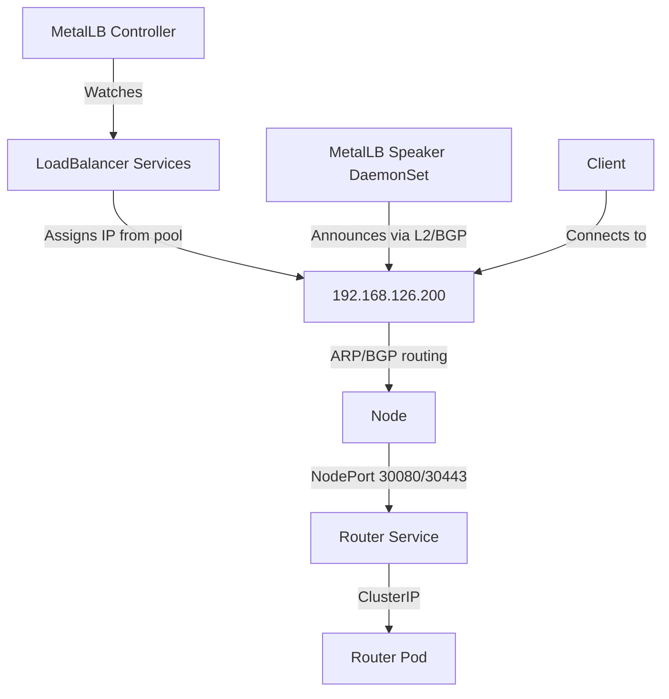

## Configuration Reference

### View Current Platform Configuration

```bash
# Platform type
oc get infrastructure cluster -o jsonpath='{.status.platform}' && echo

# Cluster domain
oc get dns.config.openshift.io cluster -o yaml

# Apps domain
oc get ingresses.config.openshift.io cluster -o yaml

# Ingress controller strategy
oc get ingresscontroller default -n openshift-ingress-operator -o yaml

# Router service
oc get service -n openshift-ingress

# Router pods
oc get pods -n openshift-ingress
```

### Common IngressController Modifications

**Explicitly set HostNetwork**:
```yaml
spec:
  endpointPublishingStrategy:
    type: HostNetwork
    hostNetwork:
      httpPort: 80
      httpsPort: 443
```

**Set LoadBalancer with MetalLB**:
```yaml
spec:
  endpointPublishingStrategy:
    type: LoadBalancerService
    loadBalancer:
      scope: External
      dnsManagementPolicy: Unmanaged
```

**Restrict LoadBalancer source IPs**:
```yaml
spec:
  endpointPublishingStrategy:
    type: LoadBalancerService
    loadBalancer:
      scope: External
      dnsManagementPolicy: Unmanaged
      allowedSourceRanges:
      - 10.0.0.0/8
      - 192.168.0.0/16
```

**Use NodePort** (rare):
```yaml
spec:
  endpointPublishingStrategy:
    type: NodePortService
```

**Note**: Cannot update `endpointPublishingStrategy` on existing IngressController. Must delete and recreate (disruptive).

### HAProxy Tuning

HAProxy configuration is controlled by IngressController spec:

**Set replica count**:
```yaml
spec:
  replicas: 3
```

**Configure TLS profile**:
Uses cluster-wide TLS security profile by default. Can override:
```bash
oc get ingresscontroller default -n openshift-ingress-operator -o jsonpath='{.status.tlsProfile}' | jq
```

**Custom error pages**:
```yaml
spec:
  httpErrorCodePages:
    name: my-custom-error-pages  # ConfigMap name
```

### Debugging Commands

**Check router logs**:
```bash
oc logs -n openshift-ingress <router-pod> --tail=50 -f
```

**Verify route registration**:
```bash
# List all routes
oc get routes -A

# Check if route appears in HAProxy maps
oc exec -n openshift-ingress <router-pod> -- cat /var/lib/haproxy/conf/os_edge_reencrypt_be.map | grep myapp
```

**Test HAProxy stats socket**:
```bash
oc exec -n openshift-ingress <router-pod> -- \
  echo "show stat" | socat stdio /var/lib/haproxy/run/haproxy.sock
```

**Check DNS resolution from within cluster**:
```bash
oc run -it --rm debug --image=registry.access.redhat.com/ubi9/ubi:latest --restart=Never -- \
  nslookup myapp-myproject.apps-crc.testing
```

**Verify TLS certificate**:
```bash
openssl s_client -connect console-openshift-console.apps-crc.testing:443 -servername console-openshift-console.apps-crc.testing
```

## Transitioning to MetalLB

The `endpointPublishingStrategy` field cannot be updated on an existing IngressController. This restriction means you cannot directly change a running IngressController from HostNetwork to LoadBalancerService.

However, you have two migration paths available.

### Migration Constraints

From the IngressController API documentation:
```
endpointPublishingStrategy cannot be updated.
```

This is a permanent field once the IngressController is created. The only way to change strategies is to delete and recreate the IngressController, or create a second one.

### Option 1: Second IngressController (Zero Downtime)

OpenShift supports multiple IngressController instances running simultaneously. Create a new IngressController with LoadBalancerService while keeping the existing default.

**Prerequisites**:
- MetalLB installed and configured with IP address pool
- Available IP addresses in the MetalLB pool
- Ability to use a different apps domain OR route selectors to control routing

**Architecture**:
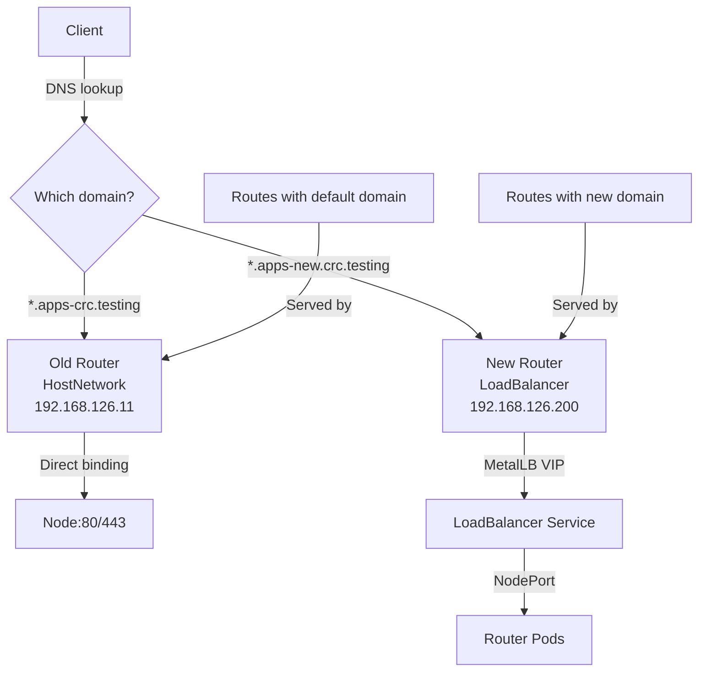

**Procedure**:

1. Install MetalLB and configure IP pool:
   ```yaml
   apiVersion: metallb.io/v1beta1
   kind: IPAddressPool
   metadata:
     name: ingress-pool
     namespace: metallb-system
   spec:
     addresses:
     - 192.168.126.200-192.168.126.210
   ```

2. Create second IngressController:
   ```yaml
   apiVersion: operator.openshift.io/v1
   kind: IngressController
   metadata:
     name: metallb-ingress
     namespace: openshift-ingress-operator
   spec:
     domain: apps-new.crc.testing
     endpointPublishingStrategy:
       type: LoadBalancerService
       loadBalancer:
         scope: External
         dnsManagementPolicy: Unmanaged
     replicas: 1
   ```

3. Verify MetalLB assigned IP:
   ```bash
   oc get service router-metallb-ingress -n openshift-ingress
   ```

   Expected output:
   ```
   NAME                    TYPE           EXTERNAL-IP        PORT(S)
   router-metallb-ingress  LoadBalancer   192.168.126.200    80:30080/TCP,443:30443/TCP
   ```

4. Configure DNS for new domain:
   ```
   # /etc/NetworkManager/dnsmasq.d/crc-new.conf
   address=/apps-new.crc.testing/192.168.126.200
   address=/.apps-new.crc.testing/192.168.126.200
   ```

5. Test with new route:
   ```bash
   oc create route edge test --service=myservice --hostname=test-myproject.apps-new.crc.testing
   curl https://test-myproject.apps-new.crc.testing
   ```

6. Migration options:

   **Option A**: Gradually move routes to new domain (requires application reconfiguration)

   **Option B**: Use route selectors to control which routes go to which IngressController:
   ```yaml
   # Update metallb-ingress to select specific routes
   spec:
     routeSelector:
       matchLabels:
         router: metallb
   ```

   Then label routes:
   ```bash
   oc label route myroute router=metallb
   ```

7. After full migration, delete old IngressController:
   ```bash
   oc delete ingresscontroller default -n openshift-ingress-operator
   ```

8. Optionally rename `metallb-ingress` to `default` (requires delete/recreate):
   ```bash
   oc get ingresscontroller metallb-ingress -n openshift-ingress-operator -o yaml > metallb-backup.yaml
   oc delete ingresscontroller metallb-ingress -n openshift-ingress-operator
   # Edit metallb-backup.yaml: change name to 'default', remove resourceVersion/uid
   oc apply -f metallb-backup.yaml
   ```

**Downtime**: Zero - both routers run simultaneously during migration

**Complexity**: High - requires domain change or route selector management

**Best for**: Production environments requiring zero downtime

### Option 2: Delete and Recreate Default (Brief Downtime)

Delete the existing default IngressController and recreate it with LoadBalancerService strategy.

**Prerequisites**:
- MetalLB installed and configured with IP address pool
- Acceptable brief outage window (30-60 seconds)

**Migration Flow**:
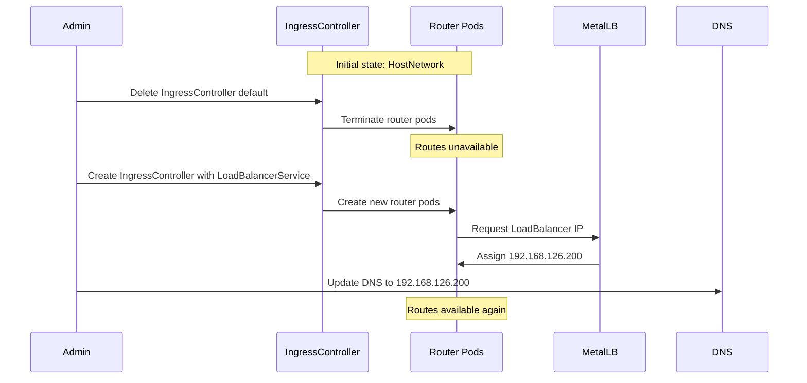

**Procedure**:

1. Install MetalLB and configure IP pool (same as Option 1)

2. Backup current IngressController:
   ```bash
   oc get ingresscontroller default -n openshift-ingress-operator -o yaml > default-ingress-backup.yaml
   ```

3. Note current configuration details:
   ```bash
   # Check replica count, domain, and other settings
   oc get ingresscontroller default -n openshift-ingress-operator -o yaml | grep -A 10 "^spec:"
   ```

4. Delete default IngressController:
   ```bash
   oc delete ingresscontroller default -n openshift-ingress-operator
   ```

   Routes become unavailable at this point.

5. Wait for router pods to terminate:
   ```bash
   oc get pods -n openshift-ingress -w
   ```

6. Create new IngressController with LoadBalancerService:
   ```yaml
   apiVersion: operator.openshift.io/v1
   kind: IngressController
   metadata:
     name: default
     namespace: openshift-ingress-operator
   spec:
     endpointPublishingStrategy:
       type: LoadBalancerService
       loadBalancer:
         scope: External
         dnsManagementPolicy: Unmanaged
     replicas: 1  # Match previous replica count
   ```

7. Verify LoadBalancer IP assignment:
   ```bash
   oc get service router-default -n openshift-ingress
   ```

8. Wait for router pods to become ready:
   ```bash
   oc get pods -n openshift-ingress -w
   ```

   Routes become available again.

9. Update DNS to point to MetalLB IP:
   ```bash
   # /etc/NetworkManager/dnsmasq.d/crc-snc.conf
   # Change from:
   # address=/.apps-crc.testing/192.168.126.11
   # To:
   address=/.apps-crc.testing/192.168.126.200
   ```

10. Reload NetworkManager:
    ```bash
    sudo systemctl reload NetworkManager
    ```

11. Verify DNS resolution:
    ```bash
    nslookup console-openshift-console.apps-crc.testing
    ```

12. Test route access:
    ```bash
    curl https://console-openshift-console.apps-crc.testing
    ```

**Downtime**: 30-60 seconds (time to terminate old pods and start new ones)

**Complexity**: Low - straightforward delete and recreate

**Best for**: Development, test, and CRC environments where brief downtime is acceptable

**Rollback**: If issues occur, recreate with HostNetwork using the backup:
```bash
oc delete ingresscontroller default -n openshift-ingress-operator
# Edit backup file to restore HostNetwork strategy
oc apply -f default-ingress-backup.yaml
```

### Post-Migration Verification

After migrating to MetalLB, verify the configuration:

**Check endpoint publishing strategy**:
```bash
oc get ingresscontroller default -n openshift-ingress-operator -o jsonpath='{.status.endpointPublishingStrategy}' | jq
```

Expected output:
```json
{
  "loadBalancer": {
    "allowedSourceRanges": [],
    "dnsManagementPolicy": "Unmanaged",
    "scope": "External"
  },
  "type": "LoadBalancerService"
}
```

**Verify router pod networking**:
```bash
oc get pod -n openshift-ingress -o jsonpath='{.items[0].spec.hostNetwork}' && echo
```

Should return: `false` (container networking, not host networking)

**Check LoadBalancer service**:
```bash
oc get service router-default -n openshift-ingress
```

Should show `TYPE: LoadBalancer` with `EXTERNAL-IP` from MetalLB pool

**Verify routes are accessible**:
```bash
oc get routes -A
curl -k https://console-openshift-console.apps-crc.testing
```

**Check MetalLB assignment**:
```bash
oc get ipaddresspool -n metallb-system
oc get l2advertisement -n metallb-system  # If using L2 mode
```

### Comparison of Migration Options

| Aspect | Option 1: Second Controller | Option 2: Delete/Recreate |
|--------|----------------------------|--------------------------|
| Downtime | Zero | 30-60 seconds |
| Complexity | High | Low |
| DNS changes | New domain required initially | Update existing domain |
| Route migration | Gradual per route | All routes at once |
| Rollback | Keep both running | Restore from backup |
| Domain strategy | Requires new domain or selectors | Same domain |
| Best for | Production | Dev/test/CRC |
| Risk | Low (can test before cutover) | Medium (brief outage) |

### Common Issues and Solutions

**MetalLB not assigning IP**:
- Check IPAddressPool configuration
- Verify L2Advertisement or BGPAdvertisement exists
- Check MetalLB controller and speaker pods are running

**Routes not accessible after migration**:
- Verify DNS points to correct IP
- Check router pods are running and ready
- Confirm routes appear in HAProxy maps: `oc exec -n openshift-ingress <router-pod> -- cat /var/lib/haproxy/conf/os_edge_reencrypt_be.map`

**NodePort conflicts**:
- MetalLB uses NodePorts to route traffic
- Ensure NodePort range is available (default 30000-32767)
- Check for conflicts: `oc get svc -A | grep NodePort`

**DNS caching issues**:
- Clear local DNS cache after updating records
- Test with `dig` or `nslookup` to verify resolution
- May need to restart dnsmasq: `sudo systemctl restart NetworkManager`

### Additional Considerations

**Multi-node clusters**:
- MetalLB provides floating VIP that can move between nodes
- Router pods can run on different nodes without changing external IP
- Better HA compared to HostNetwork where each pod binds to specific node IP

**Performance**:
- LoadBalancer adds slight overhead (NodePort layer)
- HostNetwork has direct binding (marginally lower latency)
- For most workloads, difference is negligible

**Security**:
- LoadBalancer allows source IP restrictions via `allowedSourceRanges`
- HostNetwork requires external firewall rules on nodes
- Container network isolation is cleaner separation

**Monitoring**:
- MetalLB exposes metrics for IP pool usage
- Can monitor which service has which IP assignment
- LoadBalancer service status shows in Kubernetes API

## Summary

OpenShift networking architecture varies by platform but follows consistent patterns:

1. **DNS is split**: Base domain for cluster services, apps domain for routes
2. **Ingress publishes routes**: Via IngressController with platform-specific strategies
3. **Router is HAProxy**: Dynamically configured by watching Route resources
4. **Traffic flow depends on strategy**: HostNetwork (direct binding) or LoadBalancer (via Service)
5. **DNS management varies**: Automatic on cloud, manual or ExternalDNS on bare metal
6. **Load balancing options**: Cloud LB (automatic), MetalLB (bare metal), or external LB
7. **Migration is possible**: Can transition from HostNetwork to MetalLB via delete/recreate or second controller

The system is designed to work out-of-the-box on cloud platforms while providing flexibility for bare metal deployments.
