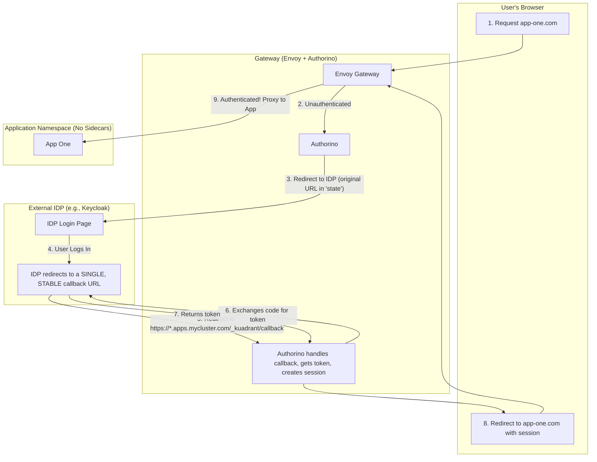
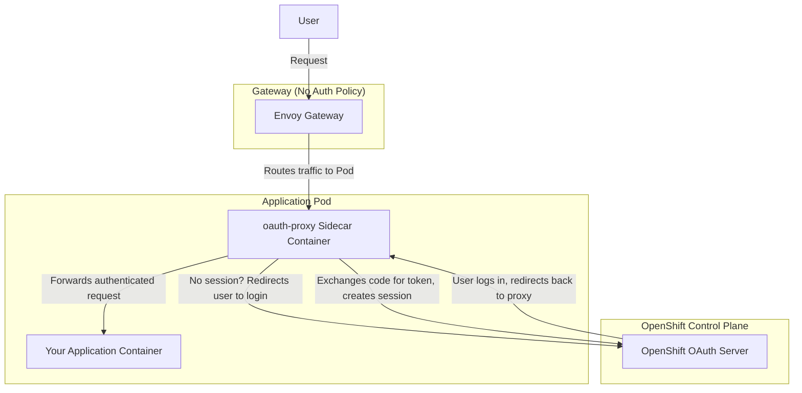

# Scalable OIDC Authentication with a Centralized Gateway Broker

## Executive Summary

The common pattern of using an `oauth-proxy` sidecar for every application is fundamentally unscalable. It leads to operational bottlenecks, manual configuration, and security risks.

This document outlines a superior architectural pattern: using a **centralized authentication broker at the gateway**. This approach leverages **Authorino** and the **Gateway API** to provide a scalable, secure, and Kubernetes-native solution for integrating with external OIDC Identity Providers (IDPs) like Keycloak, Okta, or Azure AD.

Crucially, this pattern **does not require a service mesh**.

---

## The Problem: Why Per-Application Proxies Don't Scale with *External* IDPs

The naive pattern of deploying an authentication proxy sidecar for each application creates significant, predictable problems at scale *when integrating with standard, external Identity Providers*.

### Clarification: `oauth-proxy` (Scalable) vs. `oauth2-proxy` (Unscalable in this model)

It's crucial to distinguish between two common proxies, as their scalability differs based on their backend.

*   **`oauth-proxy` (the OpenShift-specific one):** This proxy is designed to work with the **OpenShift OAuth server**. In this context, the sidecar pattern *can* be scalable. Why? Because the clients it uses (`OAuthClient` resources) are native Kubernetes CRDs. This allows for automation: a controller can watch for new applications (e.g., new `Ingress` or `Route` objects) and programmatically create the necessary `OAuthClient` for it. While it's still a sidecar per app, the critical client management bottleneck is removed, making it a **viable pattern within the closed OpenShift ecosystem**.

*   **`oauth2-proxy` (the generic OIDC one):** This popular proxy is designed to work with any **standard external OIDC provider** (Keycloak, Okta, Auth0, etc.). The scalability problems arise here because the OIDC clients for each application must be manually created and managed in the external IDP's web console, which is not programmatically accessible from within Kubernetes in a standardized way.

**The rest of this document focuses on solving the scalability problem for the much more common enterprise use case: securely integrating with *external, standard OIDC providers*.** It is in this context that the per-application proxy model fails.

The core scaling challenges of using a per-app `oauth2-proxy` with an external IDP are:

1.  **Manual Configuration Hell:** Every time a new application is deployed, a developer must manually:
    *   Create a new client in the external IDP.
    *   Copy the `clientID` and `clientSecret`.
    *   Inject these secrets into the application's deployment configuration.
    This process is slow, error-prone, and violates GitOps principles.

2.  **Redirect URI Brittleness:** The external IDP's client configuration needs a static list of "Valid Redirect URIs".
    *   Every new ingress, hostname, or path for an application requires a manual update in the IDP.
    *   This creates a tight coupling between application routing and identity provider configuration, causing significant operational friction.

3.  **Client Proliferation:** Creating a new OIDC client for every single application is a management nightmare for the identity and security teams. It clutters the IDP and makes auditing and lifecycle management incredibly difficult.

This model simply breaks down beyond a handful of applications.

---

## The Solution: A Centralized Authentication Broker with Authorino

Instead of distributing authentication logic to each application, we centralize it at the gateway. Authorino is purpose-built to act as this broker.

### How It Works: "One Client to Rule Them All"

1.  **One Centralized OIDC Client:** You create a **single** OIDC client in your external IDP (e.g., Keycloak). This client is configured with a stable, **wildcard redirect URI** that points back to the gateway, for example: `https://*.apps.mycluster.com/_kuadrant/callback`.

2.  **Centralized Secret Management:** The OIDC provider's `issuer`, `clientID`, and `clientSecret` are configured *once* in a Kubernetes `Secret` and referenced by a Kuadrant `AuthPolicy`.

3.  **The Scalable Authentication Flow:**
    *   An unauthenticated user requests `https://app-one.apps.mycluster.com`.
    *   The gateway, via Authorino, intercepts the request.
    *   Authorino initiates the OIDC redirect. It securely encrypts the original requested URL (`https://app-one.apps.mycluster.com`) inside the `state` parameter of the OIDC request.
    *   The user is sent to the external IDP to log in.
    *   After successful login, the IDP redirects the user back to the single, pre-configured wildcard callback URI.
    *   Authorino's central callback handler receives the request, exchanges the authorization code for tokens, and establishes a secure session cookie.
    *   Authorino then decrypts the original URL from the `state` parameter and securely redirects the user's browser back to `https://app-one.apps.mycluster.com`. The user is now authenticated.

### Architectural Diagram (No Service Mesh)

---

## Clarification: Service Mesh Is Not Required

This entire architecture operates at the **ingress gateway**, leveraging the Gateway API. It does **not** require a service mesh.

*   **The Real Dependency:** Authorino's core dependency is on an **Envoy proxy** with its **`ext_authz` filter enabled**.
*   **Gateway API Provides This:** The `Gateway` resource provisions an Envoy proxy pod to handle ingress traffic.
*   **The `AuthPolicy` Connects Them:** The Kuadrant `AuthPolicy` Custom Resource is the glue that configures the gateway's Envoy proxy to use your central Authorino instance as its `ext_authz` server.

This provides powerful, centralized authentication for all North-South (ingress) traffic without the complexity of managing sidecars for East-West traffic.

| Scenario | Service Mesh Required? | How Authorino is Used |
| :--- | :--- | :--- |
| **Securing Ingress Traffic (North-South)** | **No** | Envoy in the **Gateway pod** calls Authorino. This is our scalable OIDC pattern. |
| **Securing Internal Traffic (East-West)** | **Yes** | Envoy in the **sidecar pod** next to the *calling* service calls Authorino. |

---

## How This Pattern Solves the Scaling Problems

This centralized broker architecture directly solves every pain point you identified.

| Pain Point | Per-App `oauth-proxy` (The Problem) | **Centralized Authorino Broker (The Solution)** |
| :--- | :--- | :--- |
| **Manual User Input for Credentials** | **High.** Developers need to handle secrets for every app. | **Solved.** OIDC provider info is stored once in a central Kubernetes `Secret` and referenced declaratively by policies. |
| **Redirect URI Management** | **High & Brittle.** The IDP needs a static list of every app's URL. | **Solved.** The IDP only needs one stable, wildcard callback URI (`https://*.apps.mycluster.com/_kuadrant/callback`). Adding new apps requires zero changes in the IDP. |
| **OIDC Client Proliferation** | **High.** One client per application creates a management nightmare. | **Solved.** One OIDC client can securely serve hundreds of applications on your cluster. |
| **Onboarding New Applications** | **Slow & Manual.** Requires coordination between app teams and identity teams. | **Fast & Automated.** Onboarding a new app is as simple as applying a Kubernetes `AuthPolicy`. It's a pure GitOps workflow. |
| **Scalability** | **Very Poor.** Fails after a handful of applications. | **Excellent.** Scales to hundreds of applications with minimal operational overhead. |

By adopting this model, you move from a brittle, imperative process to a robust, declarative, and Kubernetes-native workflow for application authentication.

---

## What About the Built-in OpenShift OAuth Server?

This is a critical point of clarification. The centralized Authorino broker pattern described above is the recommended solution for integrating with **external, standard OIDC providers**.

The built-in **OpenShift OAuth server** uses a different, mutually exclusive pattern for interactive user logins: the **`oauth-proxy` sidecar**. You cannot use Authorino's OIDC login flow capabilities with the OpenShift OAuth server because it is not a standard OIDC provider.

### Two Mutually Exclusive Patterns for UI Logins

You must choose one of these two patterns for your user-facing applications.

| Feature | **Pattern 1: Authorino @ Gateway (This Document's Focus)** | **Pattern 2: `oauth-proxy` Sidecar** |
| :--- | :--- | :--- |
| **Use Case** | Integrating with **External/Standard OIDC Providers** (Keycloak, Okta, etc.). | Integrating with the **Built-in OpenShift OAuth Server**. |
| **Architecture** | **Centralized.** One Authorino instance at the gateway handles all apps. | **Decentralized.** One `oauth-proxy` sidecar is required for *every* application pod. |
| **How it Works** | Authorino initiates the OIDC login flow and manages the session. | The `oauth-proxy` sidecar initiates the login flow and manages the session. |
| **App Deployment** | **No changes needed.** Your application `Deployment` is untouched. | **Requires modification.** Every `Deployment` must be configured with the `oauth-proxy` sidecar. |
| **Client Management** | **Excellent.** One client in your external IDP can serve all apps. | **Good.** One `OAuthClient` CRD is needed per app, but this can be automated by a controller. |

### Architectural Diagram: `oauth-proxy` Sidecar Flow

This diagram shows how the `oauth-proxy` pattern works. Notice that the authentication logic is inside the application pod, not at the gateway.

### When to Choose Which Pattern

*   **Choose the Centralized Authorino Broker (this document's pattern) if:**
    *   You need to connect to a corporate standard OIDC provider like Keycloak, Okta, Azure AD, etc.
    *   You want to avoid modifying application deployments.
    *   You want a single, scalable client for all your applications.

*   **Choose the `oauth-proxy` Sidecar pattern if:**
    *   You want to use OpenShift's built-in user identities exclusively.
    *   You do not have or want to manage an external IDP.
    *   You are willing to add and manage a sidecar for every application that needs protection.

In summary, the scalable architecture described in this document is specifically for the common enterprise use case of integrating with external OIDC providers. For leveraging OpenShift's internal OAuth system, you must use the `oauth-proxy` sidecar pattern instead. 