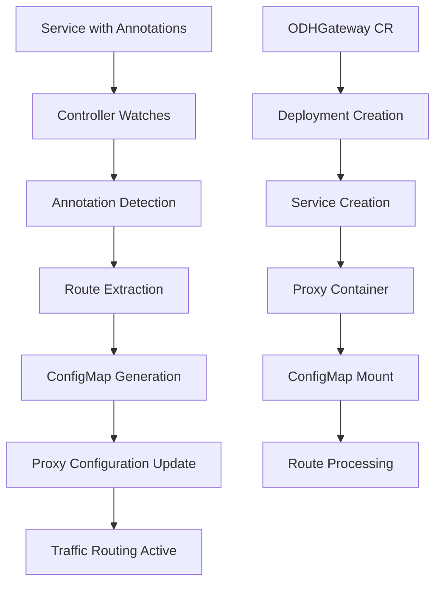

# odh-gateway-operator

A Kubernetes operator that provides centralized API gateway functionality for OpenDataHub (ODH) applications, enabling secure access management and traffic routing to multiple backend services through annotation-driven configuration.

## Description

The ODH Gateway Operator simplifies the deployment and management of API gateways in OpenDataHub environments. It automatically discovers backend services through Kubernetes annotations and dynamically configures a centralized proxy to route external traffic to the appropriate upstream services.

### Key Features

- **Annotation-Driven Service Discovery**: Automatically discovers and routes to services marked with specific annotations
- **Multi-Mode Authentication**: Supports both OIDC and OpenShift OAuth authentication
- **Dynamic Configuration Management**: Automatically updates routing rules when annotated services change
- **Centralized Access Control**: Provides a single entry point for multiple ODH applications
- **ConfigMap-Based Routing**: Generates and manages routing configuration through Kubernetes ConfigMaps

### Architecture Overview

The operator consists of several key components working together:

1. **ODHGateway Custom Resource**: Defines the gateway configuration including authentication mode, hostname, and routing behavior
2. **Controller**: Watches for changes to ODHGateway resources and annotated Services, reconciling the desired state
3. **Proxy Deployment**: Runs the actual gateway/proxy container that handles incoming requests
4. **Route ConfigMap**: Contains the routing rules dynamically generated from discovered services
5. **Service Discovery**: Continuously monitors Kubernetes Services for gateway annotations

### How Annotations Drive the Controller

The controller uses a sophisticated annotation-based system to automatically discover and configure backend services:

#### Service Annotations

Services opt into the gateway by adding specific annotations:

- **`odhgateway.opendatahub.io/enabled: "true"`**: Marks a service for inclusion in the gateway routing
- **`odhgateway.opendatahub.io/route-path: "/path"`**: Defines the URL path where the service should be accessible

#### Controller Behavior

The controller implements several key behaviors driven by these annotations:

1. **Service Watching**: The controller watches all Services cluster-wide for the presence of the `odhgateway.opendatahub.io/enabled` annotation
2. **Event-Driven Reconciliation**: When a Service is created, updated, or deleted with the annotation, the controller triggers a reconciliation of the ODHGateway resource
3. **Route Generation**: During reconciliation, the controller:
   - Scans all Services for the enabled annotation
   - Extracts the route path from the `route-path` annotation
   - Determines the appropriate upstream URL (service name, namespace, and port)
   - Generates a routing configuration in YAML format
4. **ConfigMap Management**: The generated routing rules are stored in a ConfigMap that's mounted into the proxy container
5. **Proxy Updates**: The proxy container reads the ConfigMap and updates its routing table dynamically

#### Under the Hood Process Flow



#### Example Service Configuration

```yaml
apiVersion: v1
kind: Service
metadata:
  name: my-odh-app
  namespace: data-science
  annotations:
    odhgateway.opendatahub.io/enabled: "true"
    odhgateway.opendatahub.io/route-path: "/jupyter"
spec:
  ports:
  - port: 8080
  selector:
    app: jupyter-notebook
```

This service would automatically be discovered and configured to be accessible at `/jupyter` through the ODH Gateway.

#### Generated Routing Configuration

The controller generates routing configuration like:

```yaml
routes:
  - path: /jupyter
    upstream: http://my-odh-app.data-science.svc.cluster.local:8080
  - path: /mlflow
    upstream: http://mlflow-service.mlops.svc.cluster.local:5000
```

### Authentication Modes

The operator supports two authentication modes:

#### OIDC Mode
```yaml
spec:
  mode: "oidc"
  oidc:
    issuerURL: "https://your-oidc-provider.com"
    clientID: "odh-gateway"
    clientSecretRef:
      name: "oidc-secret"
      key: "client-secret"
```

#### OpenShift Mode
```yaml
spec:
  mode: "openshift"
  openshift:
    clientID: "odh-gateway"
    userInfoURL: "https://openshift-api/oauth/authorize"
    oAuthURL: "https://openshift-api/oauth/token"
```

## Getting Started

### Prerequisites
- go version v1.23.0+
- docker version 17.03+.
- kubectl version v1.11.3+.
- Access to a Kubernetes v1.11.3+ cluster.

### To Deploy on the cluster
**Build and push your image to the location specified by `IMG`:**

```sh
make docker-build docker-push IMG=<some-registry>/odh-gateway-operator:tag
```

**NOTE:** This image ought to be published in the personal registry you specified.
And it is required to have access to pull the image from the working environment.
Make sure you have the proper permission to the registry if the above commands don't work.

**Install the CRDs into the cluster:**

```sh
make install
```

**Deploy the Manager to the cluster with the image specified by `IMG`:**

```sh
make deploy IMG=<some-registry>/odh-gateway-operator:tag
```

> **NOTE**: If you encounter RBAC errors, you may need to grant yourself cluster-admin
privileges or be logged in as admin.

**Create instances of your solution**

First, create a complete ODHGateway configuration. Here's a comprehensive example:

```yaml
apiVersion: gateway.opendatahub.io/v1alpha1
kind: ODHGateway
metadata:
  name: odhgateway-sample
  namespace: default
spec:
  mode: "oidc"  # or "openshift"
  hostname: "gateway.example.com"
  configMapName: "odh-proxy-config"
  image: "registry.tannerjc.net/odh-proxy:latest"
  
  # OIDC Authentication Configuration
  oidc:
    issuerURL: "https://your-oidc-provider.com"
    clientID: "odh-gateway"
    clientSecretRef:
      name: "oidc-client-secret"
      key: "client-secret"
  
  # Route ConfigMap Configuration (optional - will be auto-generated if not specified)
  routeConfigMap:
    name: "odh-routes"
    managed: true
    key: "config.yaml"
  
  # Namespace selector (optional)
  namespaceSelector:
    include:
      - "data-science"
      - "mlops"
```

Then apply the configuration:

```sh
kubectl apply -f your-gateway-config.yaml
```

Or use the provided samples:

```sh
kubectl apply -k config/samples/
```

**Configure Backend Services**

To expose services through the gateway, annotate them:

```yaml
apiVersion: v1
kind: Service
metadata:
  name: jupyter-service
  namespace: data-science
  annotations:
    odhgateway.opendatahub.io/enabled: "true"
    odhgateway.opendatahub.io/route-path: "/jupyter"
spec:
  ports:
  - port: 8080
  selector:
    app: jupyter-notebook
---
apiVersion: v1
kind: Service
metadata:
  name: mlflow-service
  namespace: mlops
  annotations:
    odhgateway.opendatahub.io/enabled: "true"
    odhgateway.opendatahub.io/route-path: "/mlflow"
spec:
  ports:
  - port: 5000
  selector:
    app: mlflow-server
```

The controller will automatically detect these annotated services and configure routing to make them accessible at:
- `https://gateway.example.com/jupyter` → jupyter-service
- `https://gateway.example.com/mlflow` → mlflow-service

### To Uninstall
**Delete the instances (CRs) from the cluster:**

```sh
kubectl delete -k config/samples/
```

**Delete the APIs(CRDs) from the cluster:**

```sh
make uninstall
```

**UnDeploy the controller from the cluster:**

```sh
make undeploy
```

## Troubleshooting

### Common Issues

#### Services Not Being Discovered

If your annotated services aren't appearing in the gateway routing:

1. **Check annotations are correct**:
   ```sh
   kubectl get svc <service-name> -o yaml | grep -A 5 annotations
   ```
   
2. **Verify the controller is running**:
   ```sh
   kubectl logs -n odh-gateway-operator-system deployment/odh-gateway-operator-controller-manager
   ```

3. **Check the generated ConfigMap**:
   ```sh
   kubectl get configmap <gateway-name>-routes -o yaml
   ```

#### Authentication Issues

For OIDC authentication problems:
- Verify the OIDC client secret exists and is accessible
- Check the issuer URL is reachable from the cluster
- Ensure the client ID matches your OIDC provider configuration

For OpenShift authentication:
- Verify the OAuth URLs are correct for your OpenShift cluster
- Check that the client ID is registered in OpenShift

#### Proxy Container Issues

If the proxy container fails to start:
- Check the image is accessible: `kubectl get pods <pod-name> -o yaml`
- Verify ConfigMap is mounted correctly
- Check container logs: `kubectl logs <pod-name> -c proxy`

### Debugging Commands

```sh
# Check ODHGateway resource status
kubectl get odhgateway -o yaml

# View controller logs
kubectl logs -l control-plane=controller-manager -n odh-gateway-operator-system

# List all services with ODH annotations
kubectl get services --all-namespaces -o json | jq '.items[] | select(.metadata.annotations["odhgateway.opendatahub.io/enabled"] == "true") | {name: .metadata.name, namespace: .metadata.namespace, annotations: .metadata.annotations}'

# Check generated routing ConfigMap
kubectl get configmap -l app=<gateway-name> -o yaml
```

## Project Distribution

Following the options to release and provide this solution to the users.

### By providing a bundle with all YAML files

1. Build the installer for the image built and published in the registry:

```sh
make build-installer IMG=<some-registry>/odh-gateway-operator:tag
```

**NOTE:** The makefile target mentioned above generates an 'install.yaml'
file in the dist directory. This file contains all the resources built
with Kustomize, which are necessary to install this project without its
dependencies.

2. Using the installer

Users can just run 'kubectl apply -f <URL for YAML BUNDLE>' to install
the project, i.e.:

```sh
kubectl apply -f https://raw.githubusercontent.com/<org>/odh-gateway-operator/<tag or branch>/dist/install.yaml
```

### By providing a Helm Chart

1. Build the chart using the optional helm plugin

```sh
operator-sdk edit --plugins=helm/v1-alpha
```

2. See that a chart was generated under 'dist/chart', and users
can obtain this solution from there.

**NOTE:** If you change the project, you need to update the Helm Chart
using the same command above to sync the latest changes. Furthermore,
if you create webhooks, you need to use the above command with
the '--force' flag and manually ensure that any custom configuration
previously added to 'dist/chart/values.yaml' or 'dist/chart/manager/manager.yaml'
is manually re-applied afterwards.

## Contributing

We welcome contributions to the ODH Gateway Operator! Here's how you can help:

### Development Setup

1. **Clone the repository**:
   ```sh
   git clone https://github.com/your-org/odh-gateway-operator.git
   cd odh-gateway-operator
   ```

2. **Install dependencies**:
   ```sh
   go mod download
   ```

3. **Run tests**:
   ```sh
   make test
   ```

4. **Run locally against a cluster**:
   ```sh
   make install run
   ```

### Making Changes

1. **Code Structure**:
   - `api/v1alpha1/`: Contains the ODHGateway CRD definitions
   - `internal/controller/`: Contains the controller logic
   - `config/`: Contains Kubernetes manifests and samples

2. **Key Files to Understand**:
   - `odhgateway_types.go`: Defines the ODHGateway resource structure
   - `odhgateway_controller.go`: Main controller logic and annotation processing
   - `config/samples/`: Example ODHGateway configurations

3. **Testing Changes**:
   - Add unit tests for new functionality
   - Test with sample services that have the required annotations
   - Verify ConfigMap generation and proxy deployment

### Annotation System

When extending the annotation system:
- Use the prefix `odhgateway.opendatahub.io/`
- Update both the controller logic and documentation
- Consider backward compatibility

### Submitting Changes

1. Fork the repository
2. Create a feature branch
3. Make your changes with appropriate tests
4. Submit a pull request with a clear description of the changes

**NOTE:** Run `make help` for more information on all potential `make` targets

More information can be found via the [Kubebuilder Documentation](https://book.kubebuilder.io/introduction.html)

## License

Copyright 2025 ODH.

Licensed under the Apache License, Version 2.0 (the "License");
you may not use this file except in compliance with the License.
You may obtain a copy of the License at

    http://www.apache.org/licenses/LICENSE-2.0

Unless required by applicable law or agreed to in writing, software
distributed under the License is distributed on an "AS IS" BASIS,
WITHOUT WARRANTIES OR CONDITIONS OF ANY KIND, either express or implied.
See the License for the specific language governing permissions and
limitations under the License.

