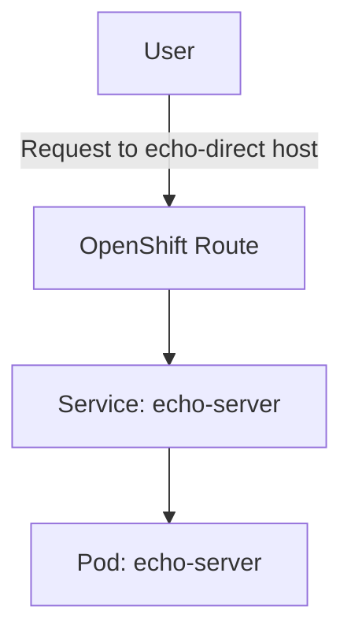
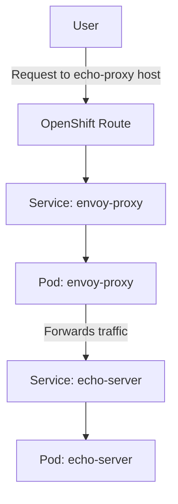
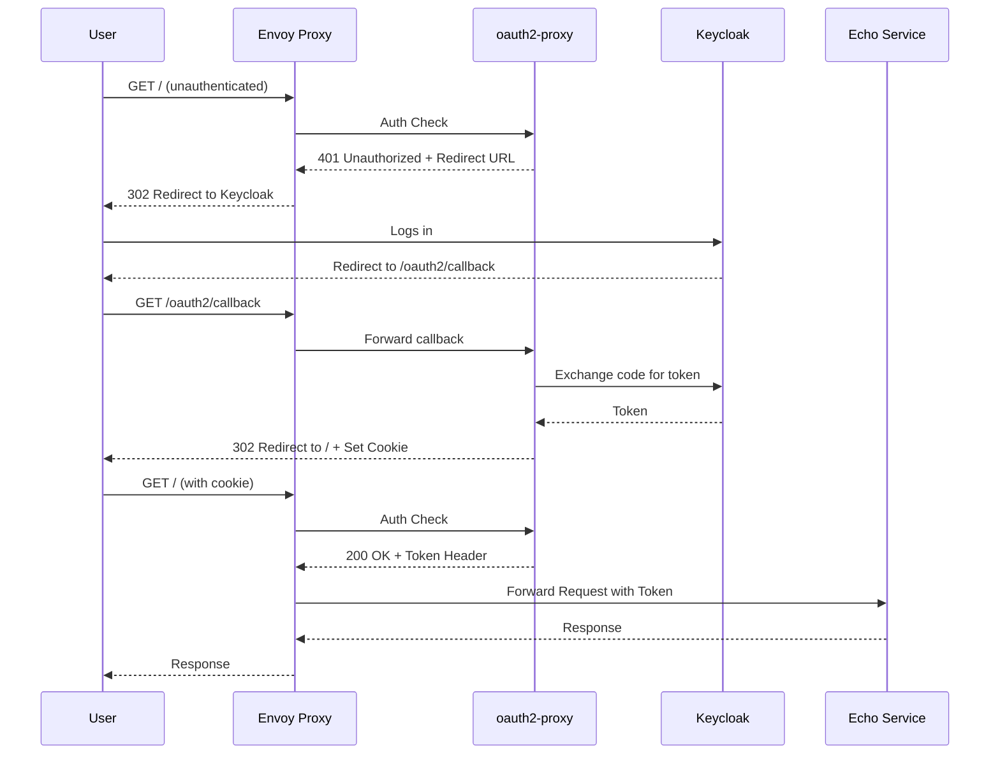

# OCP Envoy External Authorization Demo

This project demonstrates how to use Envoy as a proxy in OpenShift, including a sophisticated example of using the `ext_authz` filter with `oauth2-proxy` to secure a backend service with OIDC.

There are three main components, each in its own directory under `src/`.

---

## 1. The Echo Service (`src/echo-server`)

This is a simple backend service used as the destination for our proxies. It is exposed directly via an OpenShift Route without any additional protection.



### Components
*   `app.py`: A simple Python Flask application that listens on any path and echoes back all the request headers it receives as a JSON response.
*   `Dockerfile`: A container image definition for the echo service.
*   `Makefile`: A helper to build and push the container image to `registry.tannerjc.net/echo-server:latest`.
*   `deployment.yaml`: A Kubernetes manifest that deploys the echo service into the `echo-server` namespace. It also creates a `Service` and a direct, unsecured OpenShift `Route` to expose it.

### Usage
1.  Navigate to `src/echo-server`.
2.  Run `make build` and `make push` to build and publish the container image.
3.  Apply the manifest: `oc apply -f deployment.yaml`.
4.  The service will be accessible at `http://echo-direct.apps-crc.testing`.

---

## 2. Unauthenticated Envoy Proxy (`src/envoy-proxy`)

This is a basic example of an Envoy proxy that performs simple routing to the backend echo service.



### Components
*   `deployment.yaml`: A Kubernetes manifest containing:
    *   A `ConfigMap` with the Envoy configuration to listen for traffic and route all requests to the `echo-server` service.
    *   A `Deployment` for the Envoy proxy itself, using the Red Hat Service Mesh proxy image.
    *   A `Service` to expose the Envoy pod.
    *   An OpenShift `Route` to make the proxy publicly accessible.

> **Note on the Envoy Image:** The `registry.redhat.io/openshift-service-mesh/proxyv2-rhel9:2.6` image is designed for use with Istio and has a default entrypoint (`pilot-agent`) that we don't want. In the Deployment spec, we override this by setting the `command` to `/usr/local/bin/envoy` to run the raw Envoy binary directly with our custom configuration.

### Usage
1.  Apply the manifest: `oc apply -f src/envoy-proxy/deployment.yaml`.
2.  The proxy will be accessible at `http://echo-proxy.apps-crc.testing`.
3.  All traffic sent to this URL will be forwarded to the echo service.

---

## 3. Authenticated Envoy Proxy (`src/envoy-proxy-authenticated`)

This is the complete, secure setup demonstrating Envoy's external authorization capabilities with `oauth2-proxy` and an OIDC provider (Keycloak).



### How It Works
1.  A request comes into the Envoy proxy.
2.  Envoy's `ext_authz` filter intercepts the request and sends a "check" request to the `oauth2-proxy` service.
3.  If the user is not authenticated, `oauth2-proxy` instructs Envoy to perform a `302 Redirect` to the Keycloak login page.
4.  After successful login, the user is redirected back. `oauth2-proxy` validates the OIDC token and responds `200 OK` to Envoy.
5.  With the `200 OK` from `oauth2-proxy`, Envoy forwards the original request to the `echo-server`.
6.  `oauth2-proxy` also attaches the user's identity information and access token as headers (`X-Auth-Request-*`), which Envoy forwards to the `echo-server`.

### Components
*   `deployment.yaml`: A single, comprehensive manifest containing:
    *   A `Secret` to hold the OIDC client credentials for `oauth2-proxy`. **You must edit this file before applying it.**
    *   A `Deployment` and `Service` for `oauth2-proxy`, configured to use Keycloak.
    *   A `ConfigMap` with an advanced Envoy configuration.
    *   A `Deployment`, `Service`, and OpenShift `Route` for the authenticated Envoy proxy.

### Envoy Routing Logic Explained

The order of the routing rules in the Envoy `ConfigMap` is critical. Envoy evaluates them from top to bottom and uses the first one that matches.

1.  **Rule 1: The OAuth2 Callback Exemption**
    *   **Match:** The first rule checks if the request path starts with `/oauth2`.
    *   **Action:** If it matches, the request is immediately routed to the `oauth2-proxy` service.
    *   **Crucially:** This rule also has a `typed_per_filter_config` section that explicitly **disables** the `ext_authz` filter for this specific route. This is the key to preventing an infinite loop where the login callback itself would require a login.

2.  **Rule 2: The Default Protected Route**
    *   **Match:** If the first rule does not match, Envoy checks the second rule, which matches any path starting with `/` (i.e., everything else).
    *   **Action:** The request is routed to the `echo-server`.
    *   **Implicit Action:** Because this rule does *not* have a section disabling the `ext_authz` filter, the global `ext_authz` filter we defined is automatically applied. This means every request matching this rule must first be approved by `oauth2-proxy` before it is sent to the `echo-server`.

### `oauth2-proxy` Configuration Explained

The startup arguments for `oauth2-proxy` are critical for making it work as a pure authorization service for Envoy:
*   `--provider=oidc`: Specifies that we are using a standard OpenID Connect provider.
*   `--oidc-issuer-url=...`: The URL to your Keycloak realm's discovery endpoint.
*   `--upstream=static://200`: This is the key trick. It tells `oauth2-proxy` to not act as a reverse proxy. Instead of forwarding traffic, it will simply return a static `200 OK` response after a successful login, which is the signal Envoy needs to proceed.
*   `--skip-provider-button`: Immediately redirects users to the Keycloak login page instead of showing an intermediate login page from `oauth2-proxy` itself.
*   `--pass-access-token=true`: Tells the proxy to pass the user's access token in a header.
*   `--set-xauthrequest=true`: Works with `--pass-access-token` to specifically set the `X-Auth-Request-Access-Token` header in the response to Envoy, which is required for the `auth_request` flow.
*   `--ssl-insecure-skip-verify=true`: **(For demo purposes only)**. This is required because the `oauth2-proxy` pod needs to connect to the Keycloak server, and if Keycloak is using a self-signed or private CA, this flag is needed to bypass TLS certificate validation. In production, you would mount a custom CA bundle instead.

### Understanding the 401 Error from the Kubernetes API

When the `echo-server` attempts to use the user's token to list namespaces, the Kubernetes API will return a `401 Unauthorized` error. This is expected and correct behavior, demonstrating a key JWT security feature.

The call to the Kubernetes API from the echo server will only succeed if the JWT has an **audience** claim (`aud`) containing a client name that is also present in the allowed audience list of the OpenShift cluster's OIDC configuration. In this demo, the token's audience is for our `odh` client, but the Kubernetes API expects a different audience (e.g., `kubernetes`). The mismatch causes the API server to reject the token, which is the correct and secure action. The `401` error successfully proves that the token was passed correctly and that the destination API is enforcing its security policies.

### Usage
1.  **IMPORTANT:** Edit `src/envoy-proxy-authenticated/deployment.yaml` and fill in the placeholder values in the `oauth2-proxy-creds` Secret with your Keycloak client details and a random cookie secret.
2.  Ensure your OIDC client in Keycloak has the valid redirect URI set to `https://echo-proxy-authenticated.apps-crc.testing/oauth2/callback`.
3.  Apply the manifest: `oc apply -f src/envoy-proxy-authenticated/deployment.yaml`.
4.  The authenticated proxy will be accessible at `https://echo-proxy-authenticated.apps-crc.testing`. Accessing this URL will trigger the full OIDC login flow.

---

### Example Success Output

After successfully authenticating and configuring the OIDC provider with the correct audiences, the `echo-server` will return a response like the following. This demonstrates that the user's token was successfully passed through all layers and used to query the Kubernetes API.

```json
{
  "headers": {
    "Accept": "text/html,application/xhtml+xml,application/xml;q=0.9,image/avif,image/webp,image/apng,*/*;q=0.8,application/signed-exchange;v=b3;q=0.7",
    "Accept-Encoding": "gzip, deflate, br, zstd",
    "Accept-Language": "en-US,en;q=0.9",
    "Cache-Control": "max-age=0",
    "Cookie": "_oauth2_proxy=...<snip>...",
    "Forwarded": "for=192.168.127.1;host=echo-proxy-authenticated.apps-crc.testing;proto=https",
    "Host": "echo-proxy-authenticated.apps-crc.testing",
    "X-Auth-Request-Access-Token": "eyJhbGciOiJSUzI1NiIsInR5cCIgOiAiSldUIiwia2lkIiA6ICJxVll6QjI5TnE0WWhld2hLOUJtR050ekpRR2x4UlA0S3Z0UkczUjVzTTdZIn0...",
    "X-Auth-Request-Email": "kubeadmin@example.com",
    "X-Auth-Request-User": "2aeed4ef-05eb-4b23-9354-f19fccbcc37b",
    "X-Forwarded-For": "192.168.127.1",
    "X-Forwarded-Host": "echo-proxy-authenticated.apps-crc.testing",
    "X-Forwarded-Proto": "https",
    "X-Auth-Request-Access-Token-Decoded": {
      "exp": 1754522938,
      "iat": 1754522638,
      "auth_time": 1754522638,
      "jti": "onrtac:18f0288e-5eea-4808-82c4-461ab5cd4cf5",
      "iss": "https://keycloak.tannerjc.net/realms/ocp-byoidc-realm",
      "aud": "odh",
      "sub": "2aeed4ef-05eb-4b23-9354-f19fccbcc37b",
      "typ": "Bearer",
      "azp": "odh",
      "sid": "d1388489-ae80-4351-86d3-eb918167685c",
      "acr": "1",
      "scope": "openid email profile",
      "email_verified": true,
      "name": "Kube Admin",
      "groups": [
        "cluster-admins"
      ],
      "preferred_username": "kubeadmin",
      "given_name": "Kube",
      "family_name": "Admin",
      "email": "kubeadmin@example.com"
    }
  },
  "kubernetes_api_result": {
    "status": "Success",
    "namespaces": [
      "default",
      "echo-server",
      "hostpath-provisioner",
      "kube-node-lease",
      "kube-public",
      "kube-system"
    ]
  }
}
```
