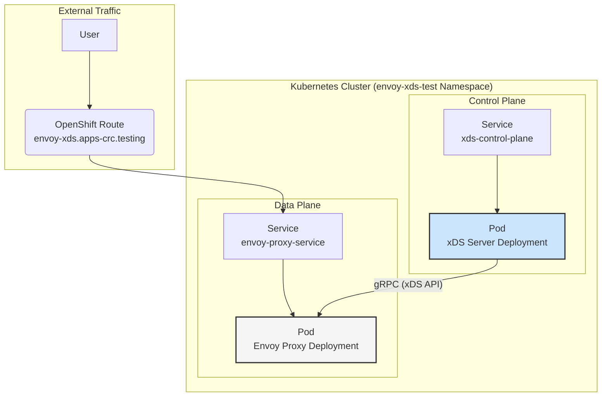
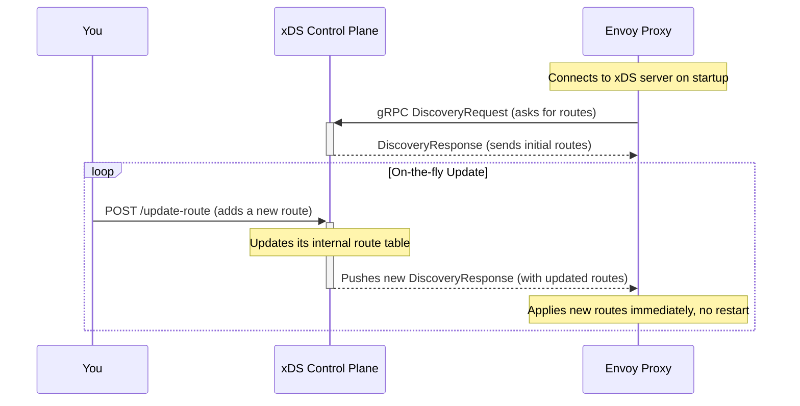

# OCP Envoy xDS Proof-of-Concept

This project demonstrates how to dynamically configure an Envoy proxy running on OpenShift using a custom xDS control plane.

## Table of Contents
- [Project Goal](#project-goal)
- [Architecture](#architecture)
  - [High-Level Design](#high-level-design)
  - [Dynamic Reconfiguration Workflow](#dynamic-reconfiguration-workflow)
- [Components](#components)
  - [1. Envoy Proxy (Data Plane)](#1-envoy-proxy-data-plane)
  - [2. xDS Control Plane](#2-xds-control-plane)
- [Deployment](#deployment)

---

## Project Goal

The primary goal is to deploy an Envoy proxy on OpenShift and be able to manipulate its routing table dynamically without needing to restart the proxy. This will be achieved by implementing a custom xDS control plane that provides a REST API for management.

---

## Architecture

The architecture is split into two main parts: a **data plane** (the Envoy proxy that handles user traffic) and a **control plane** (a custom server that configures the proxy).

### High-Level Design

The Envoy proxy will be configured with a static "bootstrap" configuration that tells it how to connect to the xDS control plane. All subsequent configuration, such as routes, will be discovered dynamically from the control plane via the xDS gRPC API.

### Dynamic Reconfiguration Workflow

The control plane will expose a REST API to allow an administrator to query and update the routing table. When an update is received, the control plane pushes a new configuration to all connected Envoy proxies.

---

## Components

### 1. Envoy Proxy (Data Plane)

- **Purpose:** Handles all incoming and outgoing traffic.
- **Image:** `registry.redhat.io/openshift-service-mesh/proxyv2-rhel9:2.6`
- **Configuration:** A minimal static bootstrap config pointing to the xDS control plane.
- **Exposure:** Exposed to the outside world via an OpenShift `Route` with the hostname `envoy-xds.apps-crc.testing`.
- **Kubernetes Resources:**
    - `Namespace`: `envoy-xds-test`
    - `Deployment`
    - `Service`
    - `ConfigMap` (for the bootstrap config)
    - `Route`

### 2. xDS Control Plane

- **Purpose:** Acts as the "brain" for the Envoy proxy, providing its configuration dynamically.
- **Implementation:** A custom Go application.
- **Functionality:**
    1.  **gRPC Server:** Implements the Envoy xDS API (specifically RDS - Route Discovery Service) to serve routing configurations.
    2.  **REST API Server:** Exposes endpoints for an administrator to manage the routes (e.g., `GET /routes`, `POST /routes`).
- **Exposure:** The REST API will be exposed externally via an OpenShift `Route` with the hostname `envoy-xds-controller.apps-crc.testing`.
- **Kubernetes Resources:**
    - `Deployment`
    - `Service`
    - `Route`

---

## Deployment

All resources will be defined in a single Kubernetes manifest file located at `src/envoy-deploy/deployment.yaml`. The control plane application code will reside in `src/xds-server/`.

